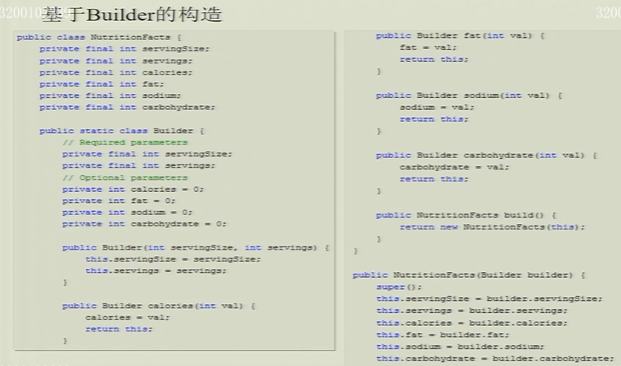
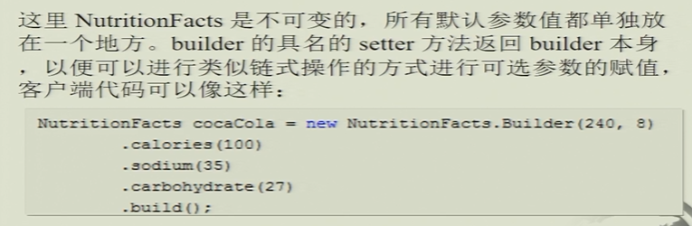
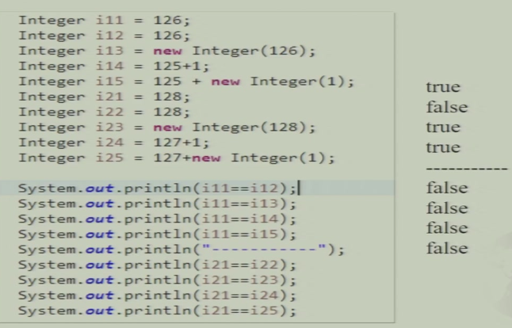
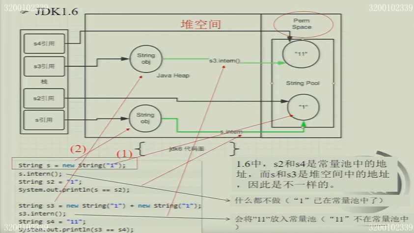
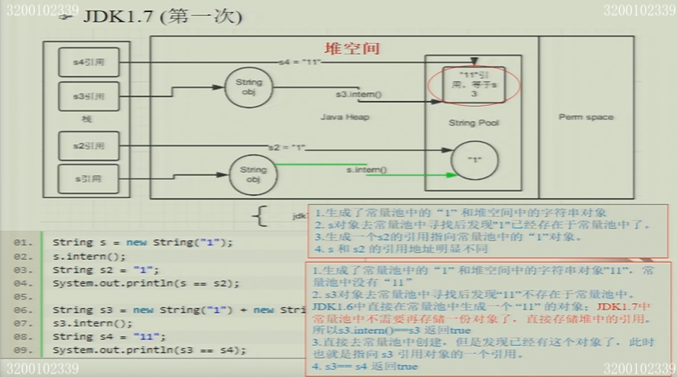
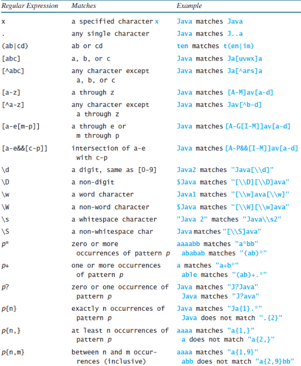
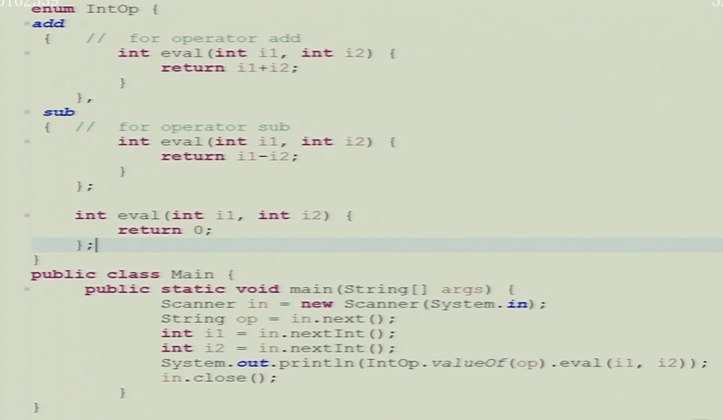
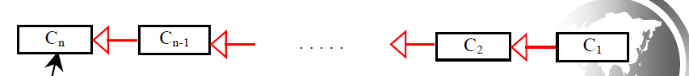

## Java应用技术2：类和对象

###### RandomStar

#### Chapter 3. Java OOP

##### 3.1 类和对象

###### 3.1.1 类的定义和初始化

- 成员变量没有加`public/private`的时候，在同一个package中是public的，即`friendly`

```java
class Number {
    int i;
}

Number n1 = new Number();
Number n2 = new Number();
n1.i = 9; n2.i = 47; n1 = n2; // 指针
// n1.i = 47; n2.i = 47;
n1.i = 27;
// n1.i = n2.i = 27
```

- 参数传递的时候primitive type会传值，而类传引用

- ```java
  Integer n1 = 47;
  Integer n2 = 47;
  n1 == n2; // true
  
  Integer n1 = new Integer(47); // depreciated
  Integer n2 = new Integer(47); // depreciated
  n1 == n2; // false
  
  int i = 47;
  Integer n1 = i;
  Integer n2 = i;
  n1 == n2; // true
  
  Integer n1 = 127;
  Integer n2 = 127;
  n1 == n2; // true
  
  Integer n1 = 128;
  Integer n2 = 128;
  n1 == n2; // false，因为超过了byte会新建对象
  
  Integer n1 = 127;
  Integer n2 = 127;
  n1 == n2; // true
  
  // JVM内有定义-127到128的Integer类型，运行时发现如果是这个区间的数就直接用内置的，否则就会新建Integer
  // String的字面量都是内置的
  // 比较还是得用equals
  
  class Value {
      int i;
      /* 此处需要重写equals，如果不重写下面就是false */
  }
  Value v1 = new Value();
  Value v2 = new Value();
  v1.i = v2.i = 10;
  v1.equals(v2); // false，因为Value类型是Object，使用Object.equals，而Object.equals是判断两者的指针，因为Object不可能知道类内部的成员变量的情况，所以只能比较指针
  ```
  
- 一个对象拥有状态(state)和行为(behavior)两个属性，状态定义了对象的内容，表现定义了对象可以进行哪些操作，类就是用于定义同一类对象的

  - Java中用变量定义状态，用方法定义行为
  - Java中的类也有**构造函数**，在对象构造的时候调用，但是对象的定义也可以不需要构造函数，当类定义里**没有显式声明的构造函数**时Java编译器会自动调用一个default constructor

- Java中方法和成员变量的引用方式：`objectRefVar.methodName(arguments)` 

  - Reference Data Fields有**默认值** 

    - String类型是null，数值类型是0，布尔类型是false，char类型是`\u0000` ，但是Java对于**方法中的局部变量**不会赋予默认值
    - 比如`int x` 后直接对其进行print会发生编译错误，因为变量没有初始化

  - 和C++的区别

    - Java编译器会为这些数据成员进行默认初始化，实际上是把刚分配的对象内存都置0
    - 在对象里定义一个引用，并且没有初始化的时候，默认为null
    - Java中**在默认的初始化动作之后才进行指定初始化**，比如下面这段代码中，创建一个对象的时候变量i先变成0在被赋值为999
      - 也就是说一定会有用默认值去初始化类成员变量的这个过程
      - 并且C++不支持直接在类定义里给成员变量赋值，但是Java可以（C++11之后也支持了）

    ```Java
    public class Value {
        int i = 999;
        Test t = new Test(); // 可以new其他类
        int res = f(t); // 可以调函数，参数可以是成员变量，但是要初始化在这个定义之前，否则编译报错：非法前向引用
    }
    
    // 这样是可以的，扫两遍
    public class Main {
        int i = f();
        int a = 10;
    
        int f() {
            return a;
        }
    }
    // 注：这里i的值为0。构造的时候i和a都先设置成0，然后调用f初始化i，所以i是0；如果将第7和8行交换那么i是10。在f里加print函数可以发现是扫了两次的。
    
    // 未定义a是啥，编译错误：非法前向引用
    public class Main {
        int i =f(a);
        int a = 10;
    
        int f(int k) {
            return k;
        }
    }
    ```

  - Java中数据成员的初始化过程是

    - 初始化对象的存储空间为零或null
    - 调用父类的构造函数
    - 先进行**默认的初始化**
    - 在进行**类定义里的初始化**（静态先，非静态后）
    - 构造函数初始化

- 对象和基本变量类型的区别

  - 基本变量类型在拷贝的时候只是拷贝一个值
  - 对象在拷贝中改变的是变量对于对象的**引用** 
    - 比如c1=c2的赋值导致c1也指向了c2指向的对象，而c1指向的对象不再被引用，会触发JVM的**垃圾回收**机制 
  - 对于不需要使用的对象可以给它赋值为null，这样就会触发JVM的垃圾回收机制释放内存空间

###### ⭐3.1.2 JVM--垃圾回收机制

- **Java的垃圾回收机制** 

  - 刚出现小垃圾不会回收，当内存用的差不多的时候启动垃圾回收。垃圾回收的时候先标记出垃圾（实际使用的方法是标记出所有的非垃圾，因为垃圾可能会互相指导致引用计数不为0），被标记的会调用`finalize()`
  
  - 对于不再被引用的对象和被赋值为null的对象就会触发Java的垃圾回收机制

    - 先标记是否是垃圾
    - 再对是垃圾的对象执行该对象的finalize函数
      - 执行的时间取决于垃圾回收机制 —— 懒

  - 一般而言如果类自己管理内存，程序员就应该警惕**内存泄漏**的问题
  
    - 内存泄漏是指没有指针/引用指向一段存内存，导致这部分内存无法被调用和修改
  
    - 例子：
  
      ```java
      public Object pop() {
          if (size == 0)
              throw new EmptyStackException();
          return element[--size];
      }
      // 假设被pop出来的是第i个，那么element[i]还是指向那个object的，所以就不会被回收，应该改成null。
      ```
  
    - 内存泄漏的另一个常见的来源是缓存，把对象引用到了缓存中就容易内存泄漏
  
    - 缓存可以用**软引用**来实现
      - Java提供了强引用，软引用，弱引用和虚引用4种引用方式
      
      - 平时我们用的是**强引用**，强引用**只要存在就不会被当作垃圾回收**，真不行了就抛出OOM异常
        - `object = null;` 就会导致原本是强引用被垃圾回收
      
      - 用软引用关联的对象在即将发生内存异常之前会被列入垃圾回收的范围而被回收，如果内存还是不够才会抛出内存异常(OOM, out of memory)的问题
      
      - 软引用主要应用于内存敏感的高速缓存，在安卓系统中经常用到
      
        .png)

###### 3.1.3 其他特性

- private Constructor 将构造函数设置为private

  - 不能在类外构造实例，里面方法都是静态方法，构成工具类
  - 类内创建单例
  - 只能被其他构造函数调用，用于减少重复代码

- 类的声明周期

  - 第一次new创建一个类的对象，或者通过类名访问静态变量或静态方法时，java会将类加载进内存。这块空间包括**类的定义、变量和方法信息、类的静态变量，并对静态变量赋值**

- instance 和 staic——和C++相同 

  - instance是变量的实例，instance variable属于特定的实例，instance method由类的一个实例调用

  - static类型的变量和方法被一个类的所有成员**共享** 

  - static成员变量的初始化在类被装载的时候被初始化

    ```java
    class Bowl {
        static { // 静态初始化块
            System.out.println("Loading Bowl!\n");
        }
        
        { // 定义初始化块，事实上是匿名类的构造函数
            System.out.println("hello");
        }
        
        static Bowl b = new Bowl();
    }
    // 顺序是：依次加载类，然后查看成员是否有类，也依次加载，每加载一个就调用一次构造函数然后装载下一个调用下一个构造函数（装载与初始化也是动态的），最后初始化该类（即调用构造函数）
    ```

- 值传递和引用传递

  - Java本质上是一种值传递

  - 对象中的一个数组实际上是一个reference variable的数组

  - ```java
    Employee a = new Employee();
    Employee b = new Employee();
    swap(a, b);
    // 无效，因为`void swap(Employee x, Employee y)`，x接收a，y接受b，x和y两个指针互相交换，对a和b还是没有影响的
    // 对数组有效，原因是值传递之后两个都指向同一片内存，修改内容，但是修改指针没用
    ```

- 不可变类 Immutable class

  - Java自带了很多不可变的类，比如String和一些基本的**包装类** 

    - 不可变类的优点：更加容易设计，实现和使用，更加安全
    - 如`Boolean/String/Integer/Long/BigInteger/BigDecimal/LocalData/LocalTime/LocalDateTime`

  - 编写不可变类的原则

    - 不提供可以修改对象状态的方法(mutator)

    - 保证类不会被扩展，具体的做法是声明为`final` 类型
      - 不可变类使所有的state都是final和private的
      - `final int[] values = {}`是不安全的，因为`final`表示地址不变，但是内容可能可以改变，需要改成private，然后使用`Collections.unmodifiableList(Arrays.asList(values))`访问public，或者提供public的get函数，里面返回数组`.clone()`
      
    - 确保对于任何可变组件的互斥访问

      - 客户端不能获得指向可变对象的引用

      - 可以返回一个new的对象

        ```java
        class Test {
            private TestChild a;
            void TestChild getTestChild() {
                // return a; // 错误！返回了一个指针，可能可以修改
                return new TestChild(a.name, a.age);
            }
        }

    - 必要时可以进行拷贝保护

  - 不可变对象，只有一种状态，也就是在创建的时候的状态

    - 本质上是**线程安全**的
    - 可以提供**静态工厂**，把频繁被请求的实例缓存起来
    - **缺点**是对于每一个不同的值都需要一个单独的对象

  - 为了确保不可变性，类不允许自己被子类化，除了使类成为final之外，还可以让类的所有构造函数都变为私有的或者**包级私有的(protected)**，并添加公共的静态工厂来代替公有的constructor 

    - 用到了**常量池技术** 

    ```Java
    public class Complex {
        private final double re;
        private final double im;
        private Complex(double re, double im) {
            this.re = re;
            this.im = im;
        }
        public static Complex valueOf(double re, double im) {
            return new Complex(re, im);
        }
    }
    ```

  - ```java
    Integer a = new Integer(3); // 调用构造函数
    Integer b = 3; // 使用valueOf函数，使用常量池
    a == b; // false
    int c = 3;
    a == c; // 其实是a.intValue() == 3，true
    ```

- this关键字：和C++相同

  - 是**对象本身的引用**的名字，用于访问hidden data fields

  - 一个常见的用法是在类的constructor中去调用其他的constructor

  - 代理构造函数

    ```java
    public class Flower {
        Flower(String ss) {}
        Flower(int petals) {}
        Flower(String ss, int petals) {
            this(petals);
            // !this(s); // Can't call constructor twice!
            this.s = s;
        }
    }
    ```

- 对象构建的TIPS

  - 基于Builder构造
    - 遇到多个constructor参数时可以考虑用Builder，可以解决类定义中的参数过多导致需要重载很多次的问题(导致代码的可读性变差，代码质量也下降)
      - 另一种方案是设置无参数的构造方法，通过setter方法来设置参数，但是这样不能保证对象的一致性
      - 这种方法也使得类不能设置为不可变类
    - 
    - 
    
  - 静态工厂方法代替构造器：代码的可读性更高，不必再每次调用的时候创建一个新的对象，可以返回原类型的任何子类型对象

    - 类似`valueOf`

  - 单例对象构建：通常用于那些本质上唯一的对象，如文件系统、窗口管理器等
    - 在Java1.5之前，可以使用private构造函数，然后使用`public static A getInstance()`来得到单例

    - 有特权的客户端可以通过反射机制调用私有构造器，要抵御这种攻击可以修改构造器，要求创建第二个实例的时候抛出异常

    - 枚举类方法：编写包含单个元素的枚举

      ```java
      public enum A {
          INSTANCE;
      }
      ```

- 编译单元

  - 一个类产生一个`.class`，与源文件名无关
  - 如果有一个类是`public`，那么该文件名必须和这个类同名，所以一个编译单元里只能有一个`public`类

- access specifiers （java定义和声明不区分，往往函数很长，所以C++的`public:`之后都为`public`的标记方法会导致不知道函数的access specifier在哪）

  - `friendly`或者默认：同一个包可以访问
  - `public`：没有限制
  - `private`：同一个类可以访问
  - `protected`：和C++不同，java里是同一个包或者子类


###### ⭐3.1.4 包(Package)和包管理

- `java.lang`不需要`import`

- package可以方便管理和组织java文件的目录结构，防止不同文件之间的命名冲突

  - 作为Java代码源文件的第一条语句，如果缺省则指定为无名包
  - 编译器在编译源文件阶段不检查目录结构

- 类的导入
  - 可以在每个类前面添加完整的包名
  - 也可以使用import语句导入整个包，比如`import java.time.*` 
  - 也可以只导入包中的特定类

- package静态导入
  - 不仅可以导入类，也可以导入静态的方法和静态域，比如`import static java.lang.System.*;`之后就可以使用`out.println` 

- Java的import和C++的include的**区别**
  - C++中要用#include把外部声明加载进来，C++编译器只能查看正在编译的文件和#include的文件，Java编译器可以查看其他文件，只是告诉编译器要去哪里查看
  - Java中显式地给出包名的时候不需要import，而C++要引用别的文件一定要#include
  - package和import更类似于namespace和using

- ```java
  package hello;
  public class Hello {}
  
  // javac不会报错，但是java运行的时候会找不到主类，java hello.Hello也找不到，必须将Hello.class移到新建目录hello中，然后运行java hello.Hello才行
  // 并且不能到新建目录hello里执行java hello.Hello或者java Hello，必须在根目录下
  // 逻辑就是：java XXX.YYY的时候，当前目录下要有一个XXX的文件夹，其中有个YYY类，并且这个YYY类说自己的package是XXX
  // 如果想在别的路径下执行的话就 java -cp path XXX.YYY（默认path是 . 即当前目录），或者设置CLASSPATH
  ```

  

##### 3.2 包装类

- 类和类之间的关系
  - Association 关联
  - Aggregation 聚合
  - Composition 组合
    - 组合的关系比聚合更加紧密
  
- Wrapper class 包装类
  - 实现了对Java中的各类基本数据类型的包装
  
  - 对象是immutable的，创建之后就不能改变
  
  - 包装类的构造函数有多种
    - 比如整型的包装类Integer可以用一个int类型来构造，也可以用String类型来构造
    
  - 数值包装类
    - 每个**数值型**的包装类中有常数`MAX_VALUE`和`MIN_VALUE` 分别代表这个数据类型中的**可能的最大值和最小值**
    - 所有的**数值型包装类**实现了向其他数值类型转换的方法，比如doubleValue，intValue等等
      - 静态方法valueOf：参数是一个字符串，产生对应的数值类型的值
      - JDK1.5以上的版本允许包装类和原本的内置类型进行自动转换
    
  - BigInteger类和BigDecimal类
    - 用于处理大数值的包装类
    
  - **String类**的语法特性
    - `immutable` 不可修改类，需要通过`charAt( )`方法访问字符串中的单个元素
      - 比如`String s = "Hello"; s = "Java";` 此时只是新构造出了一个“Java”的String对象并让s指向这个对象，原来的“Hello”对象并没有消失
      
      - ```java
        String s1 = "hello";
        String s2 = new String("hello");
        String s3 = "hello";
        
        s1 == s2; // false
        s1 == s3; // true
        ```
      
      - 使用常量池，存在于**方法区**
      
    - 有连接，比较，获取子串，查找元素和子串等多种操作
    
  - 自动装箱：AutoBoxing
    - 基本类型在运算的时候，JVM会将其装箱成安全的包装类来使用


##### 3.3 Constant Pool 常量池

- Java Constant Pool **常量池**技术

  - 可以方便快捷地创建某些对象，当需要的时候就从池里取出来，常量池实际上就是一个**内存空间**存在于方法区中

  - JVM将源代码编译成class文件之后，会用一部分字节分类存储常量，集中在class中的一个区域存放，包含了关于类方法接口中的常量，也包括字符串常量

    - 比如`String s = "java"` 则在编译期可以识别为和java是同一个字符串的，都会自动优化成常量，也就是说如果有多个字符串的值为java则他们都会引用自同一String对象

    ```Java
    String s1 = "Hello";
    String s2 = "Hello";
    String s3 = "Hel" + "lo";
    String s4 = "Hel" + new String("lo");
    String s5 = new String("Hello");
    String s6 = s5.intern();
    String s7 = "H", s8 = "ello";
    String s9 = s7 + s8;
    s1 == s2 true;
    s1 == s3 true; // 编译期进行了一定的优化
    s1 == s4 false;
    s1 == s5 false;
    s1 == s9 false; // s9是两个变量拼起来的，+/+=都不行
    s1 == s6 true;
    ```

    - 对于上面这一段代码，s1，s2和s3是相同的(因为常量池技术)而s1和s4是不同的，s1和s9也是不同的，因为s4和s9不是常量，在编译期没有确定是不是常量
         - 而s1和s6是相等的，和s5是不同的，因为s5位于堆中，**intern方法会试图将Hello这个值加入常量池中**，而此时常量池中已经有了Hello所以直接返回了其地址

  - Java中定义的**包装类大部分实现了常量池技术**，只有**浮点数类型的包装类没有实现**

    - 其中Byte,Short,Integer,Long,Character只对-128-127的对象使用常量池 

      - Double类型是没有缓存的，所以就会有如下结果

    ```Java
    Double x = 1.1;
    Double y = 1.1;
    x == y // -> false!
    ```
    - Integer利用**缓存**机制实现了常量池，缓存了256个对象，主要是常用的证书
    - 


##### 3.4 String的语法特性

- String的intern方法
  - 需要1.7以上的JDK
  - intern方法设计的初衷就是要重用String对象，节约内存消耗
  - Java的运行时Data Area
    - 堆heap中存放创建的实例对象
    - 方法区中存储了已经被JVM加载的类的信息和静态变量，编译器编译的代码
    - JDK1.7之后常量池被放入到堆空间中，导致intern的功能发生了变化
    - 
    - 
- String的其他语法
  - String的匹配，代替和分割split，支持正则表达式匹配
  - 包装类大多都有`toString()`的**静态方法**用来将其转换成String类型
  - String的format方法：根据指定的格式生成String，比如`String s = String.format(“%7.2f%6d-4s”,45.556, 14, “AB”);` 
  - 关于Java中string的一些细节
    - Java中的String**不是以空字符'\0'**结尾的
    - Java中的String不可改变，是**final类型**
    - 在String池中维护
    - 比较是否相同的时候要用equals方法，不要用==
    - 使用indexOf等方法去查询元素的位置
    - 使用subString方法去获取子串，因为==比较的是引用的对象，equals比较的是String所代表的值
    - +运算完成了对String concatenation的重载
    - 使用trim方法删除首尾空格
    - split方法支持正则表达式
    - 不要**存储敏感信息**在String中

###### ⭐StringBuilder和StringBuffer

- 是String的以一种替代品，String可以使用的地方一定也能用这两个，但是更加灵活
  - Builder和Buffer拥有toString，capacity，length，setLength和charAt等方法
- 三者的比较
  - 在执行速度上，`StringBuilder>StringBuffer>String` 
    - 比如对于String s = "abcd"，如果我们执行s = s + 1实际上执行之后的**s跟原本的s不是同一个对象**而是生成了一个新的对象(因为String是不可变的)，**原来的对象被垃圾回收了**，导致String的执行效率非常低
  - 线程安全
    - Builder是**线程非安全**的，Buffer是线程安全的，当有多个线程区使用某个字符串时，StringBuilder不安全

⭐正则表达式




##### 3.5 枚举类 Enum

- JDK1.5才有的新类型，采用enum关键字定义，所有的枚举类型都继承自Enum类型
  - 通常常量用`public final static `来定义，在枚举类中可以用如下方式定义

```java
public enum Light{
    public final static RED = 1, GREEN = 2, YELLOW = 3;
}
```

- Java的枚举**本质上是int值**

  - 通过公有的final静态域为每个枚举常量导出实例的类
  - 由于没有constructor，枚举类型是真正的final，是实例受控的，是单例的泛型化
  - 比如上面这个枚举类的定义，如果定义了一个Light类型的变量，那么任何非空对象一定属于Light的三个值之一

- 枚举类的特性

  - 枚举类是final，不能被继承
  - 含有`values()`的静态方法，可以**按照声明顺序返回其值数组** 
  - `ordinal()`方法，返回**枚举值在枚举类中的顺序**，根据声明时候的顺序决定(从0开始)
  - 可以用valueOf来得到枚举实例，用toString将枚举转化为可以打印的字符串
  - 比如`Light L =  Light.valueOf("RED");` 
  - 枚举类型也支持switch语句直接对实例进行选择
  - enum类型可以可以关联不同的数据，也可以**添加任意的方法和域来增强枚举类型**,比如添加构造函数来丰富枚举类的结构
  - **特定于常量**的方法实例
    - 缺点是难以共享代码，可以借助策略枚举，将处理委托给另一个枚举类型

  ```Java
  public enum Operation{
      PLUS{
          double apply(double x, double y){
              return x+y;
          }
      },
      MINUS{
          double apply(double x, double y){
              return x-y;
          }
      }; // 这里PLUS和MINUS都是对象，它是匿名类制造出来的，并且这个匿名类是Operation的子类
      abstract double apply(double x, double y);
  }
  ```
  
  - 这一部分听说期末考会考编程题，需要练练
  
  - ```java
    public enum Planet {
        Mercury (0, 0),
        Venus (1, 1); // 调用构造函数
        
        Planet(int i, int j) { this.i = i; this.j = j; }
    }
    ```
  
  - ```java
    public enum Operation {
        PLUS {
            double apply(double a, double y) {
                return x+y;
            }
        },
        MINUS {
            double apply(double a, double y) {
                return x-y;
            }
        }
        
        abstract double apply(double x, double y);
    }
    ```
  
  - 
  
  - 


🐀🐂🐅🐇🐉🐍🐎🐏🐒🐓🐕🐖

##### 3.6 继承和多态

###### 3.6.1 继承

- Java中继承的关键词是`extends ` ，只有单继承

- super方法：
  - 子类没有继承基类的构造函数，但是子类中可以用关键字`super`去调用基类的构造函数
  - 如果不显式地声明super，则会**自动调用基类的无参数的构造函数**
  - super关键字可以调用基类的构造方法
  
- 父类`private`成员变量在子类中存在但不能访问

- override：覆写父类的方法
  
  - java默认是动态绑定，所以如果函数名、返回值和参数相同就是默认virtual的override。
  
  - 子类会继承父类所有的方法，但是可以在子类中对父类的方法进行重载，此时调用子类的该方法就会调用新定义的，覆写了原本的方法
  
  - **private类型的方法不能被覆写**，意味着private是静态绑定（另外还有声明不能override的写法，强制静态绑定，其他情况都是动态绑定）
  
  - static类型的方法也不能被覆写，如果在子类中被重定义了，那么父类的该静态方法就会被hidden
  
  - JDK1.5开始增加了`@override`注解来声明一个覆写——不要忘了写override
    - 每个类都会有一个equals的方法，要注意区分重载和覆写  
  
  - 方法的覆写发生在继承的子类中，而**重载在继承的子类和基类中都会发生** 
  
  - **java不存在namehide**
  
  - 抽象函数用`abstract`修饰，最后直接分号结尾。如果类有抽象函数，那么必须声明成abstract。如果类是abstract，它不一定有抽象函数。
  
  - 例子
  
    ```java
    public class Father {
        private int i = 10;
        public Father() {
            increment(); // 实际上调用子类的increment，但是C++构造函数的override是不起作用的
        }
        public void increment() {
            i++;
            System.out.println("Father: i = " + i);
        }
    }
    
    public class Son extends Father {
        private int i = 20;
        public Son() {
            increment();
        }
        public void increment() {
            i++;
            System.out.println("Son: i = " + i);
        }
    }
    
    Son son = new Son();
    // 首先调用父类的构造函数，其中的increment会调用Son，导致Son的i加一变成1（因为还没有给Son的i设置为20），然后子类调用构造函数，输出Son的i为21
    // Son: i = 1
    // Son: i = 21
    ```
  
  - ```java
    public class Father {
        int i = 10; // 1
        public Father() { // 2
            prt("Father");
        }
        static int i = 10; // 3
    }
    
    public class Son extends Father {
        int i = 10; // 4
        public Son() { // 5
            prt("Son");
        }
        static int i = 10; // 6
    }
    
    public class Main {
        public static void main(String[] args) {
            prt("Main"); // 7
            Son son = new Son();
        }
    }
    // 顺序是：3 6 (两个先装载) 7 1 2 4 5
    // 先做父类的定义初始化和构造函数，然后再做子类的定义初始化和构造函数
    ```
  
- Upcast：将子类赋给父类就是Upcast
  
- Object类是java.lang.Object中定义的基本类型，如果一个类没有声明继承自何处，那么就是继承自Object类
  
  - Object中有toString方法，默认情况下会显示一个实例的类名和@符号后面跟一个代表这个实例的数字
  - ~~万物起源Object~~ 

###### 3.6.2 多态 Polymorphism

- 多态意味着基类可以被引用作为一个子类来使用

- Java的动态绑定(dynamic binding)特性

  - 假如一系列类的继承关系如下(其中Cn在Java中式Object类)

  

  - JVM会从C1开始寻找某个方法P直到找到一个具体的实现为止，然后搜索停止，调用第一个找到的方法
  - method match方法匹配，在**编译期**按照参数类型和个数来进行匹配，而动态绑定是在运行时寻找对应的方法

- Generic Programming 元编程

  - 当一个方法的参数是superclass的时候，可以用他的任意一个子类作为参数，但是具体的调用会动态地决定

- Casting objects

  - 可以在有继承结构中的类型之间互相切换，比如对一个参数要求为Object的方法，可以用new Student()作为其参数，此时会发生从Student到Object的隐式转换
  - 当从基类转换到子类的时候必须有显示的声明，但不一定总是能成功
    - `instanceof`操作符可以测试一个对象是不是某个类的实例
  - Java和C++的区别
    - Java转换失败的时候会抛出异常，而C++转换失败会产生一个nullptr，这样就会在一个操作中完成测试和类型转换
    - Java中的类型转换需要和instanceof结合使用，先用instanceof判断，然后来进行转换

- equals方法

  - 默认的equals方法在Object中是这样定义的

  ```Java
  public boolean equals(Object obj) {
      return this == obj;
  }
  ```

  - 可以在自定义类中override这个equals方法
  - == 比 equals的要求更高，会检测两个引用变量是不是引用的同一个对象，而equals只要求内容相同


##### 3.7 Java的内置模板类

- ArrayList 任意长度的任意类型数组
  - 可以用`ArrayList<typename>` 来定义一个typename类型的任意长数组
  - 相比于普通数组，拥有更多功能比如add，remove和clear，和普通数组之间可以互相转换
  - ArrayList可以用`java.util.Collections.max`和`min`方法来获取其中的最大值
  - 此外java.util.Collections中还有sort和shuffle等方法
- MyStack类
  - 一个内置的Stack结构，支持栈的pop，push，peek等多种操作

##### 3.8 关键词protected和final

###### 3.8.1 protected

- protected关键词表示一个类或者数据或者方法可以**被同一个包或者子类任意访问** 
- Java中状态和方法可访问的范围从小到大是private，default，protected，public
  - private只能在同个类中访问
  - default可以在private的基础上同个包中访问
  - protected在此基础上可以被子类访问
  - public可以被随便访问
- 继承的时候子类在覆写方法的时候不能把Accessibility弱化，只能往上调

###### 3.8.2 final

- 含有final关键字的类不能被继承
- 含有final关键字的变量是常量
- 含有final关键字的方法不能被覆写


##### 3.9 嵌套类

###### 3.9.1 复合优先于继承

- 继承打破了代码的封装性，子类依赖于基类中特定功能的实现，如果基类随着版本变化会破坏子类
- 复合composition就是不继承而是在新的类中增加一个private state并引用现有类的一个实例

###### 3.9.2 嵌套类 nested class

- 可以在**类的内部再定义一个类**，分为**静态嵌套类**和**非静态嵌套类**
  - 其中非静态嵌套类最重要，也被称为内部类inner，分为
    - 在一个类中直接定义的内部类
    - 在方法中定义的局部类 `local class` 
    - 匿名内部类 `anonymous class` 
  - 内部类的作用：内部类之间的**private方法可以共享**因此经常被作为辅助类
  - public内部类可以在外部类之外调用，但是对于非静态类，必须要使用一个外部类的对象来创建
  - 内部类如果在外部类可以直接new，但是在外部类的外面使用需要**先new出一个外部类，在用外部类new出一个内部类**
  - 静态内部类不需要通过外部类的对象来创建，外部类的变量和非静态方法都不能调用
  - 有内部类的时候在编译成class文件的时候会产生多个class文件，**每有一个类定义就会产生一个class文件**（默认名字是`<外部类>$<内部类>.class`），这意味着装载是分开的：非静态内部类是第一个对象被创建的时候装载，而静态内部类是和外部类一起被装载
  - 内部类的通常做法：返回一个内部类，这个类implements了一个接口，外部的人只知道是接口类但具体类型被隐藏了。
  
- Local class局部类
  - 定义在一个方法**内部**，只能在方法的内部实例化
  
  - 编译之后产生class文件，名字是`<外部类>$<编号><内部类>`，这里有编号的原因：防止其他函数中也定义了同名类，编号就是源代码中书写顺序
  
  - ```java
    public class A {
        public B b() {
            return new B() {
                private int i = 11;
                public int value() { return i; }
            }
            // 这里定义了一个B的子类，也是内部类，如果B是接口，这个匿名内部类就实现了接口B
            // 编译之后名字是A$1.class
        }
        
        public C c(int x) {
            return new C(x) { // 这里x调用父类构造函数
                {
                    System.out.println("Hello world!"); // 定义初始化块，实际上是匿名类的构造函数
                }
                public int f() {
                    return super.f(); // 调用父类f函数
                }
            }
        }
    }
    // 注：C语言中变量名和函数名不能相同，但是java可以
    ```
  
  - 方法内部类的对象不能使用该内部类所在方法的**非final局部变量**（后续更新可以不写final，但是不能修改这个值），但是可以使用外部类的非静态成员变量（包括私有）
  
  - 方法的局部变量位于栈上，只存在于该方法的生命期内
    - 但是该方法结束之后，在方法你创建的内部类对象可能仍然存在于堆中
    
  - 只有final和abstract可以用来修饰方法内部类
  
  - 静态方法内的方法内部类只能访问外部类的静态成员
  
  - 父类和子类有同名内部类的时候，不具有override关系。原因：成员函数是动态绑定的，成员变量是静态绑定的，成员类是静态绑定的，所以成员类和成员变量类似

##### 3.10 抽象类和接口 Abstract class and Interfaces

- Interface 接口：用来定义各种类的表现

###### 3.10.1 Abstract class 抽象类

- 抽象类的语法特性
  - 抽象类**不能实例化出对象**，抽象方法**不能在非抽象类中使用** 
  - 抽象类不能使用new操作符，但是依然可以定义构造方法并在子类中调用
    - 抽象类的非抽象子类可以创建对象
    - 可以作为一种数据类型
  - Java中的抽象类表示一种继承关系，一个类**只能继承一个抽象类** 
  - 抽象方法一定属于抽象类，抽象类不一定需要有抽象方法
  - 子类也可以是抽象类，不管是继承了一个抽象类还是一个具体的类
- 抽象方法
  - 只有方法体，没有方法名
  - 继承了抽象方法的子类必须override这个方法，否则这个子类也必须声明为抽象类，最终必须有子类override这个方法，否则这些类定义都不能实例化出对象

###### 3.10.2 Interface 接口

- 接口只包含常数和抽象方法，用于指定对象的通用行为，定义的方法如下
  - 接口是抽象方法的集合

```Java
public interface InterfaceName {
	constant declarations;
	abstract method signatures;
}
```

- 接口也不能实例化出一个对象，但是接口名**可以作为变量类型**来使用
  - 抽象类中所有的数据都是`public final static`类型，所有的方法都是`public abstract`类型
  - 接口中的方法不是在接口中实现的，只能由实现接口的类来具体实现接口中的方法
  - JDK1.8以后接口里可以写静态方法和方法体
  - 接口可以继承其他的接口（可以继承`extends`多个接口）
- 实现接口的关键字：用`implements`关键字来**让一个类实现接口中的方法**
  - 如果实现接口的类是抽象类，就可以先不用实现
  - 一个类可以有多个接口，但是只能继承自一个类

- marker interface 标记接口
  - **没有任何方法和属性**的接口，仅仅表明它的类属于某个特定的类型，这个接口只起到了标记作为
  - 主要用于
    - 建立一个公共的父接口
    - 向一个类添加数据类型
- 接口和抽象类的区别
  - 抽象类的方法可以有方法体
  - 抽象类中的成员变量可以实各种类型的，接口中只能是`public static final`类型
  - 接口中不能含有静态代码块和静态方法
  - 一个类只能继承一个抽象类，但是可以实现多个接口

