Java应用技术3：高级语法特性


#### 4. Java高级语法特性

##### 4.1 异常处理

- Java中的异常类型

  - 注意异常和错误的区别，系统错误是JVM抛出的，异常是由程序引起的，可以被检测出来
  - 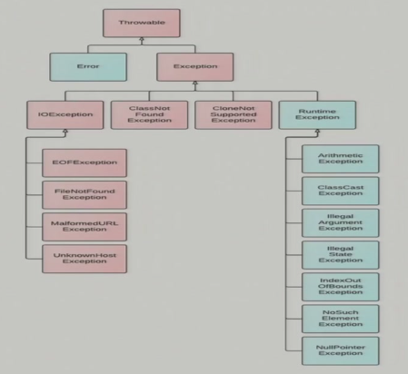

- 异常类型

  - Unchecked Exceptions 不可恢复的逻辑错误，包括RuntimeException和Error
    - 比如NullPointerException和IndexOutOfBoundsException
    - Java不需要对unchecked exceptions进行检查
  - checked exceptions 需要进行catch

- Declaring Exceptions 方法需要声明检查的异常的种类，关键字为throws。只是声明，甚至可以在代码中不catch

- Throwing Exceptions 

  - 当发现了错误类型的时候可以创建一个合适的错误类型将其抛出
  - 语法是`throw new TheException()` ，只能throw实现了`Throwable`接口的类（一般是直接继承`Exception`类）
    - `Exception`有的方法：`getMessage()/toString()/printStackTree()`
    - 如果在catch块里面再`throw e`的话，`printStackTree`就不会拿到之后的堆栈信息，所以需要先`fillInStackTree`，执行之后堆栈信息清空

  - try-catch语句

  ```Java
  try{
  	statements;//Statementsthatmaythrowexceptions
  }
  catch(Exception1 exVar1){
  	handler for exception1;
  }
  catch(Exception2 exVar2){
  	handler for exception2;
  }
  catch(ExceptionN exVar3){
  	handler for exceptionN;
  }
  ```

  - 匹配规则是`is-A`，所以子类异常，父类可以catch
  - tyr-catch语句块中可以加入finally子句，**不管有没有找到错误都会被执行** 
    - 抛出异常之后如果没有finally就不会再往下执行，有finally的时候抛出异常之后还会执行finally中的语句

- Java的异常检查使用规范

  - 不要忽略check exception：捕获就必须要处理
  - 不要捕获unchecked exception
  - 不要一次捕获所有的异常
  - 使用finally语句块释放资源，但是final块不能抛出异常
  - 抛出自定义异常异常时带上原始异常信息
  - 打印异常的时候带上异常堆栈
  - 不要同时使用异常机制和返回值
  - try不要太庞大，不然代码的可读性会降低
  - 守护线程中需要catch runtime exception

- 一些细节

  - 父类一个函数抛A异常，子类override的时候声明抛A和B异常：对于**普通成员函数**，如果允许这种情况，那么编译器只会检测子类这个函数是否处理了A异常（因为编译器不知道子类的情况），那么运行时出现B异常就会Error，所以Java要求子类override函数不能抛出更多异常（少可以）；但是对于**构造函数**，编译器知道子类函数的情况，所以Java要求子类override构造函数应该至少处理父类构造函数的所有exception（多可以）
  - 子类如果继承多个父类和接口，那么throw的类型是这些父类同名函数throw类型的交集
  - 如果父类throw的类互为父子，那么子类override的时候可以只throw那个子类，因为try-catch会处理exception的父类
  - 构造函数中不能throw


##### 4.2 Assertion 断言

- 包含一个在程序运行过程中一定是真的布尔表达式，用`assert assertion`进行定义

  - 当断言被创建的时候，Java会计算这个表达式，如果结果是false就会抛出AssertionsError这个异常
  - AssertionError有多种构造函数，用于匹配message的data type

  ```Java
  public class AssertionDemo {
  public static void main(String[] args) {
  	int i; int sum = 0;
  	for (i = 0; i < 10; i++) {
  		sum += i;
  	}
  	assert i == 10;
  	assert sum > 10 && sum < 5 * 10 : "sum is " + sum;
  	}
  }
  ```

- 不要在public的方法中使用assertion而应该使用exception handling

##### 4.3 文本读写

- ```java
  System.out.println(true? Integer.valueOf(1) : Double.valueOf(2));
  // 结果是1.0。编译的时候要将包裹类型转化成primitive type，这里有Integer和Double，最后选择返回double类型，所以前面的Integer要做类型转换
  ```

- File 类：一个由文件名和**路径**组成的包装类，提供了一系列文件信息和修改操作（具体可见最后）
  
  - 不包含读写文件内容的方法
  - 文件读写需要Scanner和PrintWriter
  
- PrintWriter 用于写入文件
  - 提供了一系列重载的print和println方法
  - 构造函数需要文件名作为变量，可以指定编码方式，比如UTF-8
  
- Scanner 用于读文件
  - 初始化之后和标准输入一样使用nextXXX来读写
  - Scanner的构造方式
    - 错误方式 `Scanner in = new Scanner("file.txt");` 构造了一个带字符串参数的Scanner
    - 正确方式`Scanner in = new Scanner(new File("file.txt"), "UTF-8");` 
      - 需要用File对象进行构造
  - Scanner很慢
  
- URL类：从web中读取信息
  - 构造方式`URL url = new URL("www.xxxxxxx");`
  - 完成构造之后可以用openStream打开一个输入流，用Scanner进行读取
    - `Scanner input = new Scanner(url.openStream);` 

##### 4.4 二进制读写

- 文本读写是人能看懂的，二进制读写是机器可以看懂的，文本读写事实上是需要编码和解码的，但是二进制读写不需要编解码二可以直接被机器识别

- Java通过输入输出流的形式来进行二进制文件的读写，二进制读写的一系列类的关系如下：

  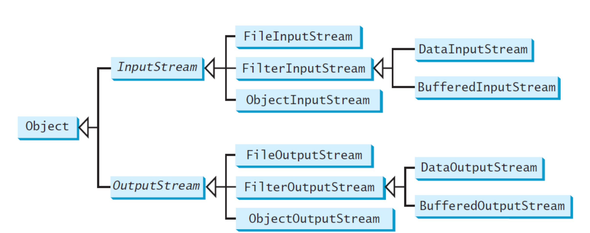

  - 其中File的输入输出流需要一个文件作为读写的对象

  - Filter的输入输出流不仅可以读写二进制字符，也可以将int，double等类型的转化成二进制字符进行读写

  - 对于string类型，Java使用的是2个字节的Unicode编码，ASCII编码是Unicode的子集，String中存储的实际上是文字的Unicode序列
    - 读写的流水线：外部文件--文件输入流--数据输入流--数据读入进行操作，要写的数据--数据输出流--文件输出流--外部文件
    
  - 对象读写流：直接读入一个对象 ObjectOutputStream需要实现Serializable

  - 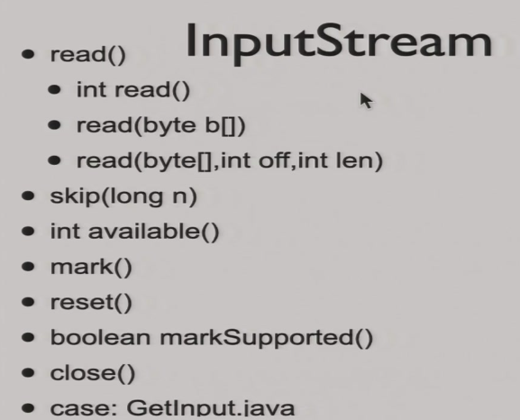

  - 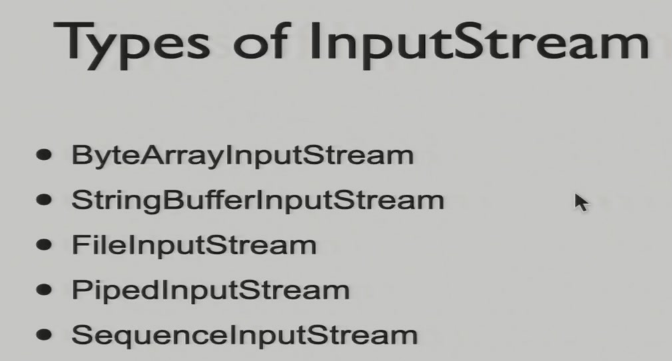

  - 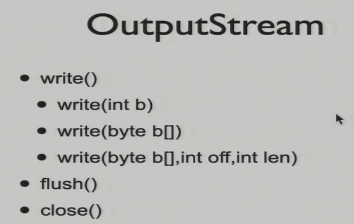

  - 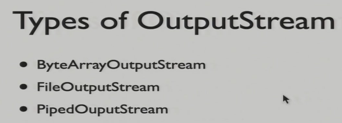

  - ```java
    DataInputStream in = new DataInputStream(new BufferedInputStream(new FileInputStream("data.bin")));
    in.readInt();
    in.readDouble();
    ```

  - 注：UTF-8英文1个byte，中文3个byte；UNICODE-16中文2个字节

  - 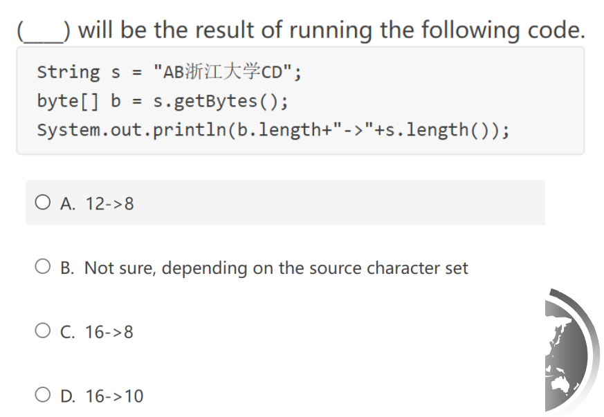

    答案是B

- 序列化和反序列化：可以被写入输入输出流的对象被称为是可序列化的。

  - 实现Serializable的接口，可以进行对象的序列化和反序列化
  - 序列化后的对象**不需要再次调用构造器**重新生成，但是在实际中，我们会希望对象的某一部分不需要被 序列化，或者说一个对象被还原之后，其内部的某些子对象需要重新创 建，从而不必将该子对象序列化
    - 方法一：实现`WriteObject`和`ReadObject`
    - 方法二：加关键字`transient`，表示这个对象不需要序列化
    - 注意：静态变量不会被序列化
  - 反序列化之后得到的对象和原来的不是同一个，因此是深拷贝，实现对象的复制
  - 使用ObjectOutputStream / ObjectInputStream

- 第二代I/O

  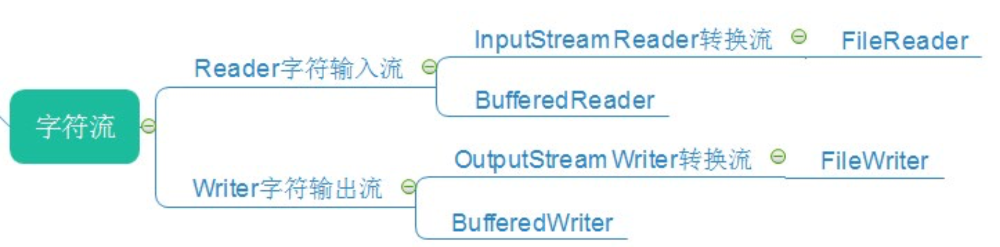

  - 内容都是UNICODE-16文本，所以需要Stream来桥接
  - 例如：`new PrintWriter(new BufferedWriter(new OutputStreamWriter(new FileOutputStream("abc.txt"))))`
  
  


##### 4.5 Generics 泛型

- 是一种**对变量类型进行参数化的**功能，类似于C++中的模板
  - 优点是能在编译期就发现一些错误而不是运行时
  - 一个泛型类或者方法可以声明类名和函数名作为变量

###### 4.5.1 泛型方法

- 泛型方法的类型参数声明要写在返回值类型前面，用尖括号括起来，比如
  - `public static <E> void printArray(E[] input);`
  - 类型参数可以有多个参数，有逗号隔开，类型参数可以被用来声明返回值类型
  - **有界限的**类型参数：可以让类型参数有一定的范围
    - 用extends关键字+类型的上界来控制类型的范围
    - 比如`<T extends Comparable<T>>` 表示T必须是可以比较大小的类型
  - JDK7之后后面一个类型可以省略，由Java编译器自己推断
  
- 判断函数中的范型参数能否被接受：画范型的继承关系，比如下面这样：

  - 这张图中，上层的可以容纳下层的对象

  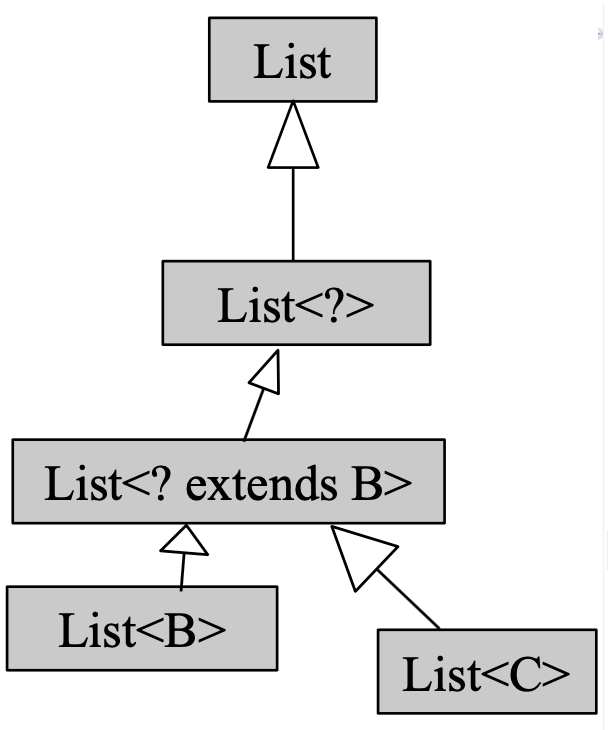

###### 4.5.2 泛型类

- 类型参数的声明添加在**类名的后面**

- 泛型方法定义

  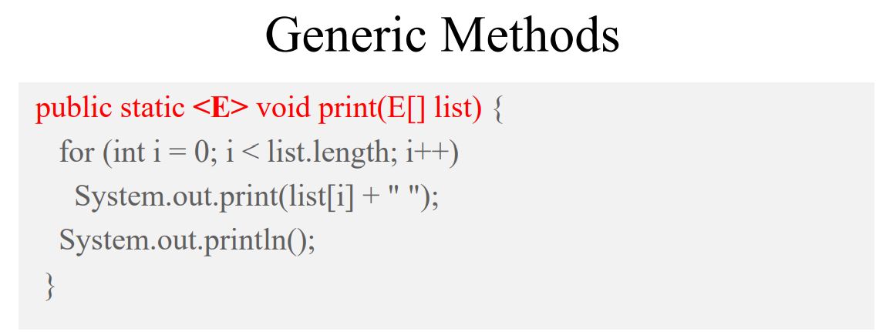

- 参数化类型**没有实际类型参数的继承关系**
  - 比如`List<Integer> list = new List<Object>`会编译错误，把两个参数类型反过来也是编译错误（`List<Integer>`不是`List<Object>`的子类）
  - 泛型的继承关系需要通过通配符
    - 使用？代替具体类型参数，比如List<?>可以代表所有具体类型List的父类
    - 比如`List<? extends Number>`表示参数的泛型上限为Number类型
    - `List<? super Number>`表示参数的泛型下限为Number类型
    - 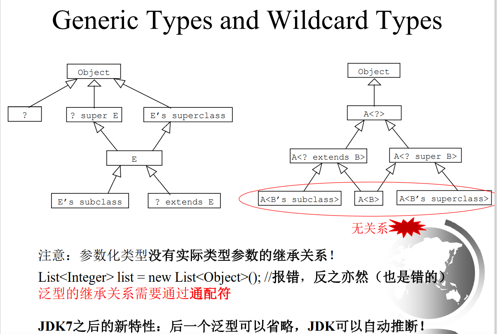
    - [Java泛型通配符 ? 与 T 的区别 - 沙湖王 - SegmentFault 思否](https://segmentfault.com/a/1190000020497160) 讲的很清楚
    - 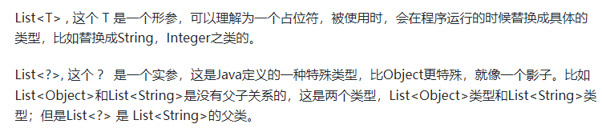
  
- 不允许用泛型类型来创建泛型数组

- `instanceof`返回左边的对象是否是右边类的一个对象

- 范型的实现方式：

  - ```java
    ArrayList<String> l1 = new ArrayList<String>();
    ArrayList<Integer> l2 = new ArrayList<Integer>();
    l1.getClass() == l2.getClass(); // true,都是java.util.ArrayList
    
    l1 instanceof ArrayList; // 编译通过，true
    l1 instanceof ArrayList<String>; // 编译错误
    l1 instanceof ArrayList<?>; // 编译通过，true
    l1 instanceof ArrayList<? extends Object>; // 编译错误
    ```
  
  - 范型使用一种叫做类型擦除的方法来实现，编译器编译的时候使用范型类型来编译代码，随后将其删除，因此范型信息在运行时是不可知的，这个方法使得范型可以向后兼容旧代码。所以上面的`ArrayList<string>`是错误的，因为根本没有这个类，只有`ArrayList`
  
  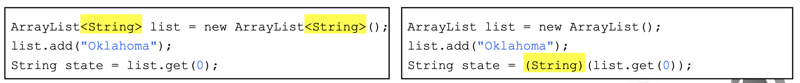
  
  - 泛型类的所有实例都有相同的运行时类，所以泛型类的静态变量和方法是被它的所有实例共享的。所以在静态方法、数据域或初始化语句中，为了类而引用泛型参数是非法的
  
  - 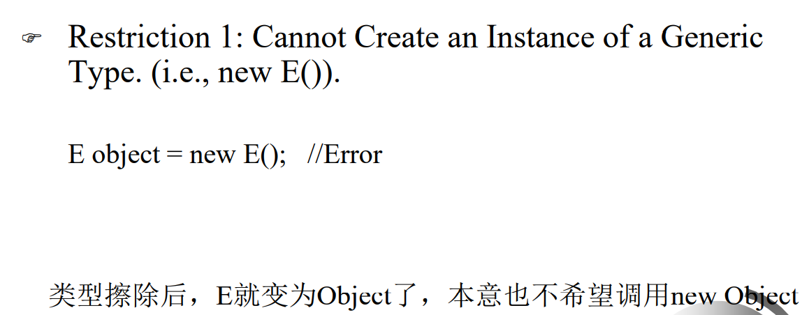
  
    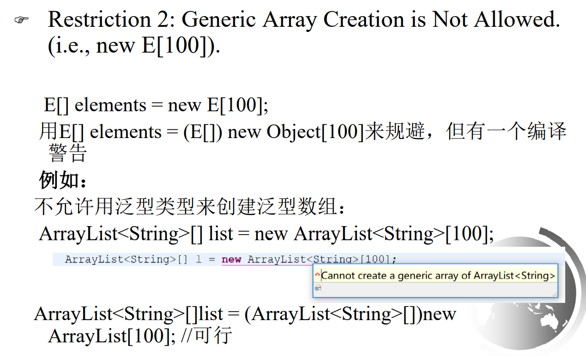
  
    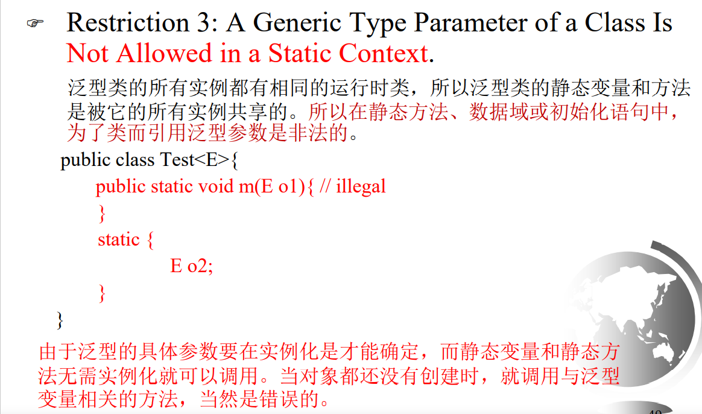
  
    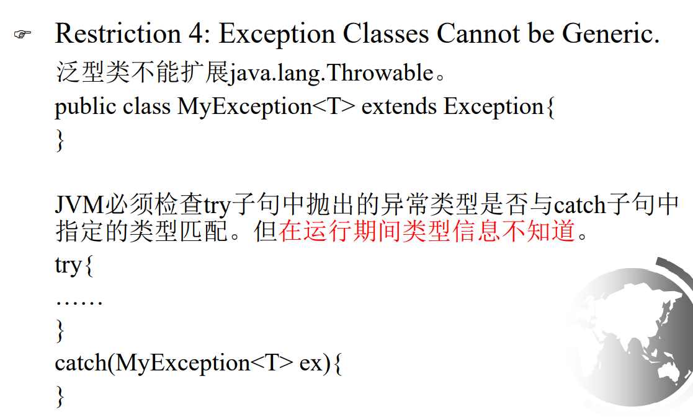


##### 4.6 Collection 框架

- Java的一系列范型容器，主要支持的类型是集合、列表和映射

  - 其中Set和List是Collection接口的子接口，set是内容无序的，而list是有序的

    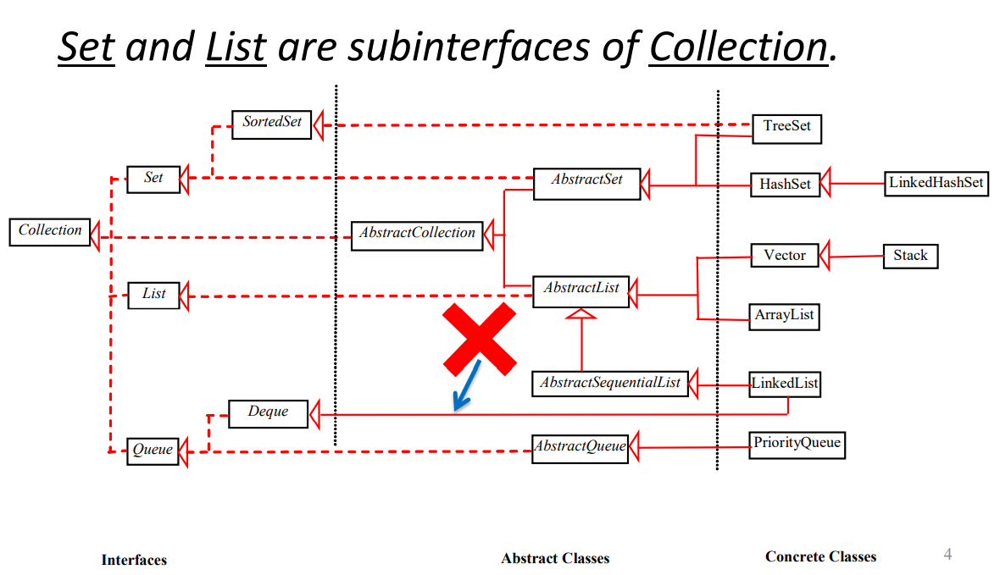

    里面打叉的先应该是虚线，即实现了接口

  - 而Map是一种key-value的映射

    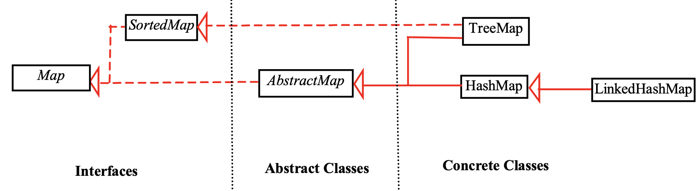

  - hashcode的使用方式：在接口中定义的hashcode是里面所有元素的映射，可以通过维护hashcode来方便对象之间进行的比较，比如equals等方法，只需要比较hashcode就可以

- LinkedHashSet相比普通的HashSet，也使用hashcode来决定元素的存储位置，并用链表维护元素的顺序，所以性能比HashSet要差

  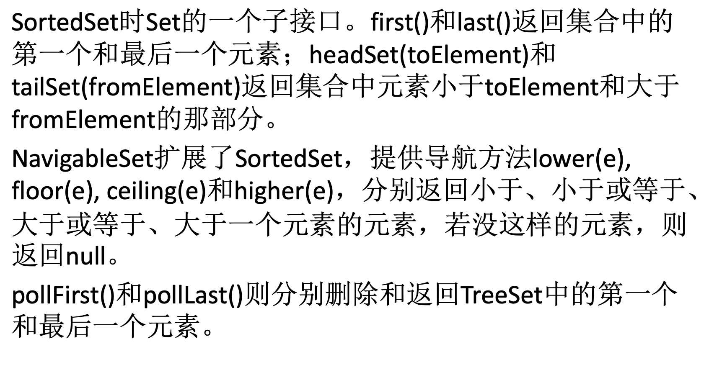

  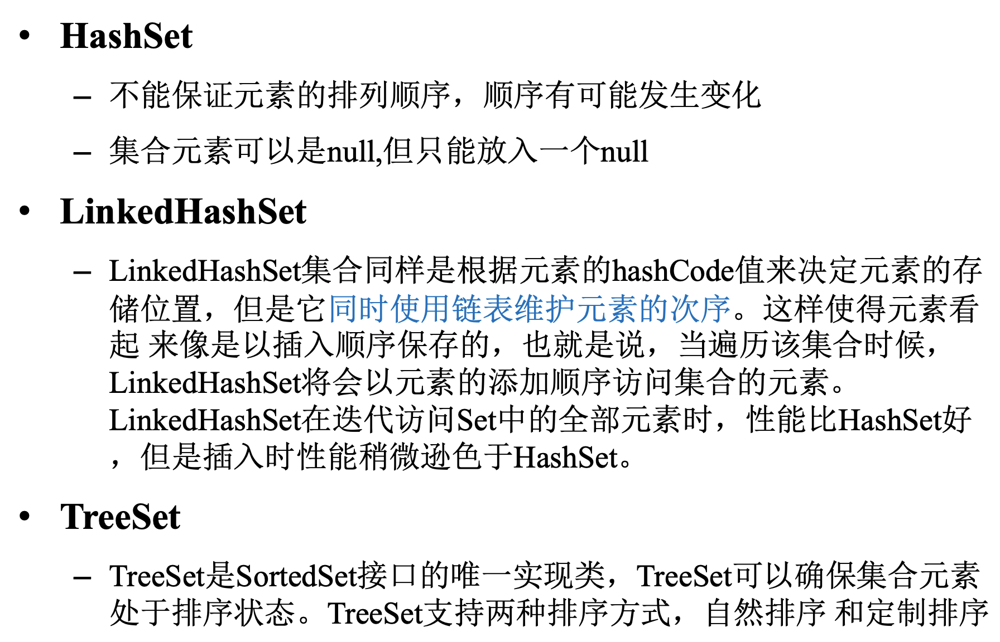

  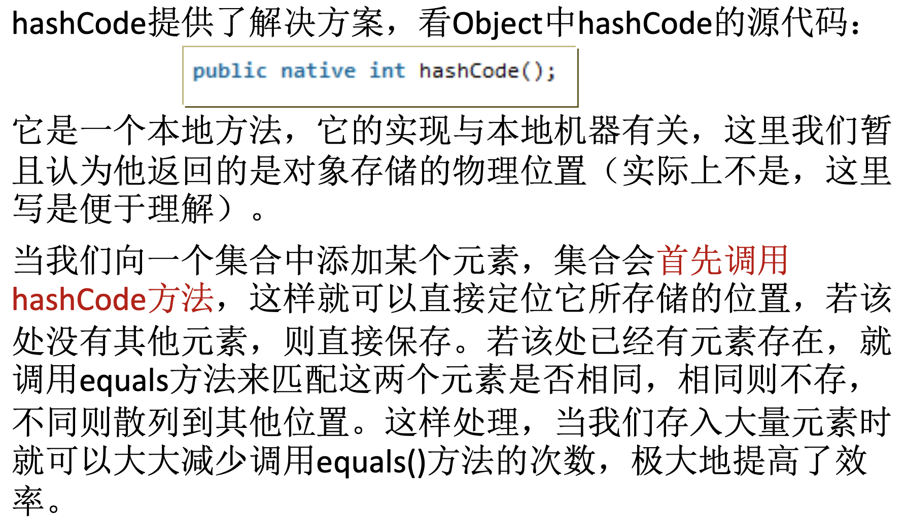

- TreeSet中排序：元素是Comparable的或者传入了一个比较器（比较器实现了`java.util.Comparator`接口，包括两个函数`compare`和`equals`）

  - 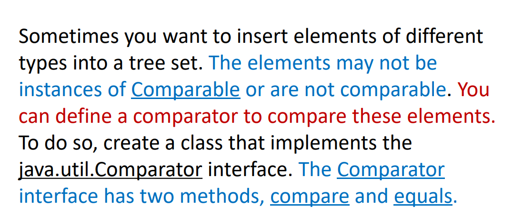

- `hashCode`和`equals`的使用

  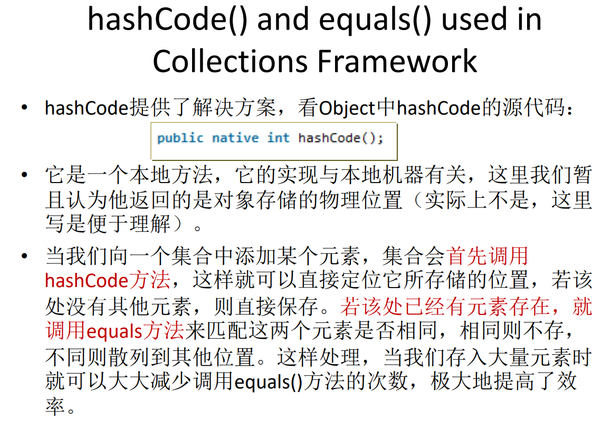

  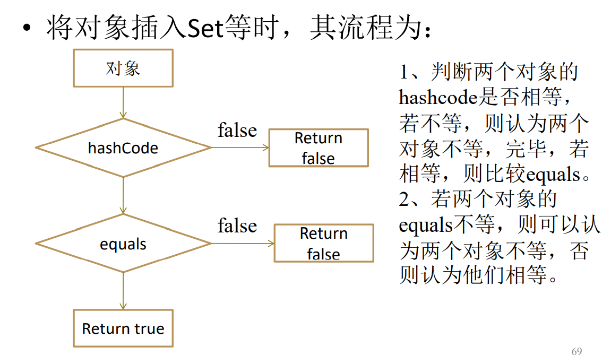

- 迭代器陷阱：迭代过程中不能发生结构上的变化，比如插入删除，否则会出问题

  - 因为迭代器是根据位置来进行的，会维护索引相关的数据，这一部分数据不能发生变化，否则会出问题

  - 不能使用容器的remove，直接用迭代器的remove

    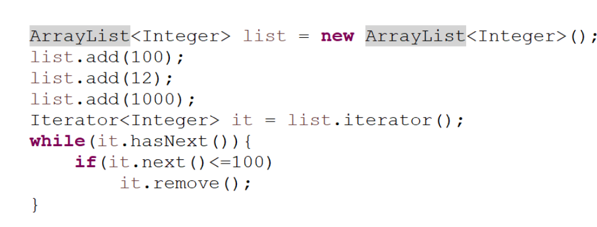

- 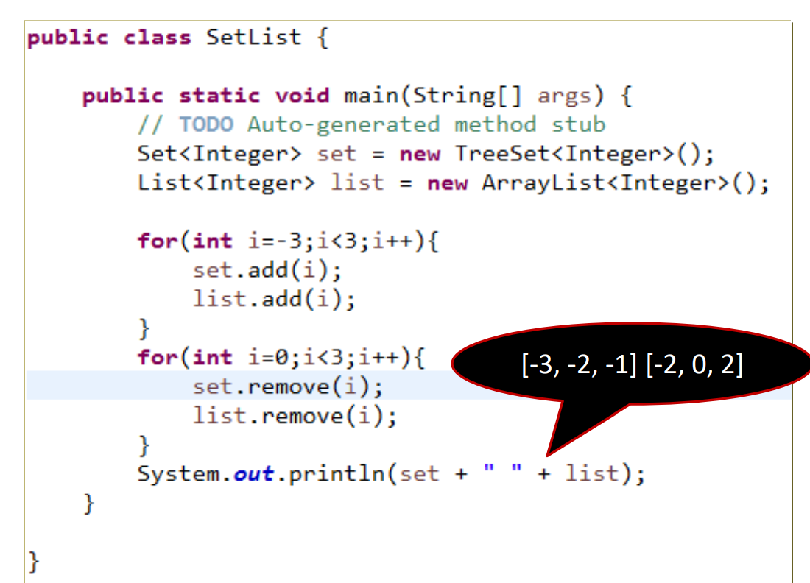

  set和list的remove不同，前者是object，后者是object或者index，注意删除一个元素之后相同index对应的元素不同了

  可以改成`list.remove((Integer)i)`

- Collection还有Vector、Stack、Queue、PriorityQueue等list结构，map。Vector和Stack是线程安全的（确保同步）。Queue的操作函数：peek、poll（Peek并remove）、offer（添加）。

- map中LinkedHashMap的排序基于访问顺序，当get之后这个元素放到最后去

- 枚举集合和枚举map

  - EnumSet提供了非常方便的方法来创建枚举集合，枚举集合中的所有元素必须都来自于单个枚举类型

- 操作函数

  - 添加：`public boolean add(E o); / public void add(int index, E element);`

  - 删除：`public boolean remove(Object o); / public E remove(int index);` 这里存在问题：容器类型可能是int

  - 获得值：`pubilc E get(int index);`

  - 大小：`size()`

  - 迭代器

    ```java
    Iterator<String> it = notes.iterator();
    while (it.hasNext()) {
        prt(it.next()); // .next()返回当前并移到下一个去
    }
    ```

  - 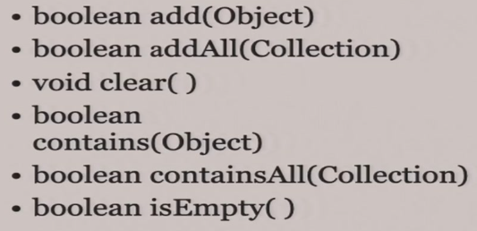

    注意`isEmpty()`性能比`size() == 0` 好

  - 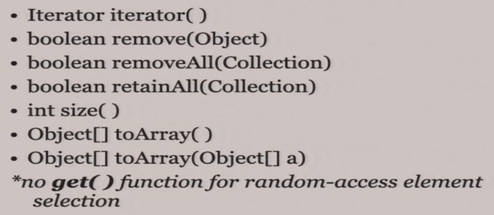

  - Map的取和放分别是`put`和`get`
  - Set的放是`add`，可以遍历但不能取下标
  - 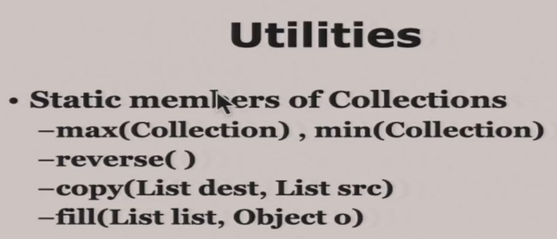

- 注意Java里面容器里放的指针

##### 4.7 File 目录系统

- Java在列文件的时候可以加上条件Filter，原理类似如下

  ```java
  // OOP解决方案
  class File {
      abstract boolean accept(file f);
      String[] list() {
          ArrayList<String> result = new ArrayList<String>();
          for (file f : dir) {
              if (accept(f)) { // Filter
                  result.add(f.getName());
              }
          }
          return result.toArray();
      }
  }
  
  class MyFile extends File {
      boolean accept(file f) {
      	...; // 之后可以用MyFile来代替File做Filter    
      }
  }
  
  // Java解决方案
  class File {
      String[] list(DirFilter df) {
          ArrayList<String> result = new ArrayList<String>();
          for (file f : dir) {
              if (df.accept(f)) { // Filter
                  result.add(f.getName());
              }
          }
          return result.toArray();
      }
  }
  ```

- 样例代码：

  ```java
  File path = new File(".");
  String[] list;
  if (args.length == 0)
      list = path.list();
  else
      list = path.list(new DirFilter(args[0]));
  ```

- 打开压缩文件`BufferedOutputStream out = new BufferedOutputStream(new GZIPOutputStream(new FileOutputStream("test.gz")))`

- JAR包

  - jar文件就是gzip，里面有class目录和manifest文件，manifest里指出main函数所在的类
    - 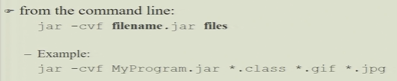
    - 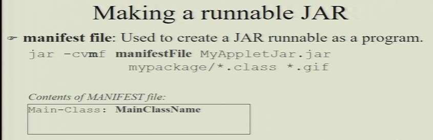
    - 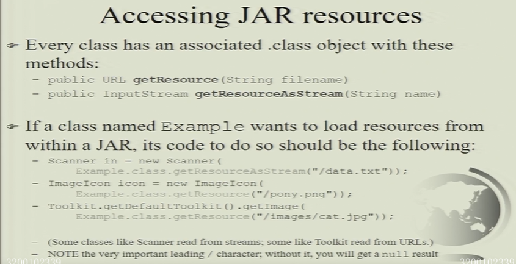
  - `java Hello`和`javaw Hello`的区别是后者新开一个进程
  - 执行`java -jar hello.jar`

- 打开文件抛异常

  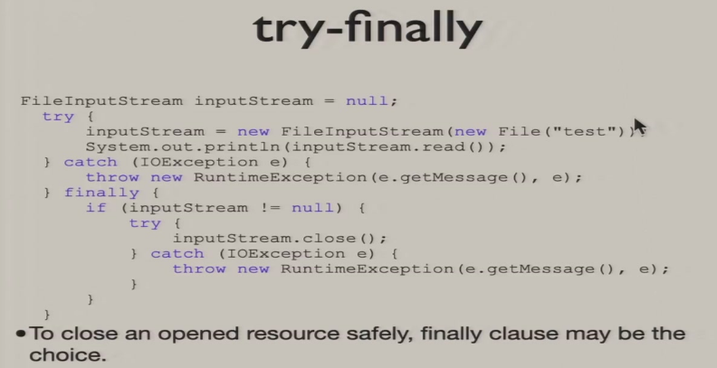

  更好的写法：会自动调用`close`，但是需要实现`AutoCloseable`接口

  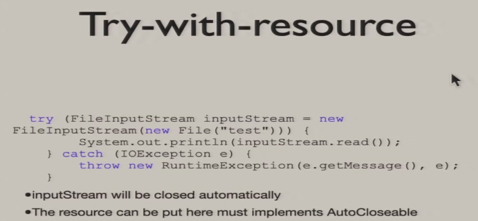

  再升级：

  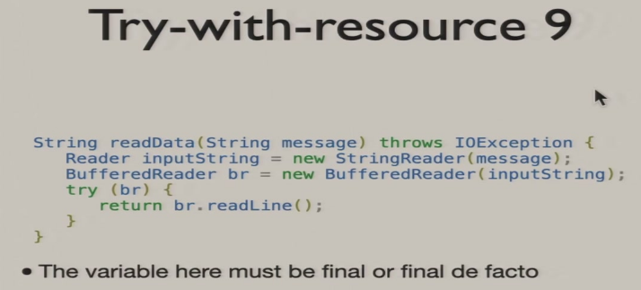

  

