# 中国古代玉器

[TOC]

## 绪论（记的比较差）

### 评分标准

解说：词1000，PPT，家乡的玉器，组内两个人

飞花令：与玉相关的东西

### 玉的定义

玉材：广义：石之美者；狭义：特指玉（和田玉、蓝田玉等）

玉器：古玉：古董的价值，造型的美，礼制的含义；今玉：装饰性，材质的珍贵

#### 玉材

（田黄石、鸡血石一般不被称为玉，主要用做印章）

阳起石（类似翠玉）和翡翠不是一个概念，我们古代意义的玉是闪玉。翡翠才能赌石，外面有石皮。

注意：玛瑙的硬度不稳定，有软有硬

最常见的是岫岩玉。青海玉是08年奥运会后兴起的，又称昆仑玉。古代中原地区常用蓝田玉、独山玉，材质较差。

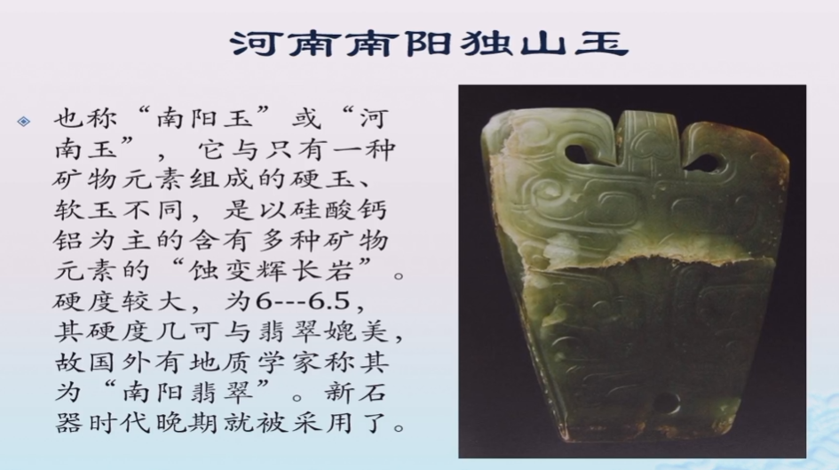

#### 玉器

最早发现的玉器：小孤山玉石片

成熟的玉器：新石器早期

下面大约是公元前6000年

最早的成熟玉器（公元前7000年）：砂绳锯石

注：考古学文化有特定含义，考古发现中属于同一时代同一族群具有比较一致的遗物的聚合体（见物不见人）

### 玉字

和“王”字的区别是“玉”三横一致

王者使用的有纹饰的器物

黄玉比较稀有

### 玉的光泽

- 透明度
  - 影响因素：光源的强弱、玉石的厚度、玉石对光线的吸收能力
  - 四个等级：透明、半透明、微透明、不透明
- 亮度
  - 灿光（钻石）、灼光（红宝石）、闪光（一般软玉）、弱光（硬度较低的软玉）

## 新石器时代

- 小孤山
  - 玉石片：不是专门使用玉器

### 新石器时代早期——产生期

#### 辽河流域

- 小南山遗址——黑龙江饶河

  - 玉璧：半径不到一半是璧，超过一半是环。正面孔大，背面孔小，两边钻。侧面有线割的痕迹，对圆柱形切割

  - 玉管、玉珠

  - 已经对材料有了概念

  - 玉玦：玉环缺了口，可以做耳环，但慢慢变成礼器等，

  - 玉坠：说明玉器脱离了生产生活用具的地位，变成形而上的用具

  - 玉璧、玉管

  - 玉环：出现断裂之后打孔，变成了饰品，可能是意外形成

  - 玉珠与玉斧：一定是加工形成，玉斧锯齿状、可能有功能性

  - 补：六器图

    

- 兴隆洼文化

  - 玉匕：功能存疑
  - 玉锛：痕迹是绑绳产生或者是二次加工未完成留下的，有使用性
  - 玉玦：不是实用器，经常在墓地脑侧或者眼窝中发现，仪式性，表明墓主人的地位（如祭祀等）
  - 管状玉玦：成对出现，可能是配饰，发现了加工原始状态的玉玦
  - 弯条形器：串饰

- 查海遗址
  - 管状玉珠：查海遗址出土的玉器比兴隆洼少一点（两者是相近时代的），不同与兴隆洼的最大特点是在查海遗址出现了**石塑堆龙**（辽河流域出现图腾文化的造型，龙型图腾最早的实物证据）

#### 长江下游流域

- 河姆渡（数量少、器型少）
  - 玉玦：出土一个没有锯透的玉玦，有人认为可能就是成品，大部分人认为是半成品
  - 玉璜：半环型，两头钻孔，与后世的玉璜已经接近了，相当于环状物断裂之后出现一对玉璜
  - 玉管：装饰性

### 使用玉器的原因

- 玉器自身的精美
- 玉器的坚固特性
- 玉器的绝对价值
- 物以稀为贵

### 新石器时代中期——发展期

**查一下考古学文化相关的内容**

长江中下游遗址众多，收集材料便利、文化原因

珠江流域也出现使用

#### 辽河流域

- **红山文化**（辽河文化以赤峰为中心）
  - 以石器为主，玉可能是偶然得到，但红山人对玉已经有辨识能力
  - 玉石斧：存在争议，质地比其他的好一些，被称为玉无可厚非
  - 玉石纺轮：最早是**陶制**的
  - 玉璧：圆角方形，肉（有玉的部分）和孔，一般两者的半径比是4:1，而这个是1:1，后世大的玉璧使用方法是双手握着，这个小一点（上面会钻两个小孔）的使用方式可能是**挂饰**（发现了一个有绳挂着的痕迹的玉璧）
  - 联璧：后世人起名，多个玉璧连在一起。造型不对称，直接从一个玉璧的孔里穿绳做挂饰，可能是**身份**的象征
  - 辽东文化和胶东文化交流丰富，文化有形式性
  - 玉环：特别圆，出现了**专门的玉石手工业者**，也说明玉器的地位，同时发现玉环有断裂处（没有强烈的**修复痕迹**）可能就产生玉璜
  - 玉璜：对玉璜的造型有了自己的认知，双兽首型，顶部钻孔，佩戴方式弯弯向上（玉heng？未来佩戴方式也是礼制的一部分）
  - 异形玉器
  - 龟鳖：表现形而上思想的成熟，鳖背甲薄且小、缩回去脖子不能完全保护、背甲光滑、四肢更长一点。希望获得**长寿**，有更多经验和对事物的认知，**德高望重**。
  - 玉猪龙：早期兽首的形态像猪（学者认为可能是熊）、鬃毛可能像马、弯曲的造型可能是玦演变而来或者是蛇（灵活、智慧），龙是多种动物好的特性的结合，兽型玦，可能是祭司神职人员**神权**的象征（配腰间，大小适中）
  - 勾云形器：模仿自然现象，可能是**统治权**的象征
  - 墓葬：头部两侧两个玉璧，手腕上玉环，手的位置是两只龟，腰间是勾云形器或者玉猪龙，说明这两种可能是**身份**的象征
  - 兽首器：对玉器的使用有非常成熟的制度，**礼制**的雏形
  - 总结：生产用品、装饰用品、礼制用品，数量多、规模大、材质好、工艺精、造型美，选玉用玉的高标准。精神层面：通神通祖先。
  - 红山文化中祭坛和墓葬放在一起，墓葬中发现人偶，通神通祖先放在同等地位，**祭祀**文化很成熟

#### 长江流域

- 马家浜文化（与良渚、河姆渡没有文化承继关系）——上海
  - 玉璜：不再是玉环、玉璧破损之后形成的，形状不是太圆，专门制作的器型。锯齿边可能是模仿蚕，也可能只是破损
  - 玉环
  - 玉玦：装饰器主要部分，与辽河流域差不多，需求更大，制作相对简单。
- 崧泽文化（承继马家浜，“改朝换代”）——上海
  - 玉璧：厚，早期装饰性，此时功能不确定
  - 玉钺：类似于生产工具，斧和钺的区别是前者功能性比较高（生产、兵器），后者象征兵权，比较进步的礼制观念
  - 玉璜：造型多样，有环形得来也有专门制作，可能是表明身份的标志
  - 玉玦：可能是耳环，玉扳指可能会干扰生产。非常标准。
  - 玉饰与葬玉：墓葬中人口中，特殊仪式使用，引领后世玉器的使用
- 北阴阳营——南京
  - 比上述两个文化比较晚，而且玉器突然成熟
  - 玉玦：开口小，尺寸大，可能不是耳饰
  - 环形玉璜：个性化，不像崧泽，可能是其他器物的改造，但是还是有设计感
  - 特殊玉璜：周边有锯齿
  - **串饰**：一组
- 薛家岗——安徽
  - 器型更多
  - 玉斧：使用痕迹更多
  - 玉璜：类似北阴阳营
  - 特殊玉璜：在北阴阳营基础上有了更多的装饰性的表达
- 大溪文化——重庆（长江中游）
  - 玉玦：发现了**修补**的痕迹
  - 玉璜：也有修复，体现对形状完整性的执念
  - 玉环：修补
  - 玉人面纹饰：最早用玉器表现人面，文明进步的标志，通神之器的源头
- 屈家岭文化——湖北（中游）
  - 对后世玉器文化有先导性
  - 玉锛：工具存疑
  - 玉钺
  - 玉璇玑：出牙的玉环
  - 玉璜：类似大溪，有修补文化

#### 黄河流域

- 仰韶文化（黄河中游）
  - 发达的文化，但是玉器使用非常少，甚至逊于彩陶（偶发性）
  - 玉斧
  - 玉刀
  - 玉玦、玉璜：外来文化的影响，可能是交易得到
  - 玉饰、玉镯：解离度比较高，对材料不是很重视
- 大汶口文化——山东（黄河下游）
  - 比起中游，对玉器的材料选择、使用有自己的认知
  - 玉铲：和玉钺、玉斧比较造型比较类似，有明显的使用痕迹
  - 玉璧、玉环：惊喜加工，对自然界的拟态，赋予神器、礼器的含义，沟通日月
  - 玉镯：用途并不确定，考古学简报中定名常常会有不同
  - 联璧：是不是收到**红山**的影响？存疑。红山的联璧一般是竖直（挂饰），大汶口是横着的（配饰）。可能会有礼制的表达作用。
  - 牙璧：类似于璇玑。红山文化的玉器发展到了更高的阶段
  - 玉人面饰：面部细节的夸大可能是对特异功能的向往。这里都做了特异化的表现，可能是早期神明的形象。
  - 玉坠：实际功能存疑
  - 鞍形器
  - 玉管：口部有阶梯形，组合功能存疑

### 新石器时代晚期——高峰期

#### 长江流域

- 凌家滩遗址——安徽（主要是晚期）*百度一下
  - 大量玉器，可能是祭坛、墓葬、玉器存储地等特殊地点，基本没有实用器
  - 玉斧、玉锛
  - 玉璧：对日月崇拜比较明显，与黄河、辽河不太一样。钻孔方式和其他不一样，使用或佩戴方法存疑
  - 玉玦：非装饰性，组合器，表达某种仪式
  - 玉璜：继承北阴阳营、薛家岗，有兽首、锯齿、出牙等，专门制作，在南京周边受到很大重视
  - 玉镯：箍状，也有两个玉璜连在一起，装饰性更强一些
  - 发笄、玉勺
  - **玉版**、玉鹰：与玄学相关，精神生活的极大丰富。鹰翅膀加上兽头，超人类的功能
  - 玉龙：独特性，龙的来源可能是鳄鱼、扬子鳄
  - 玉猪：写意
  - 玉人：五官夸大
  - **玉龟**：对龟长寿的认知，玉板夹在里面，能力叠加，可能是神权的象征
  - 三角形饰：造型独特，可能是冠饰、身份（世俗权力、统治者）的象征，集权演进体现文明进步
- 石家河文化（长江中游，取代了屈家岭，有时候并称屈家岭石家河文化）
  - 疑似玉纺轮
  - 玉璜：普通性使用，和长江下游的重视不同
  - 玉璧、琮：材质不太好，不是礼制器物
  - **人头形饰**：除了陶器之外，这种比较多，大眼大耳类似三星堆（古蜀文化一脉相承）
  - 玉蝉：认为其能死而复生
  - 玉虎：可能是某种大型猫科动物，意味着力量
  - 玉龙、玉凤
  - 玉鹰、玉凤：写实的鹰，凤可能是来自鹰
  - 玉笄
  - 玉柄形器：可能是组合器，用途存疑
  - 玉喇叭形器：除了玉器还有陶器制成，可以连接起来，可能是仪式用器
- 良渚文化
  - 最重要的玉器：玉璧、玉钺、玉琮
  - 反山：墓葬区；瑶山：祭祀区、墓葬区
  - 玉璧：祭天的礼器或者财富的象征
  - 玉钺：军事指挥权的象征，起源于崧泽文化的石钺，高度集权的象征。发现了良渚族徽的兽面神人纹，阳刻和阴刻结合，神人抱着兽面，人掌控了自然的力量。军权和统治权的统一，王权的出现，甚至一部分拥有神权
  - 玉琮：兽面纹，族徽的简化，单层或者多层，有定制规范
  - 三叉形器：冠饰的部分，从素面到复杂纹饰的演进历史过程
  - 玉冠：又称玉梳背

#### 黄河流域

黄河流域不如长江、辽河，主要是好的玉材矿脉不多。更注重彩陶。

- 龙山文化（黄河下游）
  - 大玉刀：与石刀等区别并不大，所以对材质不敏感。龙山文化晚期有材料挑选
  - 玉钺：两孔，可能与使用方式有关可能有特殊的含义
  - 玉铲：可能是实用器
  - 玉锛：有花纹少见，是否是龙山存疑，孤品，各个区域之间的交流已经很常见
  - 牙璧（璇玑）：装饰品
  - 玉琮：文化间交流频繁，可能就是良渚的，可能是仿制良渚
  - 玉璧和玉玦：规整，装饰性较强，与社会地位无关，和财富相关。比较厚重，不是日常戴的耳环，类似于储存黄金，一般等价物
  - 玉簪、组合式玉簪：极具装饰性，可能此时对玉的价值有了更深的认识，也有人认为可能不是龙山文化，因为龙山文化的陶器是以造型取胜，简朴纯粹，和玉簪的繁缛纹饰相悖。但是陶器大部分是权贵墓中，玉器可能只是财富的表现，有钱就能做的更好，此时玉器和礼制还不挂钩
  - 牙璋：这种造型到了夏代成为礼器，且分布广泛。璋出土主要是夏晚期到商，源头可能是龙山文化。新石器晚期，长江中游和下游交往频繁（战争）
- 齐家文化（黄河上游）
  - 西北地区有玉矿，但是比起长江流域质量略逊色，齐家比其他文化用玉多
  - 礼器的玉材较差，没有成熟的用玉文化，玉器当石器用
  - 玉铲
  - 玉斧：无孔的玉斧只能说是斧型器，但是有使用痕迹
  - 玉锛：厚重
  - 玉刀：使用痕迹明显，受中下游影响
  - 玉凿
  - 玉钺
  - 玉璧
  - 三阙玉璧：独特的器型，类似于三璜组成的玉璧（双璜组成的一般是断裂之后修复），装饰性和实用性的结合。材质不是太好。
  - 玉璜
  - 玉环
  - 玉琮：只能说是琮型物，可能是仿制品
  - 玉箍形器：最特殊的装饰品，材质最好，但是和身份无关，大概是和财富相关
  - 玉管形器：出土的位置比较固定，可能是身份的象征

#### 台湾地区

- 卑南文化
  - 玉玦：特色
  - 双人顶兽形玦、单人顶兽、多人顶兽：可能是耳饰或配饰

## 三代玉器

### 夏代

断代的依据：二里头文化，没有发现成体系的文字，西方不认可夏王朝

- 二里头文化

  - 可能重视六器中的几种

  - 玉圭：圭的作用存疑。周代圭的地位非常显赫，但是夏代**出土很少**，在大型墓葬里就更少了。像笏板，宋人认为是古代人的重器，但不太正确。

    

  - 玉璋（牙璋）：最早出现在岭南地区（香港），后来大量出现在中原地区（夏朝用王制影响周边），但是商代之后比较少（可能是商人有自己的礼制用器，且商代非戎即祀导致对周围影响较小）。染上朱砂（山顶洞人时期就有使用），仪式用器（可能是葬礼或祭祀），说明身份相对高贵——普遍认为是**真正的礼制用器**。三星堆（晚商）中牙璋是重要的礼器，而三星堆的玉器和同时代的玉器没有相似性，因此可能是夏人被商人驱逐出富饶中原之后到三星堆

    

  - 玉璧戚：四边韧，带牙，可能也是礼制用具象征财富与军权

    

  - 柄形器：权杖的地位？三星堆、金沙遗址出现金制权杖，说明商代有使用权杖的概念，但是能否影响夏代人用玉存疑。类似鞭或剑，可能是早期长江中游器型的继承，到商代大量出现取代了夏代的玉璋，地位被提高了。

    

  - 玉钺：应该不是玉璧改造，继承新石器时代晚期的影响，如良渚

    

  - 玉戈：不是实用器，可能是装饰玉器

    

  - 玉刀：装饰or仪式。青铜器能提高生产力，所以玉器逐渐退出实用器领域；同时金属器的进步使得玉器制作变得更加方便，夏晚期开始玉器开始大量使用，使用玉的地位也开始下降

    

  - 玉铲：其材质是否符合当时人认定的玉存疑。玉石的分野很细，纯色的玉地位较高，右边的较低变成了实用器

    

  - 玉镯或者玉管：绿松石材质占很大比例

    

  - 玉铃舌：玉器和青铜器相结合

    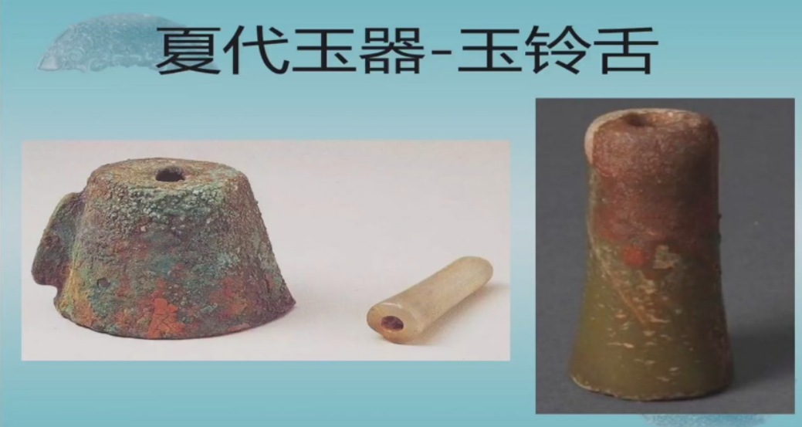

  - 月牙形器、玉箍

    

  - 绿松石镶嵌牌：金玉共振，纹饰是兽面纹（青铜器的常用纹饰），绿松石扮演锦上添花的作用

    

  - 绿松石龙型器：纹饰不是青铜器常见纹饰，且主体是用绿松石构成的。龙形象从辽河向中原推进。

    

    

  - 总结特点

    - 制玉工艺进步，器型优美，制作精良
    - 突出玉兵的现象
    - 礼玉文化形成的开始

### 商代

玉主要是装饰性和象征性器物，礼制用器是甲骨和**青铜器**，玉器地位不如青铜器

对夏代礼器继承不多，没有发现牙璋；对夏代玉兵器的继承比较多

历史划分：先商、早商、中商（妇好）、晚商

玉器历史划分：在盘庚迁殷之前为早商，之后为晚商

- 妇好墓
  
  
  
  - 大型墓葬有墓道：亚字墓、中字墓、甲字墓，但是妇好墓的等级比较低（没有墓道），是中型墓葬，虽然里面有大量玉器等——[千奇百怪:古代墓葬形式识别指南|砖室墓|墓室|木椁|土坑_网易新闻 (163.com)](https://www.163.com/news/article/E3F8M0BG000187UE.html)
  
  - 少量玉琮：猜测可能是当时的传世品，有素面有兽面纹，纹饰出现蝉纹，神圣性被抹除了，主要是装饰性作用。小型玉琮大量出现，出现在脑后，跌落神坛，成为发箍
  
  - 玉圭：商代没有形成礼器，原因：早商礼器造型不统一，晚商相对统一但是数量太少（可能在当时没有规范商文化，之后影响周文化）
  
    
  
  - 玉璧：出现内廓凸起的玉璧，出现条纹的玉璧（周代兴起），商人更重视甲骨和青铜器。
  
    
  
  - 玉璇玑：下图左边使用痕迹明显，长期挂饰（身份的象征，宗祠梁上悬挂），扉棱
  
    
  
  - 玉环：出现内廓的突棱
  
  - 玉璜：三代中没有发现用作礼器的情况，一般是装饰性，可能是组合器。出现下图鱼形或者是龙形的璜。开孔的位置不同使用方式是不同的。墓葬中出现撒冥器的情况，有人认为可能不开孔的就是冥器。动物造型的玉器在殷墟（晚商）大量出现，写实性的玉器体现玉器装饰性变强。有突棱是商代玉器的特点。
  
    
  
    
  
  - 玉玦：头上带角是奎龙（？）来自辽河流域的影响
  
  - 玉簋gui：仿商代常见青铜器，陶器（非常多）——青铜器（非常多）——玉器（一两件），纹饰也是青铜器上的常见纹饰。臣字目（“臣”字旋转90度）。非常袖珍，与巨大的青铜器趋势相悖。
  
    
  
  - 玉盘
  
    
  
  - 玉戈：制作精良，没有使用痕迹，彰显女将身份的随葬品，更多的是装饰品
  
    
  
  - 玉钺
  
    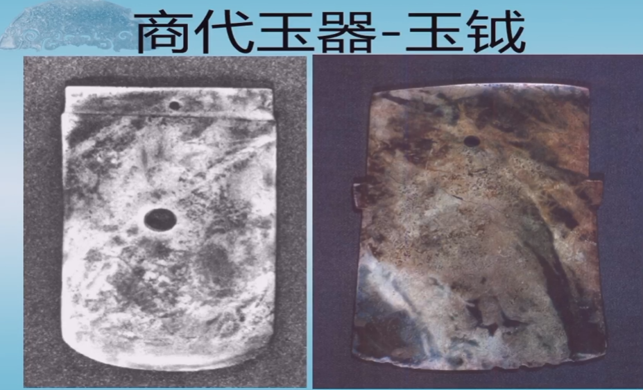
  
  - 大玉刀：比较典型的是龙山文化（流行多孔玉刀）。商代多孔比较少，多是仿青铜器，不一定是实用器
  
    
  
  - 玉斧：青铜器花纹的器型在商代很有可能是具有一些特殊地位的。良渚是自己的兽面纹，龙山文化也是玉器独有的兽面，而商代玉器的兽面是来自于青铜器的兽面（从礼器的青铜器转到玉器上）。但是这种器型并不是在每个墓葬中都有，可能是墓葬主人身边的人做的。商代高级墓葬大部分已经被盗了，所以带兽面纹的玉器是不是礼器存疑
  
    
  
  - 玉凿与玉锛：很可能就是当做工具使用的
  
    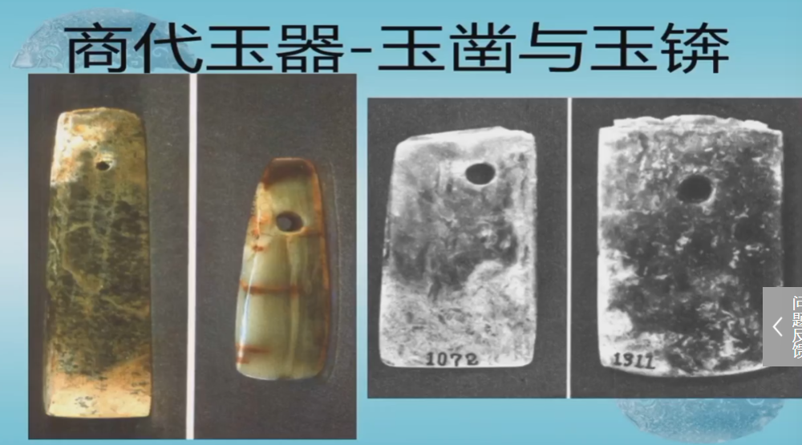
  
  - 玉铲：工具，商人眼里玉器并不是很重要
  
    
  
  - 玉镰刀和纺轮
  
    
  
  - 玉刀：仿青铜器。带齿可能是仿兵器，素面可能是仿工具
  
    
  
  - 玉梯形刀：兽面仿青铜器，梯形和实用器造型相同
  
    
  
  - 动物形玉刻刀：一说为把玩件，鸟的造型被认为是鹦鹉（妇好墓中出现了大量鸟形器件，除了凤之外很多像鹦鹉）。鹦鹉生活在热带，可能和当时气候或者进贡有关
  
    
  
  - 玉刻刀和玉锥：玉的材质不适合用作刻刀，暂时解释不清楚
  
    
  
  - 玉器柄与铲形器：带有青铜器兽面（倒目字眼睛）的玉器很可能是玉礼器的角色，但是还需要进一步研究
  
    
  
  - 玉臼和玉杵
  
    
  
  - 玉调色盘？
  
    
  
  - 玉梳
  
    
  
  - 玉匕
  
    
  
  - 玉耳勺
  
    
  
  - 玉人：典型有6件，都不大，卷云纹，玉人身份争议很大。第一个穿着衣服，可能来自山东地区的九夷；第二个没有穿衣服，可能是来自周边被征服国家，可能是来自南方，断发纹身；第三个不像中原人（颧骨很高，眼窝很深），上身赤裸，下身用布兜着，可能来自西北地区；第四个可能是来自西南地区（云贵川地区），有点牵强。可能是殉葬品（商代有人殉的恶习）
  
    
  
    
  
    
  
    
  
    
  
    
  
    
  
  - 双面玉人：一面男性一面女性；左边男性肌肉更发达一些；男性刻画出腹肌；男性手放在胯部，女性放在小腹。可能是某种仪式用器
  
    
  
  - 片状玉人：高冠，三星堆的铜人也有高冠，一般被认为是祭司，可能是身份牌或者是插在某件器物上的组合器
  
    
  
  - 玉人头：发髻和刚刚的玉人比较像，代表妇好的武功，敌人的首级
  
    
  
  - 玉龙：鳄形龙和蛇形龙都有，前者更多一些，龙图腾融合的趋势
  
    
  
    
  
    
  
  - 玉龙、怪鸟（可能仿猫头鹰的形象）：商人的图腾可能是鸮，后代认为鸮是不详的
  
    
  
  - 怪鸟：商代之后凤鸟的形象越来越高，逐渐将不同鸟的特性结合在一起变成了凤凰
  
    
  
  - 玉虎：青铜器就有虎的形象，玉器受青铜器的影响，可能是受气候原因虎多，也可能是征服南方的时候找到了很多虎
  
    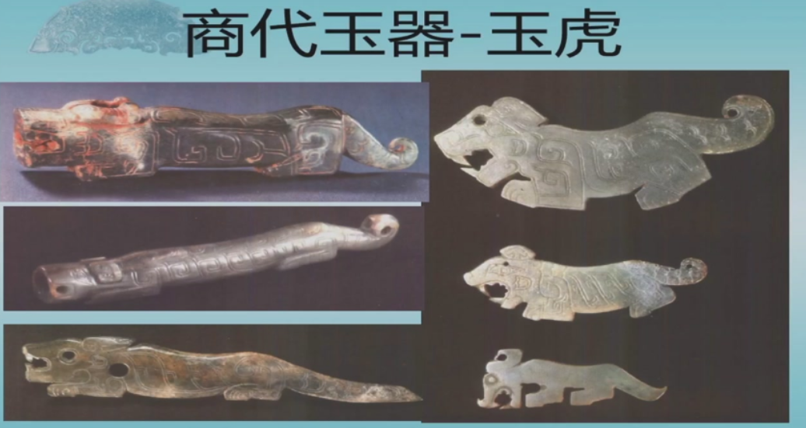
  
  - 玉象
  
    
  
  - 玉熊
  
    
  
  - 鱼和马：鱼带角可能是鱼龙
  
    
  
  - 玉凤：商代鸮的地位更高，此时凤还是发展的过程，完全发展是在周代（他们用凤来替代鸮的地位）。中高等级墓中出现了鹦鹉，猜测鹦鹉是仅次于鸮的鸟类，并且是深受底层人民的欢迎，可能当时能看到鹦鹉，或者鹦鹉比鸮好看。
  
    
  
  - 玉鹦鹉：头上戴装饰，地位可能不一般
  
    
  
  - 双头鹦鹉、兽面
  
    
  
  - 玉鹅
  
    
  
  - 玉鹤与玉鹰
  
    
  
  - 
  
  - 
  
  - 
  
  -  
  
  - 
  
  - 
  
  - 
  
  - 玉韘she（扳指）：防止射箭的时候磕伤手指。身份地位的象征，兽面
  
    

### 夏代牙璋与商代柄形器

**玉柄形器**：可能是商代礼器和仪式用器。

花地嘴是夏代前期，没有牙也没有明显的扉棱，最早的形态。东龙山也是夏早期，出现扉棱。二里头三期是夏繁盛器。四期（夏商之际）成熟。望京楼和四期相近。

陈村进入商代，韧部被处理掉，二次处理。安阳小屯M5（妇好墓）出现了璋形器部分。月河左庄村无韧部。晋国盟誓遗址大概看出牙璋形状。大范庄遗址（夏商周）被发现改造情况。上万家沟遗址类似二里头四期。

下面都是山东地区发现，在核心区域河南地区的牙璋都有被改造痕迹

下面是周边地区。石峁遗址出现了很多牙璋，制作变化很大。汪家屋强调刀韧的部分。

月亮湾属于三星堆，年代进入商代，但是古蜀文明中牙璋的形状非常规整。高骈乡三星堆商晚被改造。三星堆出土大量制作精良的牙璋，突出扉棱和牙的特征

21特异化加上神鸟，可见牙璋的地位。金沙承袭古蜀文明，已经到周代，但是牙璋依然大量出现并且规整。

南方地区（两广、珠江以东）：香港大湾、福建虎林山、福建眉力、越南维仁。商周，中原不使用，而周边地区使用更多

金沙遗址出现用铜做的牙璋，青铜的地位更高

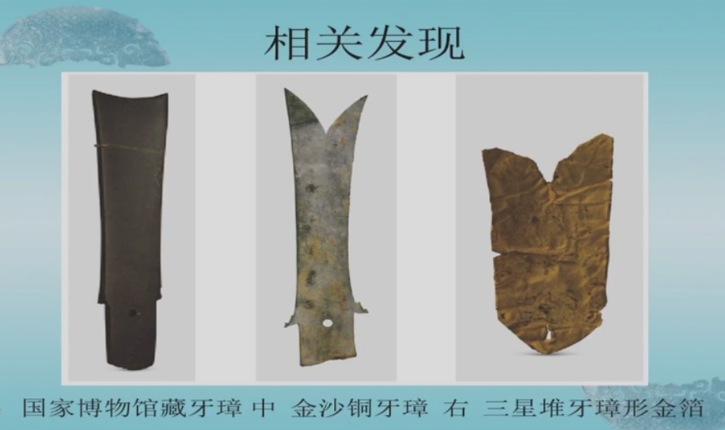

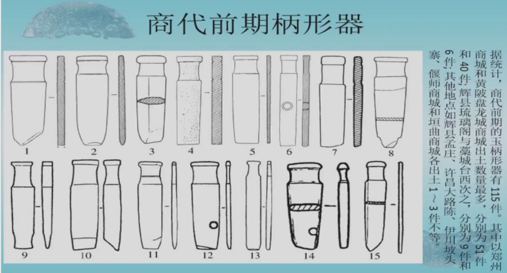

我们判断这个字为瓒，我们认为玉柄形器为瓒：玉柄形器插入箍中

祼guan瓒、鬯chang

以玉为食

### 周代

在周代，玉器被大量地应用到礼制中

西周文化统一，而到东周春秋礼崩乐坏，地方文化替代周文化

周代奴隶制达到顶峰，在墓葬中出现明显的阶级对立和分化

墓葬分成：诸侯王朝大夫及其配偶，列国大夫及其配偶，士及其配偶，庶民及以下（发现了周天子的墓葬但是盗扰严重没有办法分级）

区分：墓葬的规模，礼器的制度（鼎、簋的数量）

玉器都已经不是实用器，装饰性强于实用性，基本是礼器

周代继承使用了商代的玉器

注意周代还是青铜文明

- 周代玉铲和玉钺

  

- 玉钺与玉戚

  

- 玉戚：扉棱是夏人的传统，出土比较少。制作精美的可能是遗物，制作粗糙的可能是仿制品

  

  

- 玉刀和玉刻刀：可能是前人产物（如璋圭等）的二次利用。如果硬度达到7的玉可以体现某些青铜刻刀的功能，也可能是个人爱好

  

- 玉兵器：用作铁器的柄首，说明铁器已经进入周代，但是铁器制作还在上层阶级使用。此时铁器已经是专门打制的，但没有大规模利用，可能是铁矿脉的限制

  

- 玉剑：剑鞘的一部分，装饰兵器

  

- 玉剑璏zhi，玉剑珌bi

  

- 耳勺

  

- 玉器的等级：实际的考古发现有时候没有《礼记》中的配置，但是当时人一直在尝试将用玉纳入礼制

  

- 玉笄：早期造型比较单调，中晚期首部出现装饰，从实用器到装饰器

  

  

  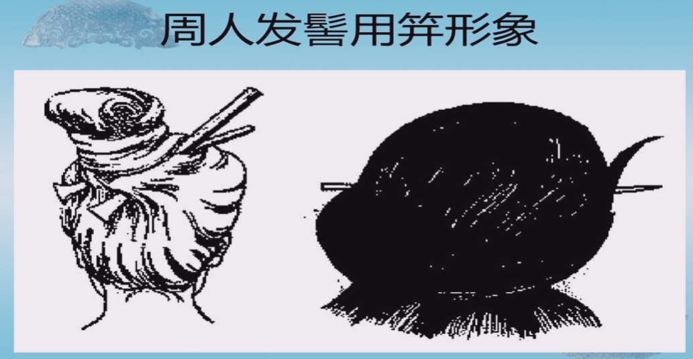

- 玉梳：齿间间距大的可能是插着做头饰，也可以固定假发

  

  

  

- 圆形有孔器（玉琮玉管等）：也常出土在头侧

  

  

  

  

  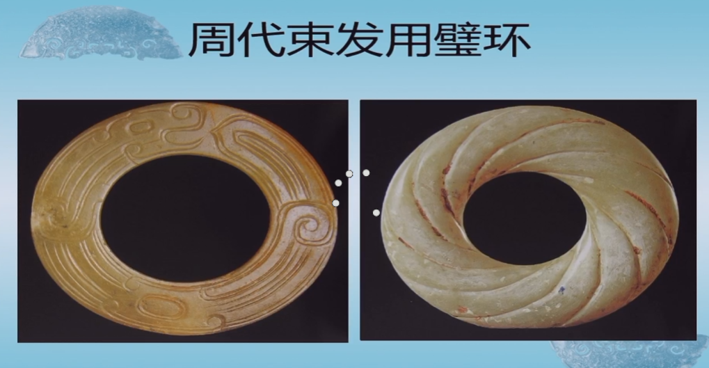

- 挂件：可能是挂帘子的饰品

  

  

  

- 玉蚕：最早的丝织品在中原地区仰韶地区出现。偏的蚕可能是食品

  

  

- 玉虎：仿青铜器的纹饰

  

  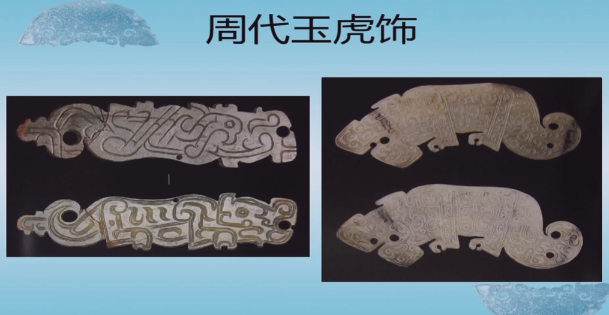

- 玉鸟：周代没有鸮和鹦鹉，可能是周代气候变冷之后动物南迁

  

  

- 项饰——以时间为序的发展，后来被称作璎珞

  - 玛瑙串珠

  - 串上海贝、蚕形——西周中期

  - 用玉排（马蹄形盾牌）和串珠

  - 亚字形玉牌

  - 龙纹玉排

  - 返璞归真变成纯串珠——西周晚期或春秋早期，转为使用玉佩

  - 注：春秋中晚期之后项饰和玉玦都不见了，有人认为可能和金器的使用有关

  - 玉组佩

    - 颈饰：璜型——春秋

    - 头饰或者耳饰

    - 腰饰（玉珩，下图右边）——战国

      

  - 带钩

- 圭——最早可能是戈转变而来

  - 戈

    

    

  - 戈后来就没有柄部，圭的形制定下来，因为玉戈和玉册（记录悼文？）同出

  - 文献中记载半圭为璋，但是只在中小型墓葬中发现了4件，因此没有可性度不高

- 柄形器

  - 上层阶级重视
  - 有明确礼器功能
  - 和商代不同，插在鞘里而不是容器中，放在墓葬中（体现了周人在使用玉柄形器的内涵发生转变）
  - 从少到多到少，从简单到复杂到简单，体现了周人继承使用柄形器但没有继承商人文化
  - 夏人发明，商人重用，周人继承并废弃

- 葬仪用玉

  - 视死如视生：将生前使用的玉器

  - 用玉保存精气来和鬼神沟通

  - 丧——葬——奠

  - 棺：放尸体，椁：外面的壳子，椁室：放随葬品，有人认为不设椁室的就是多重棺

  - 椁室外面有帛（荒帷）多重

  - 棺饰用的玉鱼、玉贝、串珠

    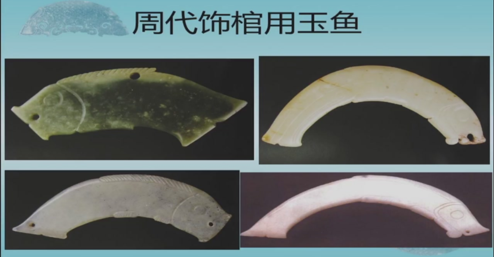

  - 玉覆面

## 秦汉玉器

### 秦代

继承西北地区齐家文化等的风格，量大粗糙不精致

- 秦玉璧与玉瑗：鼓纹，战国中晚期北方常见

  

- 秦玉剑首与剑X

  

- 秦代玉杯

  

- 秦代玉人：身份牌or代替人殉的玉牌

  

- 秦代玉虎与玉鸟：继承战国，可能是沾染了青铜器，制作粗糙

  

### 汉

- 汉代玉印：皇后之玺，都不大，上纽区分等级

  

- 黄肠题凑

  

- 玉圭：下面一张是其他玉器改的，已有定制

  

  

- 玉戈：装饰性

  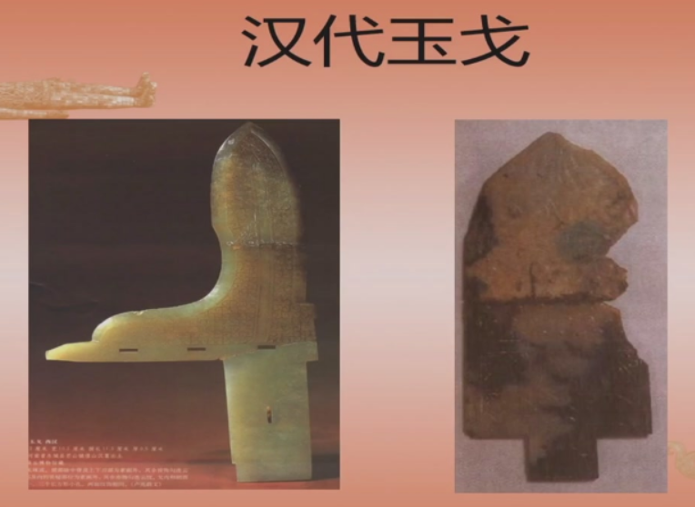

- 玉璧

  

- 玉琮与玉钺：不是礼器，只是装饰性

  

- 玉牒

  

- 玉笄和玉杯

  

  

- 玉卮

  

- 玉枕：日常生活中也用

  

- 玉带钩

  

- 玉觽xi：和带钩配套使用，将带钩挑出来（解）

  

- 玉饰铁剑

  

- 玉珩

  

- 玉环：异形环，出廓，汉代定制

  

- 玉环形佩：和生产力有关，因为开始有铁器，工具的变化

  

- 玉佩

  

  

- 玉韘：装饰性，出现了弩，不需要做太多拉弓的动作

  

- 玉舞人形佩

  

  

- 玉刚卯、严卯：辟邪

  

- 汉代玉铺首：装饰性，可能是冥器

  

- 玉胜：右侧为玉胜，发饰

  

- 棺椁上装饰有玉璧：保护精气

  

- 组玉佩

  

- 玉衣

  

  

  

​	
