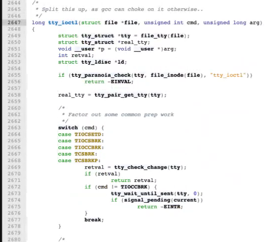
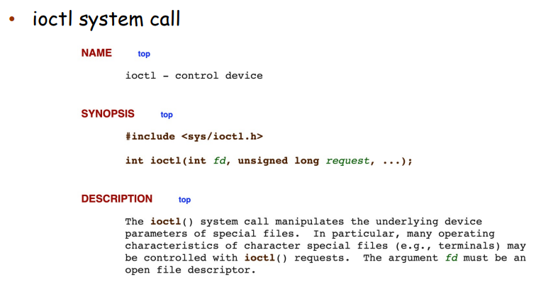
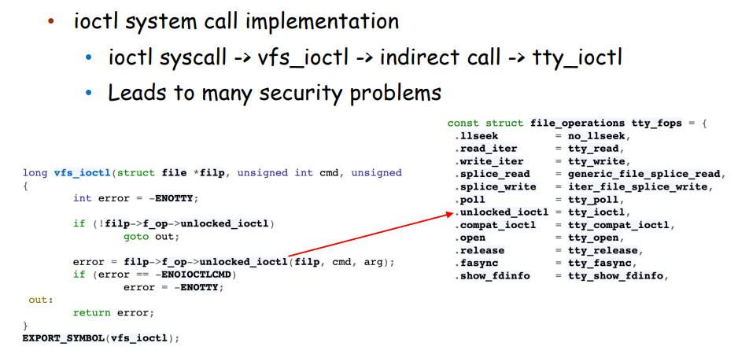

notebook2

#### 磁盘调度算法

For disk scheduling algorithm, which of the following statements are Incorrect? 

(a) SJF normally performs better than FIFO  对

(b) All algorithms only consider the seek costs 对

(c) The same technique, e.g., Elevator Algorithm(SCAN ), can be applied to SSD 

(d) Which algorithm performs better depends on the real workload 对

答案是c

### Linux文件系统

对比  s_magic  就可以知道这文件是属于哪个文件系统的. 

一个实验就是山寨一个ext2, myext2 , 把magic num 改了. 

写入的东西进行一个加密, 读出的时候解密. 

#### 磁盘调度算法

FCFS    

SSTF    Shortest-seek-time-first 找和当前磁头距离最近的磁道. 

SCAN 规定了磁头方向. 也叫电梯调度算法.

C-SCAN 快速返回到起始端. 

C-Look,  Version of C-SCAN. 到达最远端的一个请求即可.  

#### RAID

redundant array of independent disks  考过这个. 

Parity (Even) Bit

奇偶校验码

缺点:只能支持一个发生错误, 多个错误不能发现. 

优点: 计算快. 

RAID0 只做切片不做副本.  Capacity = n * min(disk sizes)   要每个磁盘容量一样不然浪费空间.

RAID 1:  reliability 最高. 一比一备份 Provides fault tolerance from disk errors and failure of all but one of the drives. Increased read performance occurs when using a multi-threaded operating system that supports split seeks, very  small performance reduction when writing. Array continues to operate so long as at least one drive is functioning.  

Capacity = min(disk sizes) ,  P(dual failure) = P(single drive)的平方 
■ RAID 2: memory-style Hamming code parity. Not really practical.   汉明码计算非常复杂

■ RAID 3: The single parity disk is a bottle-neck for writing since every write requires updating the parity data.  奇偶校验码, Capacity = min(disk sizes) * (n-1)   
■ RAID 4: Identical with RAID 3 except using block level parity. 比3更有效率 The parity disk can become a bottleneck. Large (parallel) reads and writes are good. Small write causes 4 page accesses. 
■ RAID 5: Distributed parity requires all drives but one to be present to operate; drive failure requires replacement, but the array is not destroyed by a single drive failure.  

RAID5和RAID4一样，数据以块为单位分布到各个硬盘上。RAID 5不对数据进行备份，而是把数据和与其相对应的[奇偶校验](https://baike.baidu.com/item/奇偶校验)信息存储到组成RAID5的各个磁盘上，并且奇偶校验信息和相对应的数据分别存储于不同的磁盘上。当RAID5的一个磁盘数据损坏后，利用剩下的数据和相应的奇偶校验信息去恢复被损坏的数据。

■ RAID 6: extra redundancy information to guard multiple disk failures. Capacity = min(disk sizes) * (n-2) 允许最多两个磁盘错误. 比5的开销更大. 

现实中,  

大部分用 RAID1 .最安全, 

RAID2用汉明码太复杂,  现实中不用.

RAID3 用了 parati , bottleneck , 不用

RAID5 也常用. 

RAID6太复杂, 存多个奇偶校验码, 计算慢, 也不常用. 

RAID(1+  0 )and  RAID(0+  1 )

RAID(0+  1 ) 先对数据做 RAID(0 )再做 RAID(1 )

考试不考组合.

##### 例题

Consider that many RAID devices now ship with the following options: RAID 0 - data striped across all disks
RAID 1 - each disk mirrored
RAID 5 - striped parity

Assume a system with 8 disks For each level, how much usable storage does the system receive?

RAID 0    8

RAID 1    4

RAID 5    7

Assume a workload consisting only of small writes, evenly distributed. Calculate the throughput (in request per second) assuming one disk does 100 writes/sec, 

RAID 0    800   

RAID 1    400

RAID 5    200     读一个校验码, 读另一个的校验码, 写这个, 写另一个的校验码. 所以速度只有1/4 . 如果读所有的重新计算parity 就只有1/8

MTTF is the average time that an item will function before it fails

#### Stable-Storage Implementation

CPU12%时间在计算 , 31% 在buffer pool

#### HDFS

HDFS is not designed for  : 

1. Low-latency reads, HDFS适合大吞吐量,    HBase addresses this issue 

2. large amount of small files   一般用于大于100MB的文件, 
3.  Single writer per file.    一般用于多个 writer, Writes only at the end of file, no-support for arbitrary offset

Architecture of HDFS
❻ One Namenode ❻ One Second Namenode ❻ Multiple Datanode

##### File Blocks

❻ Files are split into blocks (single unit of storage) ❻ Managed by Namenode, stored by Datanode ❻ Transparent to user
❻ Replicated across machines at load time ❻ Same block is stored on multiple machines ❻ Good for fault-tolerance and access ❻ Default replication is 3
❻ Blocks are traditionally either 64MB or 128MB ❻ Default is 64MB
❻ The motivation is to minimize the cost of seeks as compared to transfer rate ❻ 'Time to transfer' > 'Time to seek'
❻ For example, lets say – seek time = 10ms ❻ Transfer rate = 100 MB/s
❻ To achieve seek time of 1% transfer rate – Block size will need to be = 100MB


Hadoop现在更新到3.0 了

java 写的, 提供原生的java api

YARN来管理结点.  用raft 分布式协议

国外的考试是开放的, 要求你懂了然后思考,  国内就是换个数字写一写都是计算题思路都一样.

decrease the memory size below the requirements for the applications; a situation that will cause the system to start paging.

300GB  $30  ,  还有$430 ,

TLB 最小,   4096 entries , 409.6$  但是这样 内存太小.

256*20 我们需要5GB , $50 . 

3800 entries,  300GB.  内存双通道的是2的整数倍, 但是钱有限也可以不是整数倍/

## Chapter 13: I/O Systems

Polling或Interrupt

Linux中APP使用`ioctl`来和系统交互


同步和异步IO


Linux中的实现，Everything is file，device也是file。假设我们使用的device是`/dev/ptmx`，那么我们使用`ptmx_fops`来和device交互。

首先在`tty_default_fops`中给`ptmx_fops`初始化，然后给`ptmx_cdev`中的`op`成员赋值成`ptmx_fops`


`ptmx_fops`是一个`struct file_operations`，其中都是函数指针，其中我们关心`unlocked_ioctl`。这个`unlocked_ioctl`指向`tty_ioctl`。（但是如果我们不是用`/dev/ptmx`，那么我们的`unlocked_ioctl`一定不指向`tty_ioctl`，而是其他的处理函数）


`tty_ioctl`是从user space读取command。这里有很多安全问题，主要是`void __user *p`会得到user space的内容，导致会出漏洞



调用io使用syscall



vfs中调用`ioctl`



有一个PCI bus 把 graphics 控制器,  memory 控制器,  IDE disk控制器和 expansion bus interface 连起来

Device I/O Port Addresses on PCs . 

#### 内核态

用户态到内核态的三种情况

1. 用户进程执行 trap 指令,比如一个system call, trap 也叫 同步软中断.
2. 用户进程 造成一个异常, 比如除以0, access bad address. page fault等
3. 接收到interrupt 后处理器转到内核态 


用户程序系统调用-> 内核调用处理程序-> 设备驱动程序 ->硬件中断

controller 有什么东西?  

1. I/O Port Registers. 四大寄存器, data-in 设备的数据放在这里给host也就是CPU,   data-out, status 设备运行状态是繁忙还是等待, control


interrupt  

三类,  一个是 hardware  的IRQ 中断请求. 一个是 processor 的exception/trap , 一个是 软中断. 

DMA为什么可以截获 中断? 因为是通过PCI总线发送的. 

所有数据到buffer , 然后DMA告诉CPU去处理. 

DMA有 burst mode,  cycle stealing mode 和 transparent mode. 

 cycle stealing mode  每次CPUcycle 做完了跑一次DMA, 数据的读取打散了.

 transparent mode 由DMA controller 来决定每次多长时间读取. 


#### 系统调用

`strace ls` 追踪ls 的内核调用

用户调用fork -> eax=2（保存系统调用号到寄存器中） 

■ int 0x80 （触发中断，切换到内核态） 

■ 在中断向量表中查找（0x80号），执行0x80对应的中断服务程序（ system_call） 

■ 在系统调用表中找到系统调用号为2的那一项（通过之前保存的 eax=2） -> 执行系统调用（sys_fork

一个进程栈的默认大 小是1M


系统调用时把 用户态保护的信息压入内核栈,  内核执行结束, 内核栈中保护数据弹出, 恢复用户态栈.

system_call()函数实现了系统调用中断处理程序 ：

1. 它首先把系统调用号和该异常处理程序用到的所有CPU寄 存器保存到相应的栈中， SAVE_ALL 
2. 把当前进程task_struct （thread_info）结构的地址存放 在ebx中 
3. 对用户态进程传递来的系统调用号进行有效性检查。若调 用号大于或等于NR_syscalls，系统调用处理程序终止。 （sys_call_table） 
4. 若系统调用号无效，函数就把-ENOSYS值存放在栈中eax 寄存器所在的单元，再跳到ret_from_sys_call() 
5.  根据eax中所包含的系统调用号调用对应的特定服务例程

##### 系统调用中参数传递

每个系统调用至少有一个参数，即通过eax寄存器传递来 的系统调用号 

■ 用寄存器传递参数必须满足两个条件： ● 每个参数的长度不能超过寄存器的长度 ● 参数的个数不能超过6个（包括eax中传递的系统调用号），否则， 用一个单独的寄存器指向进程地址空间中这些参数值所在的一个 内存区即可 

■ 在少数情况下，系统调用不使用任何参数 

■ 服务例程的返回值必须写到eax寄存器中

## chapter14 进程调度的实现

### 内核进程调度算法

实时任务 vs 普通任务

 实时任务调度策略： ● SCHED_FIFO，按照任务的先后顺序执行，高优先级的任务可以抢占低优 先级的任务； ● SCHED_RR，为每一个任务分配一定大小的时间片，时间片用完后会将任 务准移到队列的尾部，高优先级的任务可以抢占低优先级的任务； ● SCHED_DEADLINE，优先选择当前时间距离任务截止时间近的任务。 

■ 普通任务调度策略： ● SCHED_NORMAL，普通任务调度策略； ● SCHED_BATCH，后台任务； ● SCHED_IDLE，空闲时才执行。

■ sched_class本身定义了一个抽象接口，具体是现实可以是多样化 的，目前的实现包括：

```c
 // 会停止所有其他线程，不会被其他任务打断，优先级最高的任务会使用 
 extern const struct sched_class stop_sched_class;  
// 对于上面deadline调度策略的执行 
extern const struct sched_class dl_sched_class;  // 对应上面FIFO与RR调度策略的执行，具体哪一个策略，由policy字段指定 
extern const struct sched_class rt_sched_class;  // 对应NORMAL普通调度策略的执行，我们称为公平调度类，其内部采用的 是cfs调度算法，后面会详细说明 
extern const struct sched_class fair_sched_class;  
// 对应IDLE调度策略的执行 
extern const struct sched_class idle_sched_class
```

## 

调度实体用于维护task调度相关的元信息，

其有以下几种： ● 普通任务使用的调度实体 struct sched_entity se;  ● 实时任务使用的调度实体 struct sched_rt_entity rt;  ● deadline调度类的调度实体 struct sched_dl_entity dl;

### CFS

（Complete Fair Schedule）调度算法的思想是为每一个 task维护一个拟的运行时间vruntime， ■ 调度程序优先选择vruntime值最小的任务执行，之所以引入 vruntime的概念，是为了支持优先级调度。 

■ vruntime其实是基于task的实际运行时间及优先级权重计算出来 的值，其计算公式如下： vruntime += delta_exec * NICE_0_LOAD / weight 

● vruntime：虚拟运行时间 ● delta_exec: 实际的执行时间 ● NICE_0_LOAD：进程优先级nice值为0对应的权重值 ■ nice值越小其权重值越大，则最终计算出来的vruntime就会偏小( 列了一个表, 优先级改变就去查表 .) ■ 为了优先获取vruntime最小任务的时间复杂度，LinuxCFS算法 的实现上采用红黑树的数据结构，其具体实现是运行队列中的 cfs_rq。

#### 运行队列

对于每一个CPU都会有一个rq的结构体，维护着所有待运行的任 务，我们称之为运行队列（running queue）

rq 队列包括 cfs , 实时和deadline 三种队列.

## 复习

进程的同步, 死锁问题. 

操作系统为进程维护了3类队列

job queue , ready queue, device queue.

fork 必考题, 每年考. 

写时拷贝. 

socket 比较底层, 可以用上层的RPC.

前两次quiz 都是考试最难的题目. 

线程的好处:

共享进程的 资源, 比共享内存更快. 创建一个线程比创建一个进程更快.  切换更快.   

多个 kernel thread  对应 多个 user thread.

thread pool 的Advantages: 

1 Usually slightly faster to service a request with an existing thread than create a new thread
2 数量不会过多, to be bound to the size of the pool
3 Separating task to be performed from mechanics of creating task allows different strategies for running task vi.e.Tasks could be scheduled to run periodically

linux 创建一个进程和线程 都是fork , 只是参数不同. 

#### CPU Scheduling

Switches from running to waiting (nonpreemptive)  主动放弃

Switches from running to ready (preemptive) 

Switches from waiting to ready (preemptive) 

Terminates (nonpreemptive) 主动放弃


调度算法:  FCFS 实时, SJF , RR 实时.   实时是0-99的优先级,  100 -139优先级用 CFS 基于红黑树的完全公平算法.  CFS给每个进程一个预估的时间, 时间和上一次跑的时间和她的权重相关. 

DMA的时候, cpu 不能访问 memory ,只能访问cache.

Memory mapped I/O determines how the pages of an I/O-bound  process are mapped to page frames. 错误的, memory map是外部文件映射到物理内存,    页表确定了how the pages of an I/O-bound  process are mapped to page frames. 

There is only one MBR (master boot record) on a disk drive, but  there could be several boot sectors. 错误, 只能有一个boot sector.

访问PCB 需要系统调用. 

操作系统只调度kernel thread.

#### file system

即使32位地址, 还是需要虚拟内存,  因为更安全 user 访问 0-3 G, 而且可以把一些映射到同一个物理内存. 

TLB 命中了, memory 会不存在吗 ? 不会, 如果置换出去了会把TLB 的条目删除. 

page table 的大小和用了多少page无关, 只和 虚拟地址大小和页的大小  有关.

##### FAT  file access table

There has to be a FAT entry for each disk block. Since the disk is 2^37 bytes and a disk block is 2^13 bytes, the number of disk blocks (and thus the number of FAT entries)  = 224. Since there are 2^24 entries, a block number (disk address) requires a minimum of log(2^24) bits = 3*8 bits = 3 bytes. In this case, the minimum amount of space occupied by the FAT is the number of entries (2^24) times the 3 bytes per entry, namely 2^24 ∗ 3 = 16MB * 3 = 48MB.

Suppose that on a different computer, the OS uses i-nodes and each disk block is 4KB (2^12 bytes). Assume that an i-node contains 12 direct block numbers (disk addresses) and the block numbers for one indirect block, one double indirect block, and one triple indirect block. Assume also that a block number is 4 bytes. What is the largest
possible file on that computer (assuming the disk is large enough).

Since a disk block is 4KB (2^12 bytes) and a block number is  4 bytes, there are 2^10 = 1024 entries per indirect
block. Therefore, the maximum number of blocks of a file that could be referenced by the i-node   12 + 2的10次 + 2 的20次 + 2的30次   . Thus, the maximum size of the file would be 48KB + 4MB + 4GB + 4TB.

存文件, 除了自身大小, 还有创建的索引 inode大小, 


banker算法, 定义资源的种类, 


检查是否安全,  如果有一个安全执行序列就是安全的.

能否分配给请求向量?  一个是<= need  一个是 <= available 就可以. 

####  I/O

What is the advantage of the elevator algorithm电梯算法 over the shortest-seek-first algorithm?

衡量好坏是看距离. 电梯不会 starvation. In the presence of a stream of incoming block requests, the shortest seek first algorithm, which always chooses the block request to satisfy that requires the least movement of the head, could lead to starvation of requests for blocks that are far from the current head position.

CPU 调度

turnaround time 进程从进来到完成的时间

waiting time

Transaction Scheduler


进程同步, 最重要的两类, 一类是有限buffer 生产者和消费者, 一个是读写问题. 

Four processes R1, R2, W1, and W2 share a buffer space named B. R1 reads a number from the keyboard and saves it into B, so that the saved number is only consumed by W1, which prints the number to the screen. R2 reads a character from a mouse and also saves the character into B, so that only W2 can print the character to a printer. Please write the synchronization code for the four processes so that no race condition may arise among them. Define semaphores if necessary. 这是一个有限buffer 问题, buffer = 1  . 要保护B .  buffer怎么保护, 那两个是一对, 一对需要一个信号量. 

分清那些是读, 哪些是写, 保护读写.

```c
Semaphore S = 1, S1 = 0, S2 = 0; 
Buffer B;
R1() {
  int n;
  while (1) {
    n = getKeyboardInput();
    wait(S); //看buffer是否ok 
    B = n; //放到buffer 
    Signal(S1);// 唤醒w1
  }
}
W1() {
  int n;
  while (1) {
    wait(S1);//等待别人唤醒
    n = B;
    signal(S);//解锁B
    print n;
  }
}
R2() {
  char c;
  while (1) {
    c = getMouseInput();
    wait(S);
    B = c;
    signal(S2);
  }
}
W2() {
  char c;
  while (1) {
    wait(S2);
    c = B;
    signal(S);
    print c;
  }
}
```


### lec15

A4纸考试可以抄一下 reader-writer 和bounded buffer 的解决方案。 多半是这两种。

mutex 初始值 =1 的排他锁.  同时只有一个进程可以修改buffer. 

 不能只用信号量解决, 需要monitor 来解决, monitor不作为考试内容 

#### deadlock 

4要素

1. Mutual Exclusion 排他性  , use read lock 
2. hold and wait 
3. No preemption 拿到了就不能强迫你释放锁。 
4. Circular Wait  。  给所有锁一个编号， 必须拿到前面的才能拿后面的。 

#### 复习2

A user-level process cannot modify its own page table entries  对

Banker’s algorithm only guarantees that a system is in a safe state. If a system is in an unsafe state, deadlock may or may not occur.  就是说不按banker 算法也不一定死锁. 

The small reads need only be sent to a single disk, so in theory, a RAID-1 system can double small random read throughput. 对的

Remote Procedure Calls provide identical semantics to local calls. 错误的. RPCs can suffer from network/server failures

mmap maps memory addresses to portions of files by changing page table entries to map virtual addresses to disk block addresses. 错误的,  不是映射到 disk block 而是映射到物理内存.

最好拿分的就是定义信号量, 然后定义初值就有一半分数.

CPU Scheduling 会有三四道选择题
