体系结构

[TOC]

## 考试

一张cheating sheet

## Appendix C: Basic pipeline concepts and implement

### Pipeline Hazards

- Structural hazards
  - Multiple acesses to memory
    - Split IMem and DMem
    - Memory bandwidth need to be improved by 5 folds
  - Multiple accesses to the register file
    - Double bump 一个时钟周期内利用两个边沿先写后读
  - Not fully pipelined to functional units
    - Fully pipeline the functional unit
    - Using multiple functional unites
- Data hazards
  - violation of data dependence
- Control hazards

## Chapter 1 量化设计与分析基础

### 1.1 引言

- ILP 指令级并行
- DLP 数据级并行
- TLP 线程级并行

### 1.2 计算机的分类

#### 1.2.6 并行度与并行体系结构的分类

- 指令级并行：在编译器帮助下，利用流水线思想和推理执行开发数据级并行
- 向量体系结构和GPU：单条指令并行应用于一个数据集
- 线程级并行
- 请求级并行

计算机分类：

- 单指令流、单数据流（SISD）：ILP技术（超标量和推理执行）的SISD体系结构
- 单指令流、多数据流（SIMD）：向量体系结构、标准指令集的多媒体扩展、GPU
- 多指令流、单数据流（MISD）：暂时没有出现
- 多指令流、多数据流（MIMD）：针对任务级并行。线程级并行、请求级并行（集群和仓库级计算机）

### 1.5 集成电路中的功率和能耗趋势

#### 1.5.1 功率和能耗：系统观点

- 最大功耗
  - 提供电压指数方法来使处理器减缓速度，调整电压
- 持续功耗：热设计功耗TDP
  - 当温度接近结点温度上限时，电路降低时钟频率
  - 如果上述不成功就启动第二热过载启动装置，以降低芯片的功耗
- 能耗和能耗效率
  - 功率就是单位时间的能耗
  - 一般来说能耗更适合对比处理器：能耗=平均功率*执行时间

#### 1.5.2 微处理器内部的能耗和功率

调节能耗的方法：

- 以逸待劳，关闭非活动模块的时钟
- 动态电压-频率调整DVFS
- 针对典型情景的设计
- 超频
- 竞相暂停：CPU是系统整体能耗的一部分，可以关闭其他部分

### 1.7 可信度

- 平均无故障时间 MTTF
- 故障率 FIT = 1 / MTTF
- 平均修复时间 MTTR
- 平均故障间隔时间 MTTF+MTTR
- 模块可用性 $\frac{MTTF}{MTTF+MTTR}$

注：计算系统的MTTF，要先计算系统的故障率，即所有模块的故障率相加

### 1.9 计算机设计的量化原则

#### 1.9.4 Amdahl定律

#### 1.9.5 处理器性能公式

## Chapter2 存储器层次结构设计

### 复习

- 更大的block size可以降低compulsory miss，因为越多的block都读进来了

- 

- 当给定Cache Size，求Tag的时候，其实不需要知道Block Size，因为直接映像时：$2^{offset+index}=CacheSize$。当有$n$个set的时候，$offset+index$的位数减少$\log_2 n$位，因为$2^{\log_2^n+offset+index}=CacheSize$

- Virtual indexed and physical tagged cache

  - 为加快速度，TLB表和Cache同时访问（之前是先访问TLB获得PPN然后再访问Cache）
  - 思路：将Page offset的位数直接去访问cache（virtual index），所以要将offset+index位控制在page offset的域里，将找到的内容和TLB得到的PPN（tag）做比较（physical tagged）

- Cache性能

  - 

  - 

  - 利用乱序执行可以降低延迟

    

### 2.1 引言

### 2.2 缓存性能的10种高级优化方法

#### 2.2.0 提高DRAM速度

- DRAM的时序

  - 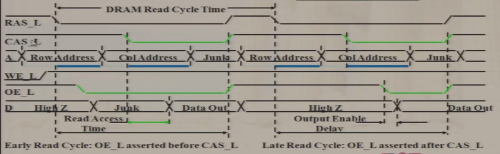
  - `RAS_L`和`CAS_L`分别是行选通和列选通信号，低电平有效，先`RAS_L`信号变成低电平获得行地址，然后`CAS_L`变成低电平获得列地址，最后得到Data。`RAS_L`和`CAS_L`再变成高电平。
- 优化方法

  - 对同一行的多次访问
    - 同步DRAM
      - 给DRAM增加clock

  - Wider Interfaces 一次取多个word

  - Double data rate (DDR) 上下沿分别读

  - Multiple bank 并行
- FPM (Fast Page Mode DRAM)
  - 
  - 利用时间局部性，一次读取多个字，`RAS_L`一直保持低电平，连续读取Data
- Synchronous DRAM
  - 传统的是异步的，增加一个同步信号
- Double data rate (DDR) 数据倍频
- RAMBUS (RDRAM)
  - 在Memory访问中加上流水线
  - 
- 内存结构
  - Wider memory：block的长度增加
  - Simple interleaved memory 低位交叉存储器
    - 为了能够同时访问地址相邻的block，将地址相邻的block放在不同的bank里，索引的时候用地址的低位表示bank index
    - 共享bus，访问连续的块的时候，第一块需要读取，而后面的块可以紧跟着放上去，节省时间
    - 只有访问连续block的时候才能并行
  - independent memory banks
    - 给每个bank一根bus，让访问不同bank可以并行
  - avoiding memory bank conflict
    - 连续访问同一个bank
    - 软件方法：例如访问`A[128][128]`可以改成`A[128][129]`来让访问的内存地址错开在不同的bank里
    - 硬件：设置bank的数量是$2^n+1$或者$2^n-1$
- Flash memory
  - NAND (denser) / NOR (faster)

#### 2.2.1 减少HitTime

1. Small and Simple Caches

   - 直接映像HitTime最短，地址越短地址译码器越小时延也小

2. Way Prediction

   - 不管tag比较，先根据预测结果送出word，然后比较结果出来的时候就给CPU cache miss信号，然后CPU流水线暂停一周期
   - 局部性原理，适用于Instruction Cache，行为可预测性强于Data Cache
   - 缺点：pipeline每一级的时延不确定，可能需要取最长的

3. Avoiding Address Translation during Indexing of the Cache

   - 虚拟地址映射到PA然后再去找Cache，浪费时间。如果做一个VA到物理内存的Cache，需要加一个进程标识号。但是还是会有Cache里重名问题（虚拟寻址）

   - 别名：如果两个地址在Cache里互为别名，要求软件使得这两个VA index及之后位相同。

     

   - 虚拟寻址少，但是常用virtual indexed, physically tagged，可以直接用VA的最后几位来索引，然后用TLB中得到的PA来做tag

     缺点：限制了Cache容量，例如直接映像时Cache容量不能超过一个页面的大小。解决方法：多路组关联

     

4. Trace cache

   - 动态执行指令流出流水线的时候，打包这些**实际执行**的若干指令称为cache的一行，放到trace cache里。另外打包之后的指令是已经译码之后的，所以可以节省译码的时间

   - 针对多发射处理器，局部性原理

   - trace：动态指令流

   - 

     指令包里面把predict info也放在包里。上图：如果在实际执行的时候发现branch的结果不是TF，例如是TT，那么可以有多种处理方法：

     - 直接从ICache中获得指令
     - A和B留着，执行到C的时候就扔掉C，重新去ICache中找指令
     - 都留着，C加上一个标记

#### 2.2.2 提高带宽

1. 流水线Cache

   - 写的时候必须匹配tag才能往里面写，如果失配还得先load到cache里面，时延过长
   - 两级流水线（Cache匹配，写Cache）

2. Multibanked Caches

   - sequential interleaving：顺序word放在不同的bank里面

     

3. Nonblocking Cache

   - 失配了要先load进来（很长的miss penalty），在读取的过程中需要能接受第二次访问
   - 支持乱序执行流水线
   - hit under 1 miss：接受两次miss，之后就拒绝访问

#### 2.2.3 减少Miss Penalty

1. Multilevel Caches
   - 一级快，降低hit time；二级大，减少miss penalty
   - 
   - 
2. Giving Priority to Read Misses Over Writes
   - 加了Write Buffer的时候，如果read miss，需要先清空write buffer然后再read导致miss penalty很大
   - Cache有Write Buffer，此时还没有写入Memory的时候，当Read失配的时候，就先去Write buffer里面找，如果找到就直接取，否则就去memory中读
   - read的优先级更高
3. Critical Word First & Early Restart
   - 关键词优先：如果我需要是cache line中其中一个word，那cache直接优先读我需要的那个；
   - Early Restart：从0开始读到我需要的word，CPU就直接继续
   - 对大块非常有用，但是有的时候会伤害空间局部性
4. Merging Write Buffer
   - 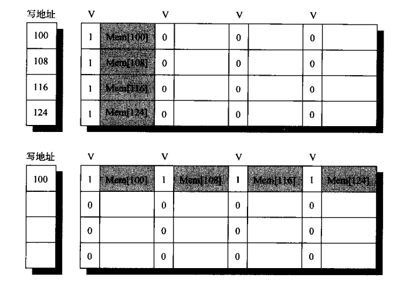
   - 比对某个word所在的block是否已经在write buffer里面，可以合并放在一个block里面
   - write buffer又变成了一个小的buffer
5. Victim Cache
   - 发生替换的时候，被替换的有可能之后又回来，所以就替换到小的Victim Cache（暂时）
   - Miss rate & Miss penalty都降低了
   - 时间局部性

#### 2.2.4 减少Miss Rate

1. 更大的block size

2. 更大的cache

3. 更高关联度

4. 编译器优化

   - Merging arrays：将独立的多个数组合成单个struct的数组
   - loop interchange：内外循环的改变
   - loop fusion：将多个loop放到一个loop里面来利用时间局部性
   - blocking optimized matrix multiplication：模块化，算部分和
     - 

5. Way prediction & pseudo-associative cache：伪关联的cache

   - Way prediction降低了conflict miss同时保持直接映像的hit speed
   
     
   
   - 想尽量用直接映像（hit time低但是冲突率高），但是又想降低miss rate，所以就用伪关联cache，直接映像中增加一个位置。下图除了8位index索引的位置，还可以用最高位取反+剩下7位index来索引一个新的位置**伪对应块**（类似二路组关联）。此时tag就需要多加上index最高位，所以在下图中tag是22位。
   
     
   
     另外会增加一个预测器，如果预测可能是命中伪对应块那就让对应块和伪对应块交换，保证基本都是直接映像命中。

#### 2.2.5 利用并行性降低Miss Penalty / Miss Rate

1. Hardware Prefetching of Instructions and Data
   - memory空闲时间提前预取到buffer / Cache可以降低compulsory miss
   - 预取有不同策略：恒预取（每次都预取）、失配预取
2. Compiler-controller prefetch
   - 编译控制的预取
   - 需要硬件支持预取指令
3. 用高带宽的Memory（HBM）来扩展存储层次
   - 用大容量的4级Cache（128M到1G），DRAM

### 2.4 保护：虚拟存储器和虚拟机

## Chapter3 指令级并行及其开发

### 3.1 指令级并行：概念与挑战

- 5级流水线要支持浮点运算，可以让EX阶段重复多次直到运算结束

- 两个术语

  - latency：从一个产生值的指令到一个使用该值的指令之间暂停的时钟周期

  - initiation interval：两条进入同一个部件的指令之间必须经过的时钟周期

    - 完全流水线单元：initiation interval = 1

    - 非流水线单元：initiation interval = latency + 1

    - 

      第一行：使用Forwarding，latency为0

      第二行：Load-Use使得latency为1，initiation interval表示每个周期这个操作部件都可以执行一次

- 结构竞争

  - 写口冲突
    - 提高写口数量：不好，因为写寄存器比例反而降低了，不应该增加写口
    - 预约寄存器
      - 在ID译码之后可以明确知道在哪个周期WB，如果发生冲突就不能发射就暂停一个周期

  - 操作部件忙

- 数据竞争

  - RAW也称真相关
  - WAW也称输出相关或命名相关
    - stall
    - 取消前一条指令的写

  - WAR也称反相关或者命名相关

- 例子

  - 
  - 上面initiation interval可以画流水线图，它表示两条同样的指令需要隔几拍，例如`Add, subtract`，正常流水线下一条的`S+A`会和上一条的`A+R`冲突，下两条的`S+A`会和上一条的`R+S`冲突。

- 控制竞争

- 异常行为

  - 需要和未调整顺序的时候保持一致
  - 一般不把LW放在Branch前，因为LW可能会发生异常，而Branch可能不执行LW

### 3.2 揭示ILP的基本编译器技术

- 循环展开
- 静态转移预测
- 静态多发射：VLIW（Very Long Instruction Word）
- 高级编译器调度
  - 软件流水线
  - 全局代码调度 Global Code Scheduling
- 硬件支持
  - 条件执行的ALU指令代替条件跳转

### 3.3 用高级分支预测降低分支成本

### 3.4 用动态调度克服数据冒险

- Scoreboard
  - 寄存器有很多写口
  - 
  - 流水线中ID阶段分成两个Issue (IS)和Read operands (RO)
  - 
  - Scoreboard有三张控制表
    - 
    - Instruction status
      - 记录每一条指令的状态
    - Functional unit status
      - 所有操作部件都有一行
      - `busy`：该设备是否忙
      - `op`：操作部件具体做的操作
      - `Fi / Fj / Fk`：目的寄存器、源操作数1、源操作数2
      - `Rj / Rk`：源操作数1/2是否可用
      - `Qj / Qk`：如果源操作数1/2不可用，那么它此时在哪个操作部件里
    - Register result status
      - 每个寄存器有一个标签，表示在等待哪个操作部件的结果
  - 可以用显式寄存器重命名来解决WAW/WAR问题以及精确断点
    - 需要对照表
    - 需要更多的寄存器
    - 需要知道哪些寄存器是空闲的
  
- Tomasulo
  - Function Unit (FU)
  
  - 寄存器重命名，使用reservation stations (RS)来保存寄存器的值
  
  - 公共数据总线
  
  - 
  
  - 
  
  - 
  
    
  
    
  
  - 
  
  - 
  
    
  
  - 
  
  - 缺点
  
    - 比较难精确中断

### 3.5 动态调度：示例和算法

以下假设加减3 clock，乘10 clock，除40 clock

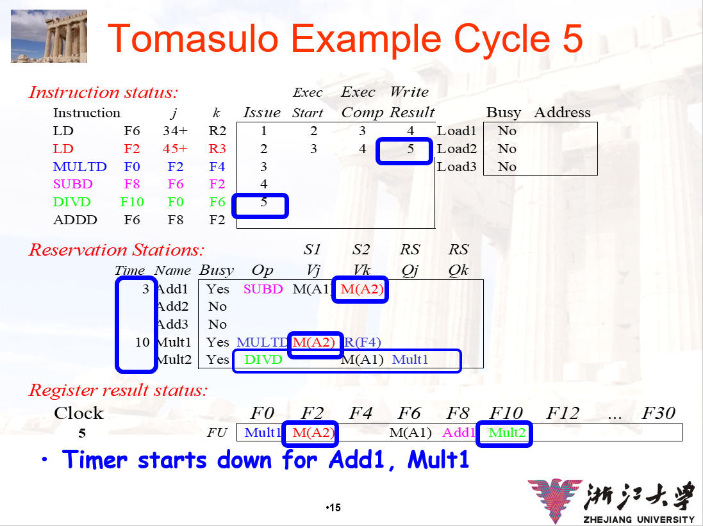

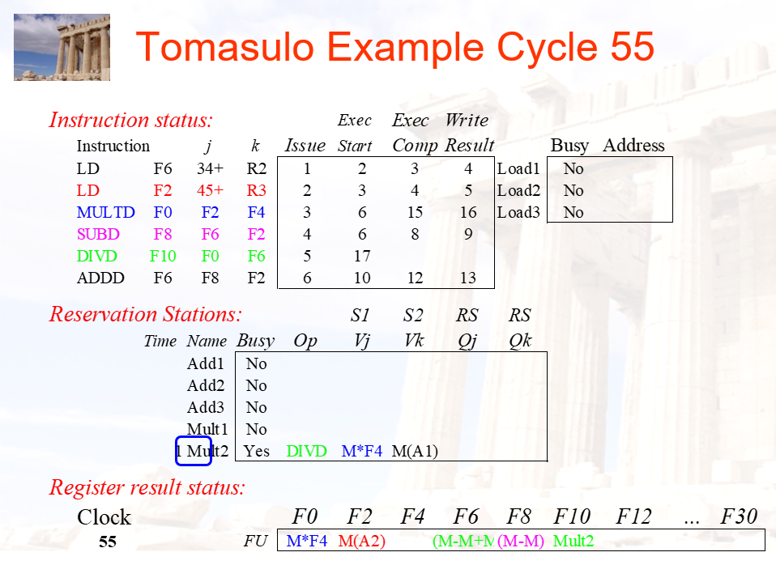

### 3.6 基于硬件的推测

- 1位预测器：记录上一次是否跳转

- 2位预测器

  

- 相关预测器

  - $(m,n)$表示最近$m$条，使用$n$位
  - PC的后若干位来寻址
  - 关联预测器为**每个**分支实现了**多个**2bit预测器。（m,n）预测器表示使用最近m个分支行为，从2^m个分支预测中进行选择，每一个预测是对应于单个分支的n位预测器。
  - 
  - 
  - 问题：很多分支情况用不到，浪费资源

- 饱和预测器（两级预测器） Tournament Predictors

  - 为了区分全局还是本地跳转
  - 两个预测器，一个全局一个局部
  - branch history就是前$n$条branch的结果，这体现全局性；branch address就是使用当前branch指令的PC后几位，这体现了局部性
  - 

- gshare

  - 将跳转历史（全局）和branch地址（局部）异或来找入口，可以比相关预测器使用的资源更少
  - 

- PPM（Prediction by partial matching）/ Tagged Hybrid Predictors

  - gshare中异或可解释性差，这里我用一个hash函数
  - 想法是：局部和全局二分太片面，我可以用不同量的history来预测，下图从左往右依次使用history数量为0, 10, 20, 40, 80，然后将pc和history两次hash之后（一次是查表看tag，一次是直接hash求值，比较tag和值）看是否能匹配上，匹配上就用这个predict
  - 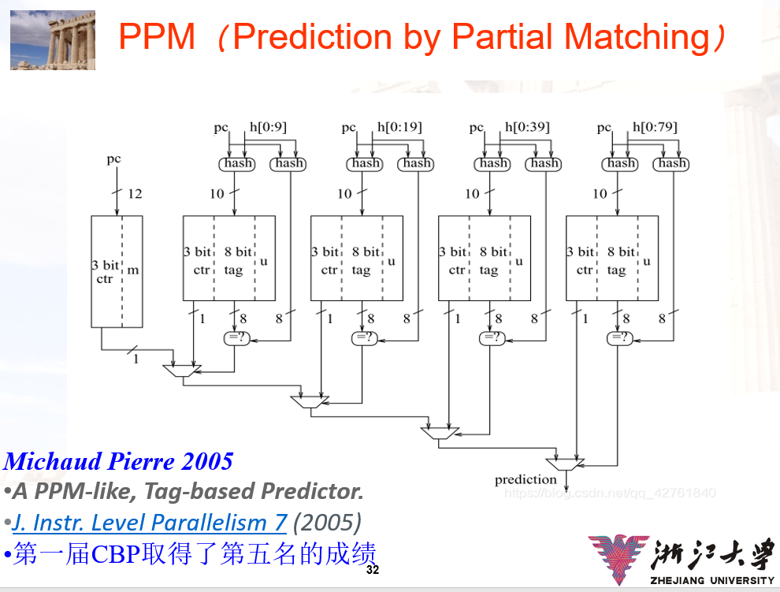

  - 问题：长历史会导致hash冲突

- Branch Target Buffer

  - Predictor只能给出结果，但是target address还是需要再计算，所以可以把target address存到buffer里面
  - 
  - 
  - 但是还需要取指令，所以有变种：直接记录instruction，或者记录address和instruction，另外再记录not taken的instruction

- 返回值预测器

  - 又做一个返回值buffer

- Hardware Based Speculation

  - Tomasulo的缺点：不能精确断点

  - 思路：先执行，将结果放到一个缓冲区中，最后commit通过了再写入

  - 

  - 异常或者跳转的时候直接将reorder buffer清空

  - 改名是根据reorder buffer

  - ROB中的项：

    

  - 

  - 

- 例子：

  

  第一条LD结束，写结果到ROB中

  

  注意下面有Forwarding path，因为第一条LD得到的值还在ROB中不在Memory中，但是DIVD的F6已经获得了LD的值

  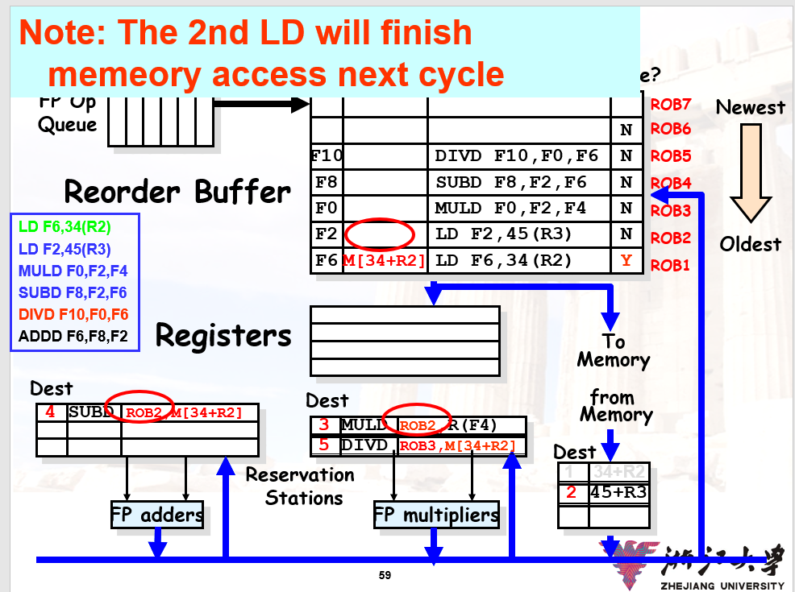

  

  SUBD先执行完，ADDD的F2也Forwarding的从ROB中得到了

  

- 存在问题：Store和Load的RAW问题，因为Store在前写入的数据还在ROB中

  - 解决：LD需要判断地址是否和ROB中的Store地址一样
  - 
  - WAW不需要考虑，因为每次进入ROB的时候，目的寄存器会被改名成ROB中的序号

- 

### 3.7 以多发射和静态调度来开发ILP

- 多发射处理器类型
  - Vector Processing向量计算，一次对多个分量做运算
  - Superscalar
    - static superscalar：按顺序拿到两条看能不能发射，按序执行
    - dynamic superscalar：取指令数量大于发射口数量，从中选指令发射，乱序执行
    - speculative superscalar：加上ROB
  - VLIW：编译器生成长指令
  - 

- Superscalar

  - 检查发射包内指令的相关性，以及发射包和当前飞行中指令的相关性

  - 比较次数

    

  - delay的代价很高，因为会浪费很多指令槽

  - 例子：一个FU一个Integer（负责ALU和地址计算）一个Memory Unit，没有speculation

    

    增加一个Integer之后，CDB又要增加

    

  - 例子2：有无speculation，有了speculation可以直接先发射branch之后的ld指令

    

    

- 软件优化方法

  - 

  - 循环展开

    

  - VLIW

    - 问题：代码长、stall一下可能整个processor都stall

  - Branch Folding即上面的Branch Target Buffer

  - Renaming

    - 三种：编译器、使用Station或ROB、额外寄存器

  - Software pipeline

    - 思想：单次循环内是有很多True data dependency，但是不同循环之间是没有的，所以可以横向将多次循环的一段组织在一起（下方红框部分）同时执行。首尾存在没法放入循环体的代码（启动代码和结束代码），这些需要单独执行。
    - 
    - 

  - Global code scheduling，将循环体中的代码越过转移指令调度代码，典型的方法有trace scheduling和superblock

    - Trace scheduling

      - 

      - 分成两步：路径选择、路径压缩。利用预测器，找到大概率的路径，例如上图中每个小段调度能力比较差，但是四个小段的调度能力比较好

      - 编译器要在其他分叉中生成补偿代码

      - 例子：调度之后两个基本块变大，调度能力提高

        

    - Superblock

      - 上面方法中补偿代码要加很多。这里优化：统一出口
      - 

  - 硬件支持

    - 

    - 直接增加一个条件转移指令，控制依赖变成数据依赖

    - hyper block

      

    - block structure

      - 将代码粒度变成以块为单位
      - 
      - 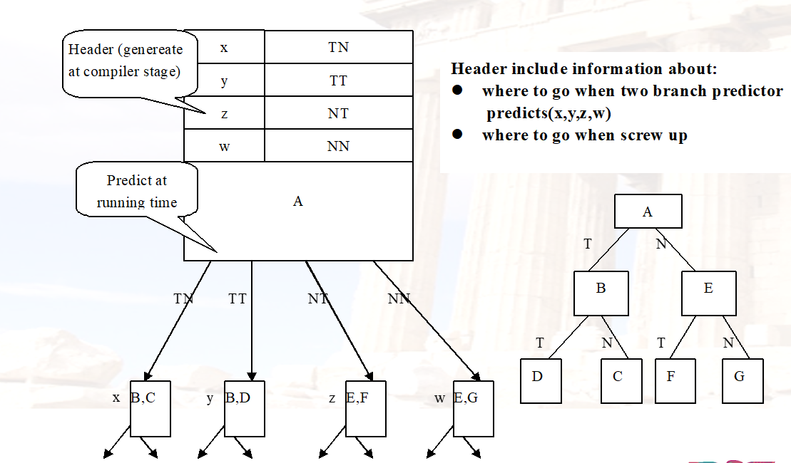

### 3.12 多线程：开发线程级并行提高单处理器吞吐量

- 单个线程内指令并行性不高

- 

- 类型：

  - 细粒度：每个时钟周期切换线程
  - 粗粒度：几个时钟周期切换一次，可能是发生FU unit data hazard或者L1 miss或者L2 miss等

- 补充：寄存器窗口。caller在调用函数的时候，会将寄存器压栈，但是可以约定callee和caller用一部分相同的寄存器，然后这些寄存器就不需要压栈

  

## Chapter4 Data-level Parallelism Vector, SIMD, and GPU

- 链接 chaining：对Forwarding的拓展

  

  

  如果没有链接的话，就得等Load指令全部计算完才能到下一条指令执行

- 向量执行时间

  - 操作数向量的长度
  - 操作之间的结构竞争
  - 数据竞争

- 护航指令组 convoy

  - 
  - 链接类似Forwarding，允许RAW，目前链接使用**灵活链接**，使得向量指令能链接到任意其他活动向量指令

- 钟鸣 chime

  - 

  - 例题

    

- 多条车道

  - 

    横向：链接；纵向：多车道

    上图加上向量链接，Load得到的值直接流入mul

- 处理不等于64的循环

  - strp mining，保证所有的向量操作数个数都是小于MVL。下图第一次内层循环计算多出的$n~\%~MVL$个元素，之后就每次计算$MVL$个元素

    

- 向量遮罩寄存器：处理向量循环中的IF语句

  - 
  - 
  - 两种实现方法：
    - 执行所有的指令，但是$VM$中不为1的就不写回
    - 只有遮罩寄存器$VM$中为1的位对应的元素才参与计算
    - 
  - 除了mask，也可以增加一个向量flag寄存器，每一位保存IF语句的结果
    - 

- 内存组：为向量载入/存储单元提供带宽

  - 
  - 一般bank数量是$n-1$，这样让同一行或同一列的元素不在同一个bank里面

- 步幅：处理向量体系结构中的多维数组

  - 

- 集中-分散：在向量体系结构中处理稀疏矩阵

  - 
  - 
  - 上面的LVI是Load Vector Index就是集中，SVI就是分散
  - 

- Loop-Level Parallelism

  - Loop-carrier dependence，循环之间的依赖

  - $x[i+k]=x[i]+y$：相关距离$k$

  - 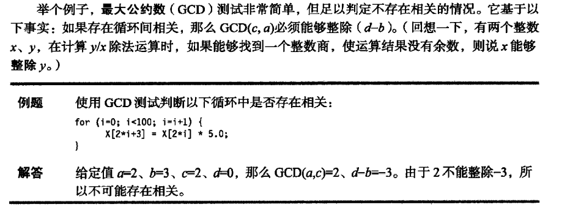

  - 迭代间的依赖要转成迭代内的依赖

    

  - reduction规约

    

## Chapter5 Thread Level Parallelism

### 5-1 Multiprocessors

- 内存结构

  - 共享 or 分布式（对于硬件和软件）

    

  - 

    distributed shared-memory表示对于软件来说不同核可以共享内存（逻辑上共享）

  - 

    UMA随着规模变大latency也会变大，NUMA需要尽可能让核去访问自己的内存

### 5-2 Cache Coherence

- 共享内存存在的问题
  - Cache coherence（Value，same location）
  - Synchronization
  - Memory consistency Mode（order，different locations）

- 考虑单核中Cache Coherence问题，CPU和Disk（通过DMA）都会访问Memory
  - Memory写到Disk：有可能Memory是旧数据，新数据在Cache里但是没有写到disk里（write back），如果是write through那么大部分情况就是对的
  - Disk到Memory：如果是write through那么CPU可能会拿到旧的数据（如果已经拿到cache里，那么就不会从memory中更新cache，因为一直是hit）
  - 解决方法
    - 硬件：从disk写入读取的时候都需要看cache
    - 软件：新增一个buffer，里面保持着最新的数据并且不会被写到cache里面

- 多处理器解决思路：所有的写被所有核看到的顺序相同（串行化）

  - 两种规则

    

  - 方法：Snooping广播；Directory-Based适用于分布式，维护一个存储块的目录

    

- Snooping Solution

  - 

    Cache得有两套Tags，一套给CPU访问，一套给Memory来访问

  - Snoopy Protocols

    - Write Invalidate：多个读单个写，如果我要写就在总线上广播，如果有人监听到我这个读会被写来更新，那么就会清除出cache，即将有效位置0，即invalidate，当有总线上有个控制器来保证写的顺序；如果发生cache miss，那么就去总线上发个请求，此时该地址最近的更新者就会从cache中回写到memory里面，别的cpu再去取（单核是从cache中出去的时候写回）

      注意下图的invalidate

      

    - Write Broadcast：写的时候直接将写的值广播到总线上，然后其他cpu直接从总线中拿到新值改写到自己的cache里面。一般和write through配合

      

    

  - 实现：对总线控制器实现有限状态机。

    状态分成3种，invalid / Shared / Exclusive

    

  - 状态图：CPU侧和总线侧

    

    

    例子：

    

  - Coherence Miss：新增一个True sharing misses，就是读取被无效化的块导致的miss

    

- Directory-Based Schemes

  - 目录中记录：每个block的状态，哪些处理器有这个block的copy（用一个bit vector），block是否是dirty

    

  - 结构

    

  - 实现

    

    block有三种状态：Shared / Uncached / Exclusive

    为了简化，write hit和write miss都看做是write miss

    核心思想：读变成shared，写的话先要向所有有copy的处理器发一个invalidate信号，等到这些有copy的节点响应之后才能继续做写操作

    

    三种节点要区分

  - 考虑invalid：

    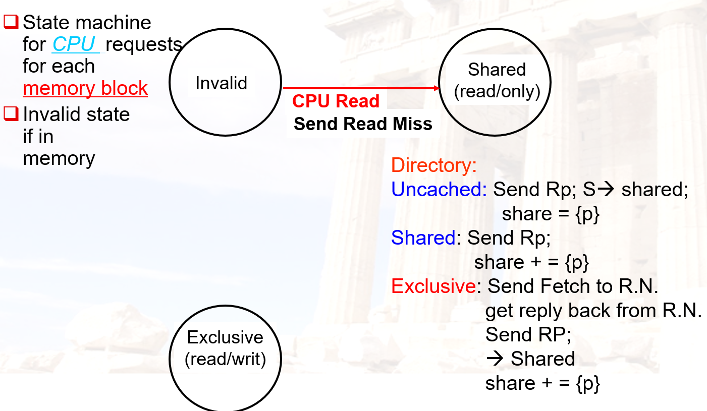

    

    考虑Shard：

    

    考虑Exclusive：

    

  - 对于目录：

    

  - 例子：P1要写入X值888

    

    结果：

    

    此时P2再向X写入999

    

  - 例子2

    

    如果P0读300，但是cache中没有，于是发送WriteMiss到Home Node P2（P2的memory中实际保存着300），P2返回P0并且将目录中的状态进行修改

    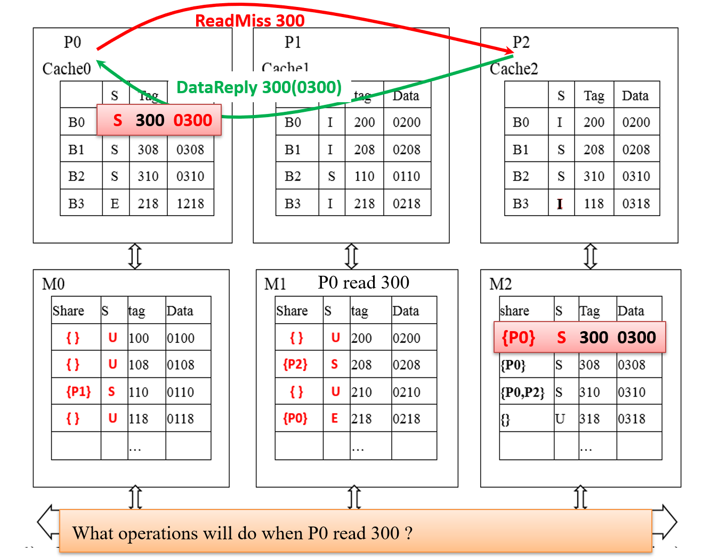

    

    如果P2读218：

    

    

### 5-3 Synchronization in Multiprocessor

- 需要硬件原语

  - 原子交换：如果交换得到的值为1（busy）说明交换不成功
  - test-and-set：读取目标内存地址的值到寄存器，如果是0（free）就写入值
  - fetch-and-increment

  

- 实现的时候是2条

  

  

  上面应该是`beq`

  

- spin lock：如果一直对memory写很浪费，可以将对应地址读到cache里面，这样访问起来就比较快，一旦修改了这个值由于cache一致性会无效化掉这个entry，然后再从memory读进来。

  

  性能分析：

  

- Barrier：强制所有处理器等待，知道他们都到达barrier。方法：使用计数器，自旋等待

  

  上面存在的问题是：release / count都是共享变量，还属于critical section，因此不能释放掉

  

  存在的问题：有可能release=1之后开始运行然后立刻回来release=0，其他处理器就不执行了

  改进：sense-reversing barrier，使用一个private变量local_sense，确保是正确的轮数

  

  性能分析：

  

- 软件优化

  - 指数后退

  - 排队锁

  - 合成树：某个节点报告它的子节点是否busy

    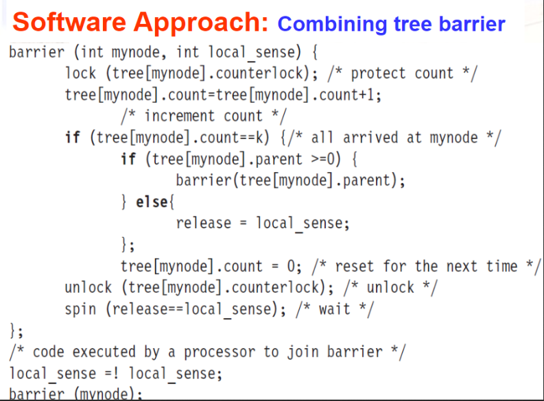

- 硬件原语

  - queuing lock

    

    

  - fetch & increment

    

    

### 5-4 Models of Memory Consistency

- 定义：一个处理器什么时候能看到它被修改

  

- 级别

  - sequential consistency：要求最高

    

  
