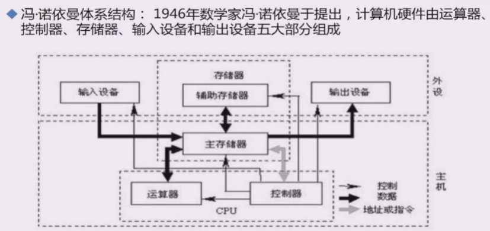
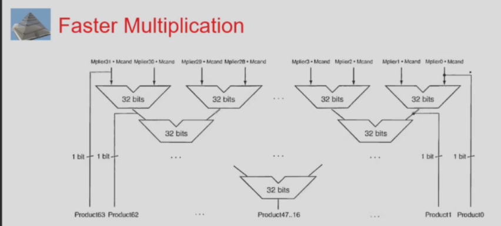
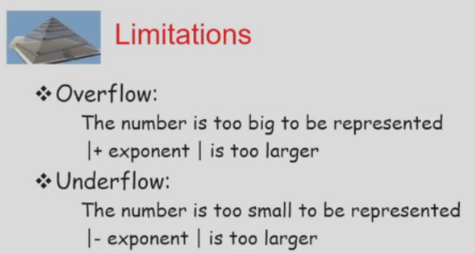
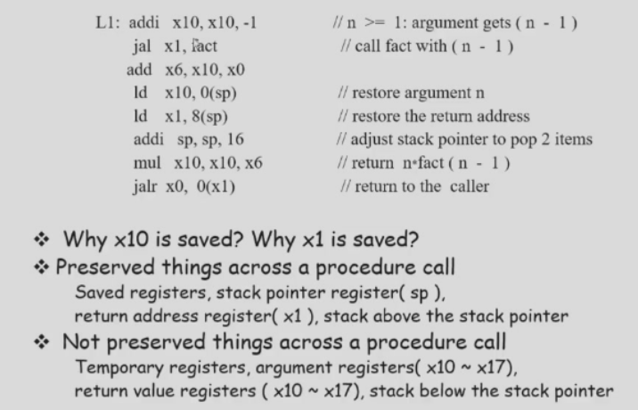
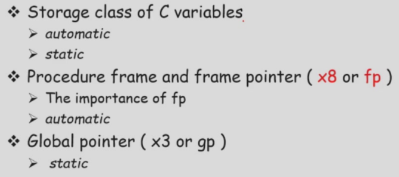
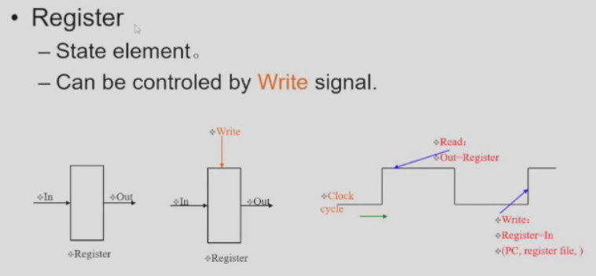
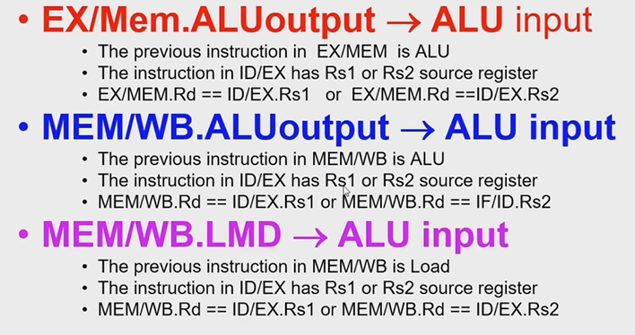
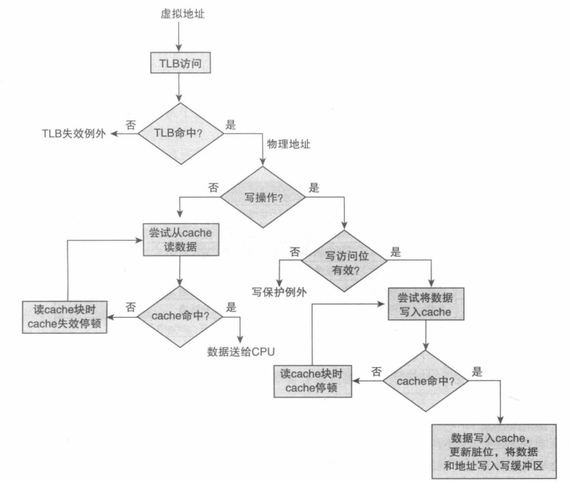

# 计算机组成与设计


## Ch0 Introduction


## Ch1 计算机抽象层次系统 (1.1-1.11)

### Class of Computers

- PC
- Server 可靠性：Checkpoint、Backup
- Embeded 功耗
- SuperComputers

### PostPC Era

- PMD(Personal Mobile Device)
- Cloud computing

### Eight Great Ideas

- Design for Moore's law

- Use Abstraction to Simplify Design

- Make the Common Case Fast

  - Amdahl's Law
    $$
    Speedup_{overall}=\frac{ExecTime_{old}}{ExecTime_{new}}\\
    =\frac1{((1-Fraction_{enhanced})+\frac{Fraction_{enhanced}}{Speedup_{enhanced}})}
    $$

- Performance via Parallelism

- Performance via Pipeline

- Performance via Prediction

- Hierarchy of Memories

  - 

- Dependability via Redundancy

### Memory Allocation


最上面一段是堆栈区，往下是Stack栈，往上是Dump堆

可以按word或者按字节来编址，通常是按照byte

最下部Reserved的部分是操作系统使用

### Computer Organization





### Performance


- Response(Execution) time 综合时间，包含IO等事件
  - user perception
  - system performance
- CPU time 去除外部影响因素
  - designer perception
  - CPU performance
  - CPU time include：
    - User time
    - System time 操作系统时间，一般需要估算去除
- Throughput 吞吐率，单位时间内的任务数量
  - administrator perception
  - server 调度策略

优化：多个CPU的response time不一定增加，因为会增加其他时间


## Ch3 ALU设计

### Introduction

#### 指令

- memory-reference 地址计算
  - lw (load word), sw (store word)
- arithmetic-logical instructions
  - add, sub, and, or, xor, sll, srl, sra, slt, sltu
- control flow instructions 目的地址计算
  - beq, bne, blt, bge, jal, jalr

#### Generic Implementation

- use the program counter(PC) to supply instruction address
- get the instruction from memory
- read registers
- use the instruction to decide exactly what to do

### 数字表示

#### 移码

一般：将补码加上$2^n$，相当于最高位（符号位）取反

浮点数IEEE754：补码加上$2^{n-1}$

### Compare Operations

- signed integer
  - slt: set when less than
  - slti: set when less than immediate
- unsigned integer
  - sltu
  - sltiu

### Overflow

#### Overflow process

- ALU硬件检测
- Generation of an exception
- Save the instruction address(not PC) in special **EPC**
- Jump to specific routine in PC

#### Which instructions cause Overflow?

有符号会导致overflow

- add
- addi
- subtract

无符号不会

- addu
- addiu
- subu

### New RISC V instructions

- Byte instructions
  - lbu: load byte unsigned (fills the remaining with '0')
  - lb: load byte signed (根据MSB扩展)
- Set instructions for conditional branches
  - sltu
  - slti
  - sltiu
- Logical shift operations
  - right (srl)
  - left (sll)

### 加法器

- CLA
  - 4位CLA
- Hybrid CLA+Ripple carry
- Carry-Skip Adder
  - 当$P_i$为1，$G_i$=0
  - 
  - 并不常用，时延不一定
- Fixed Block Width Carry-Skip Adders
  - 
- Carry Select Adder (CSA)
  - 
  - 高4位同时算进位为1或0，然后看第四位的进位来选择

### 乘法器

- Multiplier V1
  - 
- Multiplier V2
  - 
- Multiplier V3
  - 
  - 硬件需要时序
  - 也可以用软件
- signed multiplier
  - 
  - 
  - 右移的时候0变成1就减，1变0就加，1变1或者0变0就不变
  - 
  - 注意要看两位的时候，一开始没有要添一个0
- Faster Multiplier
  - 
  - 最上面就只要用2选1的多路选择器即可


### 除法器


- Division V1
  - 
  - 当不够减的时候要加回去
  - 
- Division V2
  - 
- Division V3
  - 
- Signed Division
  - 

### 浮点数


指数有正有负，使用移码：单精度+127，双精度+1023

因为规格化之后小数为1.xxxx，所以为了表示0，规定：所有位为0就是0





## Ch2 RISC-V指令

RISC-V是Load/Store结构，指除了Load和Store之外别的指令都不访问存储器，因为Memory太慢

### 一些指令


前面是destination 后面是source


t寄存器是存放临时结果的寄存器

常数被称为立即数


argument是参数的意思，用来参数传递


不对齐的时候load比较麻烦

通常CISC指令编码是不定长编码，而RISC的指令是定长编码（32位）


立即数、load都是用I-format

R-format

store用的是S-format


注意没有not运算：xor x0, x0, -1


### 函数


将下一条指令的地址放到x1中，return的时候返回x1。实际上x0是0不会变更改


如果参数过多（超过8个）就压入堆栈

|       | 32   | 64   |
| ----- | ---- | ---- |
| short | 1B   | 2B   |
| int   | 2B   | 4B   |
| long  | 4B   | 4B   |
| long  | 8B   | 8B   |

我们根据64位来

#### 叶子节点 callee save


s寄存器必须要保护，t寄存器一般不保护，如果caller要使用t寄存器，就要在caller里保护起来

如果是非叶子程序，再次需要jal的时候就会改变x0等的值

尽量用t寄存器

#### 非叶子节点


Caller需要保存：

- 返回地址
- 参数
- 重要的t寄存器
  - 写入堆栈（写入memory开销比较大）
  - 存到s寄存器（子程序里会保护s寄存器）


Callee需要保存：

- s寄存器


#### 嵌套（递归程序）


一定需要caller save，但没有局部变量所以不用callee save



x10是参数，x1是返回值

提高效率可以使用循环

### 寄存器总结




动态数据放在堆栈

静态数据放在text区，由GP来指

### FP指针


任意一个程序都有自己的工作记录

FP实际上指向local变量开始的地方（因为最前面是caller压进去的部分）

注意：argument register是上一个caller压入的，return address是本程序作为下一个程序的caller压入，然后是本程序作为callee压入

比较规范的方法是return address的时候也把上一个fp存起来，但是为了效率有时候不存


fp一般不变一直指向局部变量

### Memory Layout


最大的BUG：

- 忘记释放空间
- 释放空间太早

### 输入输出


一个字节表示一个字符


### 大的立即数


### 跳转

branch有12位用来跳转，jal有20位用来跳转

此时用的是半字跳转，地址最后一位是0（2的倍数）就略去


如果跳转的L1比较大的时候，可以如上图结合使用bne和jal

### 寻址Addressing


- 立即数
- 寄存器
- 基址（偏移量）——最常用
- PC相对beq和jal

### 译码Decoding

汇编——机器码

反汇编

### 并行和同步

- Load Reserved： lr.d
- Store Conditional: sc.d

## Ch4 数据通路

### 4.1 Introduction

单时钟周期：所有的指令时间都是一个时钟周期（clock cycle就会很长）

过程：


### 4.2 Logic Design Conventions


我们约定上升沿write




- R-type如ADD rd, rs1, rs2
  - PC送入Instruction Memory (ROM) 得到32位instruction
  - 将32位Inst的[6:0] opcode、[14:12] funct3、[31:25] funct7送入Controller
  - 将32位Inst的[19:15] rs1送入Reg File的Read Port得到32位rs1内容；同理送入[24:20] rs2也送入Reg File得到rs2内容
  - 将32位rs1、32位rs2以及控制信号（来自Controller）送入ALU，得到32位Result
  - 将Inst[11:7] rd，32位Result以及写信号（来自Controller）送入Reg File的Write Port
  - PC做一个简单的加法器，并回送到PC（需要clk但不用write enable）
- I-type
  - ALU的RI如ADDI rd, rs1, imm即rd = rs1 + ext(imm)
    - PC送入Instruction Memory (ROM) 得到32位instruction
    - 将32位Inst的[6:0] opcode、[14:12] funct3、[31:25] funct7送入Controller
    - 将32位Inst的[19:15] rs1送入Reg File的Read Port得到32位rs1内容；同理送入[24:20] rs2也送入Reg File得到rs2内容；将Inst的[31:20] imm送入Sign Extension变成32位imm
    - 将32位rs1、32位被扩展的imm（**不能占用R-type的rs2，所以加一个MUX2T1_32，MUX的控制信号ALUsrc2来自Controller**）以及控制信号（来自Controller）送入ALU，得到32位Result
    - 将Inst[11:7] rd，32位Result以及写信号（来自Controller）送入Reg File的Write Port
    - 同上PC
  - Load指令如LW rd, imm(rs1)即 rd <- Mem[rs1 + ext(imm)]
    - 同上前4步得到32位Result（Memory Address内存地址）
    - 将32位Memory Address和读信号ReadMemory（来自Controller）送到Data Memory，读到32位内容，写入Reg File的Write Port（**又需要加一个MUX2T1_32，输入为32位Data和32位Result以及一位的控制信号M2Reg**）
- S-type如SW rs2, imm(rs1) 即 rs2 -> Mem[rs1 + ext(imm)]
  - 同上前4步得到32位Result（Memory Address内存地址），但是其中imm需要先**拼**起来{Inst[31:25], Inst[11:7]}然后再SignExt，为了方便可以封装成一个ImmGeneration！
  - 将Reg File输出的32位rs2、Memory Address以及WriteMemory（来自Controller，ReadMemory**不能**和WriteMemory合并）送入Data Memory
- SB-type如beq rs1, rs2, Label
  - PC原来是只和4相加，现在需要一个MUX来加一个imm（Label-imm的值），这个MUX的使能是cond（ALU comparator得到的condition code），但是注意只有是跳转的时候才能触发，所以需要将cond改成taken，$taken=branch\cdot Jal$
- UJ-type            
- U-type


可见load花费时间最长，之后可以用流水线

### 4.6 Interruption & Exception

Exception如缺页中断page fault：程序执行过程中在内存中找不到代码，需要操作系统从Memory中读取代码

Interruption中断如IO等

RISCV中发生Exception和Interruption共享同一个入口，之后再统一处理

过程：


模态变化：User Mode用户态和Supervisor Mode管态（后者级别更高，同时exception和interruption的级别也不同）

Control Status Registers 控制寄存器只能在管态中使用，被称为特权寄存器


#### Interruption

- polling 轮询：不断查看IO设备的状态，浪费时间
- interruption driven I/O 触发中断之后继续做user code然后等到I/O做完之后interruption request信号发过来
- DMA(Direct Memory Access)：CPU让DMA来处理interruption

#### Handling Exception

- 方法一：直接跳到总管处然后再分析


注意写操作应该改成 `WReg & ~Exp`

- 方法二：先分析然后再跳转到不同的地方


有一个base基址，然后加上Vector得到地址，然后跳到不同的地方

一般是vector和前面的base拼起来成为32位然后送到PC中

#### Privileged Architecture


用户层——系统层——Hypervisor（虚拟机）


#### CSR

一共有4096个


MPIE：Previous


注意control signal各种控制信号

exception和interruption：一般，前者不会执行当前错误指令，并存当前的PC（因为不知道要不要回来），但exception可能恢复可能结束；后者会执行当前指令然后存PC+4；而RISC-V要求是不执行当前的指令，都存PC。注意：实验中exception为跳回PC+4，为了能够继续运行。

流程：

- judgement

  - exception

    - undefined
    - misalign(load)
    - misalign(store)

  - interruption

  - 注意jump when mstatus.mie=1 & mie[i] = 1 & mip[i] = 1

    - 当在处理非常紧急的事情（不想被别的exception打扰）或者PC进入mtvec之后开始读取cause等重要事情时（正式处理exception的时候mie为1），mstatus.mie=0

    - mie[i]和mip[i]表示处理exception的处理级别

- hardware response

  - mepc <- current PC
  - pc <- mevec
  - mstatus[7]\(mpie) <- mstatus[3]\(mie), mstatus[3] <- 0
  - Reg_wen和Mem_wen <- 0

- exception handler

  - mepc <- mepc + 4

- mret

  - pc <- mepc
  - mstatus.mie <- mstatus.mpie

### 同步

- lr.d rd, (rs1)
  - load reserved，监控load的地址让它不能被写

- sc.d rd, (rs1), rs2
  - store conditional，不能向被监控的地址中写

### 链接

- symbol table
  - 存放label的相对偏移地址
  - 一开始会扫描所有的label，形成symbol label，第二遍生成代码（label计算偏移量）
- link的时候假设有一个大的逻辑地址，然后转换成exe文件的时候确定下来（external symbol）
- 动态链接库，当第一次调用的时候才加载库函数进来。第一次调用库函数跳到接驳程序（前者给后者提供标号），接驳程序找到在外部哪里叫linker链接进来，os加载到内存中，然后将内存中的位置链接到原文本中；第二次就直接从内存中找到

## Chapter5 Pinepline

### Multicycle Approach 

- seldom used now
- 用有限状态机（FSM）
- 可以将控制信号放在ROM中，ROM内容可写，容易新增指令
- 问题：串行

### Pipeline

#### 特征1

- Latency：并没有提高，因为所有指令都要流经所有节拍
- Throughput：提高

#### 特征2

- clock cycle
- machine cycle 可以是几分之一的clock cycle，实验中认为和clock cycle相同

### RISC-V Pipeline


问题：WB的时候rd已经被改变了


### Hazards

- 结构竞争：RegFile需要2个Read和1个Write，两条指令使用同一个部件
- 数据竞争：还没WB下一条指令就要用（先写后读Read After Write）
- 控制竞争：本条指令会修改PC，但下一条指令已经读PC了

解决方法：

- 软件插入nop指令

- 增加额外硬件来detect stall情况然后往pipe中放入气泡（前面的锁存器不变，后面插入bubble）

  

  当stall的时候，disable掉MEM/WB和IF/ID的写使能

  如果是数据竞争，然后往ID/EX送进一个空进去即清掉

  如果是结构竞争，还需要将IF/ID的数据清掉（beq之后接and or等），但是后来发现可以不需要

  （数据竞争停1拍，结构竞争停2拍，控制竞争停3拍）

  

  流水线性能：

  

  

  

- 对于结构竞争中的Memory Read and Write可以用cache line分开IMEM和DMEM、也可以直接物理分开、也可以使用double bump（双重触发）即上下降沿分别读写

  - 现代CPU允许结构竞争，为了降低成本或者降低延迟，因为不是common case

### Forwarding (aka Bypassing)


stall中要送出两个forward信号给ALU的两个多路选择器

forward三种情况：

- 红色线：ALU指令之后马上就要用rs1或者rs2
- 蓝色线：load之后的结果需要放到ALU中去运算，注意只能给到隔了一条指令后的ALU src中去，因此可能会有一个stall
- 粉色线：ALU计算结果过两条之后再用




注意如果comparator和ALU分开来的话还需要再考虑


注意：出现double data hazard的时候得拿最近的值


load拿不到数据的时候还是得停一拍，软件可以调度一下顺序（不要load之后送到rs中）

forwarding的第四种情况：


例如下面的情况 $DM/WB.ALU_{output}\rightarrow DM入口$

```assembly
add x1, _, _ # 或者lw x1, _
sw x1, 8(x2)

IF ID EX DM WB
   IF ID EX DM WB # DM前需要上一条EX的结果
   				  # 此时forwarding上面EX已经在WB，所以应该将DM/WB的数据送到DM的入口
```

### Prediction


控制竞争会导致3拍的stall，可以采取两种prediction策略：

- Predict-untaken

  - not taken 0个stall，taken有3个stall
  - 如果taken就把锁存器送0清空
  - ideal performance = 1 + (jump% + branch% * taken%) * 3

- Predict-taken

  - 需要早点算出跳转地址，将PC+imm的加法器提前，但是还是有一个stall

    

  - ideal performance = 1 + taken% * 1 + not-taken% * 3

  - 对RISCV没有优势

优化：

- Move the branch computation forward: stall 减少成2拍

  

- Move the branch computation more forward: stall 减到1拍

  

  flushing: $1 + (branch\% + jump\%) * 1$，这个方法也可以放到predict-taken和predict-not-taken策略

  predict-not-takn+flushing: $1 + (branch\% * taken\% + jump\%) * 1$

  存在的问题：

  - 每级的时延增长

  - forwarding策略：source到sink，sink原来主要考虑的是ALU入口和DMem的入口，而Comparator提前到RegFile这一级之后还需要考虑

    ```assembly
    add x1, _, _ # lw x1, _, _
    beq x1, x3, _
    
    # 若为add和beq
    # IF ID EX DM WB
    #    IF ID EX DM WB
    # EX阶段算出x1，但是下一条指令在ID就需要x1，只能stall
    # lw和beq要stall两拍
    ```

  - 总结stall的情况
  
    - jmp
    - ld x1 然后用x1
    - add x1; beq x1
    - DM load; beq

更加合理的predict策略：

- static: 基于behavior，后向猜测taken（loop），前向猜测not-taken
- dynamic：基于运行轮廓
  - branch prediction table
  - indexed by recent branch instruction address
  - branch target buffer 把taken地址也存到buffer中去甚至是taken的指令

流水线越深，控制竞争的可能性就越高 branch penalty就越大

### Instruction-Level Parallelism (ILP)

- Deeper pipeline
- Multiple issue
  - 一次取多条指令

动态调度（乱序运行）的情况下有RAW、WAR、WAW等相关性冲突（后两者被称为命名相关，理论上改一下名字就不相关了）

## Chapter 5 Large and Fast: Exploiting Memory Hierarchy

### Introduction

- DRAM
  - 异步
- SDRAM
  - 同步，比DDR慢，读一个word
- DDR SDRAM
  - 上升沿和下降沿都可以读，可以读两个word

- DDR2
  - 4个word


没有cache的情况下，上面两个部分都要等待memory ready的时候才返回数据，继续流水线，需要很多clock

### Cache

从片外Cache到片上Cache到片上三级Cache

任意两级之间的管理是相似的

一些重要的术语：

- Hit / Miss
- Hit time
- Miss Penalty：拿不到会有时间上额外的损失（注意包含写回脏块的时间）

### Basics of Cache

#### Direct Mapped Cache

地址有32位，最后两位是byte address（因为是按word存的），再前面$\log_2^n$（$n$是cache的size）位表示cache位置。cache每一条由以下位组成：valid bit|tag|data，其中Index就是上面$\log_2^n$位。


上图：block size=$2^4$ word = $2^6$ bytes, cache data size = $2^6$ bytes * $2^8$ = $2^{14}$ bytes = 16KB, total cache size = 16KB+$2^8$*(1+18)bit

(如果是write的时候最后一个值需要增加一个**dirty bit**)

data段可以有多个word（组成一个block），因此就写成valid bit|index|block offset，所以数据被称作data line或者data block。

cache分成 数据存储区（data line）、控制存储区（valid bit|index）

结果：冲突率非常高

实际容量大约是data容量的1.15倍


当太小的时候空间局部性没有利用起来

当太大的时候块数很少，冲突率增加

当write hit的时候，write的策略：

- write-back: 在cache里写数据会导致cache和memory中的数据不一致，改写过将**dirty bit**置1，替换的时候写回去。注意只要改了block就得全部写回memory整个block代价非常高。如果是write hit效率很高，对于memory的带宽比较低。也需要**buffer**，dirty写回去很慢所以就先写到buffer中
- write-through: 改的时候就写入，通常会设置一个write buffer，write不用很大，两个word就够了；指令cache没有写

当write miss的时候的策略：

- write allocate: 先把block取进来，然后再做写操作
- no write allocate (write around): 绕过cache直接写入memory

其他版本：

- Wide Memory Organization
  - 用的少
  - 缺点：纠错码更新比较麻烦
- Interleaved Memory Organization 并行交叉存储器

### Performance


注意：增加内存不能提高带宽，因为地址是串行并排；而上面并行交叉地址是“串行”

[多体并行：高位/低位交叉编址](https://blog.csdn.net/nuo_Shar/article/details/79048019)

#### 不考虑CPU: AMAT


注意：上面第一行miss的时候也要先去cache找，所以也有5ns的cache time，最后就修改成了新的红色公式

#### 考虑对CPU影响

最终计算CPU Time


**CPI=1 + Stall per instruction \* miss rate \* miss penalty** 

注意：上面 # of instructions对不同指令不同（如ALU一次，LW/ST二次），Read/Program等于1+LD%，Write/Program等于SW%


###  多路主关联

略

### 多级cache


注意上面1.3是因为一条指令至少访存一次，假设30%为load指令


多级Cache的参数设置：

- 关联度：直接映像（hit time最短，需要快速从2级中获得，1级cache使用）、组关联（miss rate比较低，不需要一直往内存中找，2级cache使用）、全关联（代价太高）

### LRU

在valid bit之前加一个lru bit

### Virtual Memory

全关联的映射方式

disk上的数据分成多个page（页面），内存分成多个page frame（页面框），操作系统来分配


操作系统维护一个page table


VA映射到PA的页表是内页表，VA映射到DA（Data Address）的页表是外页表

页表是软件实现中而且很大，被称作是慢表

最近经常访问的页表放到cache，被称为快表


注意快页表需要存VPN（virtual page number），因为TLB中不能按照顺序存VPN的

Valid表示是否为空，Dirty表示是否写过，Ref是用来做LRU的最简单的方法（有的时候会加一个history记录之前的ref，操作系统每隔一段时间会刷新ref为0）

有一些page还有访问保护，会有protection位




实际上每个用户都有自己的page table，每一行是UID和PT Start Address，TLB表中有Valid, Dirty, Reference, Protection, PID, VPN, PPN

### Virtual Mache

略

### Summary

miss的种类：

- 冷启动失配（第一次访问一个block一定会失配）
- 容量失配（无法全部放到cache中）
- 冲突失配（多个块映射到同一个set中）

## Chapter 6 I/O Devices

### 6.1 Introduction

考虑因素：expandablility/resilience/performance

三大特征：behavior/partner/data rate

计算throughput：一段时间移动多少数据、单位时间内完成多少次I/O操作

### 6.2 Dependability, Reliability and Availability

- Dependability 可依赖性
  - 评价服务质量：即多久坏一次，坏一次修复时间
  - 可完成性、可修复性
- Reliability
  - MTTF mean tine to failure
    - 提高方法：fault avoidance/fault tolerance(容错，冗余备用)/fault forecasting
  - MTTR mean time to repair 
  - MTBF (Mean Time Between Failures) = MTTF+MTTR
- Availability 可用性
  - $Availability=\frac{MTTF}{MTTF+MTTR}$

### 6.3 Disk Storage

- Organization of hard disk
  - platter 盘片（两面都可record）
  - track 磁道（1W-5W）
  - sector 扇区（扇区之间有间隔）
- Access the disk
  - seek 寻道时间（毫秒级）
  - rotational latency（毫秒级）
  - transfer 传输时间（目前传输速率为30-80MB/s）
  - disk controller
  - 
  - 一般得到page fault的时候才去磁盘里找
- 硬盘接口
  - IDE接口
    - 并口PATA/ATA
    - 串口SATA/SATA II
  - SCSI
    - 用于小型机，可支持热插拔

### 6.4 Flash Storage

- Flash种类
  - NOR 更像内存
  - NAND 更像硬盘

### 6.5 Connecting Processors, Memory, and I/O Devices

- three characterisitics of I/O system

  - 使用interrupt来传递I/O操作信息

- Buses 总线

  - 两种线类型

    - Control line
    - Data line

  - transaction

    - 传输地址
    - 接受和传递数据
    - 
    - 

  - 总线类型

    - processor-memory 高速

    - backplane 高速PCI

    - I/O

    - 

      用总线适配器连接不同速度的I/O设备

  - 沟通方式

    - 同步总线：有同步时钟，距离短

    - 异步总线：没有同步时钟，通过握手来实现

      - 请求线 ReadReq
      - 数据准备线 DataRdy

      - 确认线 Ack

  - 总线使用权的分配

    - 方法一：processor做bus master，很慢
    - 方法二：bus arbitration 仲裁
      - daisy chain (谁近谁有控制权not very fair)
      - centrailize
      - self selection
      - collision detection

- 三大芯片
  - 处理器，北桥，南桥（后两者是芯片组）
  - 趋势：北桥做到处理器中，另一部分和南桥合并

### 6.6 Interfacing I/O Devices to the Processor, Memory and Operating System

- I/O 数据传输控制模式
  - polling 轮询
  - interrupt 中断
  - DMA (direct memory access)

- 中断顺序

  

  

  按照优先级来处理，流水线一般是WB之前看有没有中断

  响应：硬件，处理：软件（主要是mask）

  

  

  注意mask1响应的顺序是1234，但是处理的顺序是4321

  所以可以通过软件设置mask来改变处理顺序让中断处理更加flexible

- DMA传输模式

  

  

  处理器设置：ID、Operation、地址、字节数

  DMA启动操作，并对总线仲裁

  DMA处理完之后就interrupt controller

### 6.7 I/O Performance Measures

- I/O rate：每秒磁盘access的次数，和data rate不同
- 同步总线和异步总线的性能分析
  - 
  - 

### 6.8 Designing an I/O system

- Interrupt-driven I/O

  - 需要保存PSR (Processor State)，使用堆栈stack

  - 堆栈指针分成USP(User Stack Pointer)和SSP(Supervisor Stack Pointer)，用户堆栈指针和系统堆栈指针的切换是由硬件完成

  - 可能有interrpt的嵌套

  - 

    上面大括号部分是软件完成

### 6.9 Parallelism and I/O: Redundant Arrays of Inexpensive Disks

RAID：磁盘冗余阵列


RAID0：没有备份，可靠性最差

RAID1：全部备份，代价很大，读的效率带宽提高，写的速度降低，可靠性最好（MTTR很快）

RAID2：ECC加奇偶校验，非常少


RAID3：新增一个盘放前面4个盘的校验码，有一个盘坏了，可以恢复出坏盘的信息（bit为单位，读写传输效率比较低）

RAID4：以block为单位（写的性能很低），但是校验盘每次都要读写，反而容易坏，而且影响并行性

RAID5：


## 复习

并行交叉存储：[(25条消息) 并行存储器知识总结_苗小熊的博客-CSDN博客_并行存储](https://blog.csdn.net/miao20091395/article/details/79288153)

