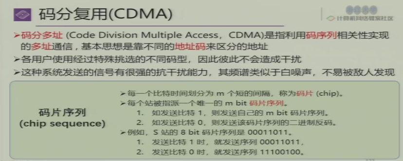
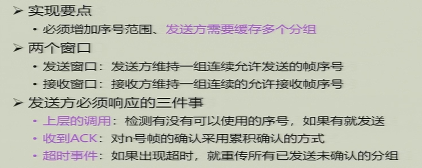
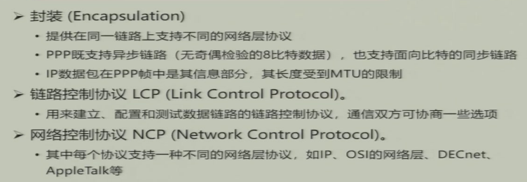
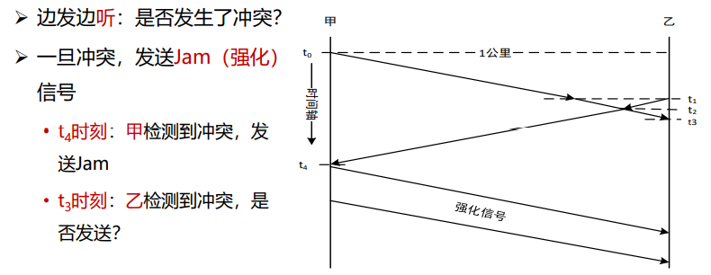
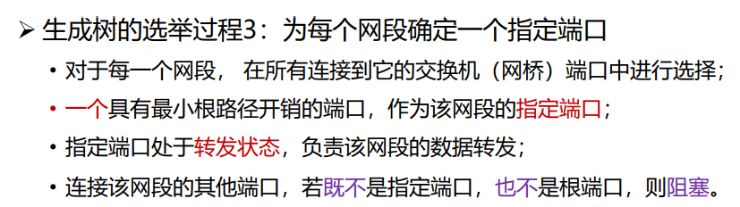
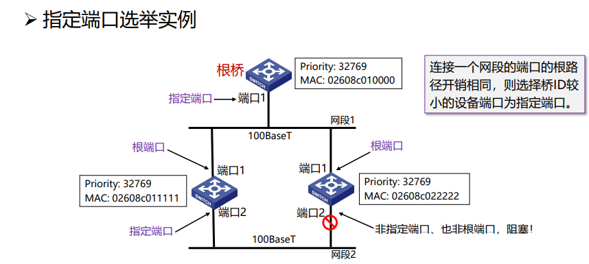
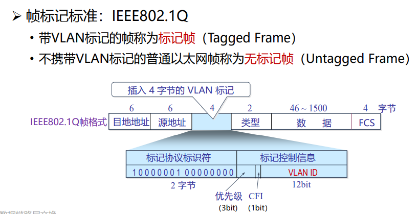
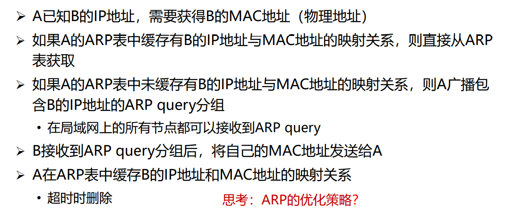
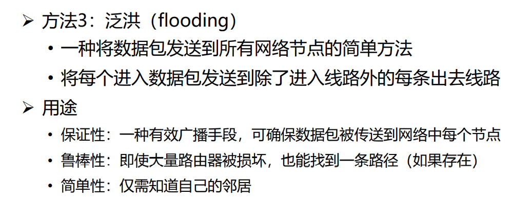
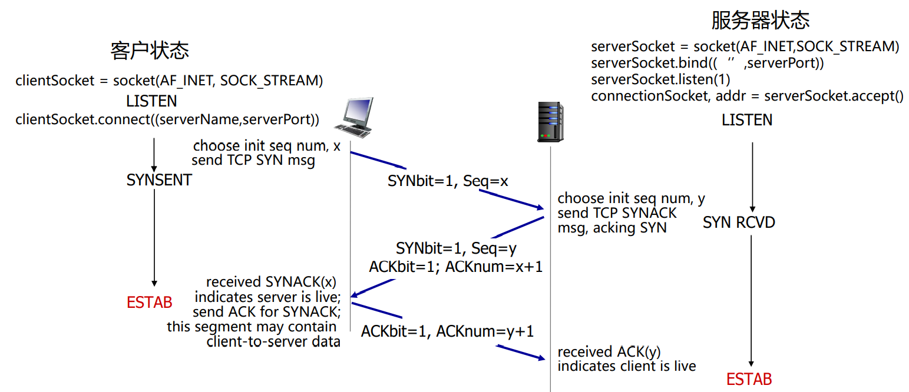

# 计网

[TOC]

## 第一章 引言

### 评分规则

- 平时成绩 50%
  - 课程作业7-8次
  - 课程实验6次
  - (optional) 分组presentation
  - 出勤+quiz 3-4次
- 期末考试 50%

### 网络实例

- 网络分类
  - 个域网PAN
  - 局域网LAN
  - 城域网MAN
  - 广域网WAN：Wide Area Network
- 网络的网络
  - 
- 网络构成
  - 网络边缘
    - 主机
    - 接入网，边缘路由器。如光纤FTTH、数字用户线DSL、同轴电缆、无线连接、企业和家庭网络
    - 物理介质
      - 引导型介质
        - 光纤
        - 双绞线
      - 非引导型介质
        - 无线电
        - 蓝牙
        - 卫星
  - 网络核心
    - 交换模型
      - 分组交换
      - 电路交换：先建立物理连接，资源利用率低。使用FDM和TDM，无法应对互联网中突发Burst流量
      - 
    - 两大功能：路由和转发

### 协议与分层结构

横向是协议，纵向是服务（提供接口）

服务类型：

- 面向连接
- 无连接

### 参考模型

IP地址和MAC地址不同因为分层

无连接与面向连接：

- OSI模型网络层能支持无连接和面向连接
- TCP/IP模型的网络层仅支持无连接通信（IP）

### 计算机网络度量单位

- 比特率 bps

- 带宽：网络中某通道单位时间内能通过的最高数据率 bit/s

- 包转发率PPS：交换机或路由器以包为单位的转发速率

  - 线速转发：交换机在满负载情况下帧转发达到最高速度
  - 大包更容易实现线速，因为大包数量少，控制计算比较少

- 时延

  

  

- RTT（Round-Trip Time）：来回时间

- 时延带宽积：**传播**时延*带宽

  

- 吞吐量 throughput

  - 单位时间内通过某个网络或信道的数据量，单位是b/s

- 有效吞吐量

- 利用率

- 丢包率

- 时延抖动：变化的时延

- 延迟丢包

## 第二章 物理层

### 物理层基本概念

- 物理层接口特性

  

- 物理层常用标准

  - 点对点通信线路

  - 广播通信线路

    

### 数据通信基础

- 数据通信基础理论

  

  

  

  当谐波数量比较多的时候才能恢复出原来的信号

  

  

  我的理解：信号用傅里叶分析转化成多条谐波（即sin/cos中的某一项）的叠加，当谐波数越多就越接近真正的信号，但是线路有截止频率（频宽有限），使得超过某个频率就不能传输。所以带宽和传播速度有关。

  

  注意当V=2的时候，最大传输率就是2H。上上图中的例子，一个symbol是8位（一个周期能表示8bit，所以需要256 level），所以V=$2^8$

  

  symbol rate表示每秒中有多少个波形，每个波形能代表多少位（如果level是8就能代表3bit）

  

  **重要**：实际做题的时候，应该计算有信噪和无信噪两种情况并取小的那个作为上界

  

  事件出现概率小就信息量大

- 基本概念与术语

- 传输方式

  - 
  - 
  - 

- 数据编码技术

  - 

  - 

    曼彻斯特编码缺点：时钟要求变高，2倍

  - 

- 频带传输：数字数据的模拟传播，也称载波传输

  - 

  - 

    收音机AM调幅，FM调频

    

    上面点的数量就是V的值。最后一张图，有些点角度不同表示相位不同，到原点距离不同表示幅度不同

### 传输介质

- 非导引

  - 

  - 

    

    短波会出现干扰

  - 散射传播

  - 地面微波

  - 光波传输

    - 频率低的时候饶射能力强，光的频率高饶射能力低，带宽高

  - 可见光传输

- 导引

  - 双绞线

  - 磁介质：磁带交通运输，带宽非常大，但是延迟很大

    

  - 同轴电缆

  - 光纤

    

    多模表示光纤内有多种光纤

    

  - 电力载波

### 无线与卫星通信

卫星通信特点：

- 传播时延长，达到500-800ms
- 损耗大，200dB

类型：

- 同步卫星通信
- 低轨道卫星系统 LEO
  - 带宽小

### 多路复用技术

- FDM

  

- TDM

  

  缺点：

  - 延迟
  - 带宽浪费

- STDM 统计时分复用

  

- WDM 波分复用

  多束不同波长激光

- CDMA 码分复用

  

  

  

  

  抗干扰，更加安全

- OFDM 正交频分复用

  

  将一个信道再分成多个正交子信道

  

  利用欧拉公式变换

  

  $c_n$变换成$F(\omega)$，将$L$趋向于无穷大，将傅里叶级数变成了**傅里叶变换**

  

  离散的傅里叶变换

  

  下面是FDM的问题：大的带宽导致短的symbol time。由于多路传播（例如多次反射）导致不同光到的频率不同，从而出现延迟，而symbol time很短，就会导致出现严重的ISI（干扰）

  

  OFDM将宽频划分成窄频

  

  

  

  将一条信道分成多份，然后调制到不同频率上去，但是这实施起来非常困难

  

  后来发现这个公式和离散傅里叶逆变换一样，所以不需要分成多份依次调制，只需要对整个信号做一次IDFT就在逻辑上给信号分层了

  

## 第三章 数据链路层基础

### 数据链路层的设计问题

- 位置

  - 

- 功能

  - 成帧
  - 差错控制
  - 流量控制

- 提供服务

  - 无确认无连接服务
    - 以太网
  - 有确认无连接服务
    - 802.11
  - 有确认有连接服务

- 成帧

  - 字节计数法：每个frame的第一个字节表示该frame有多少字节

    - 问题：出错就破坏了帧的边界

  - 带字节填充的定界符法

    - 定界符（FLAG）：一个特殊字节用于区分前后两个不同的帧，如01111110, 0x7E

    - 当有效载荷中出现定界符加上转义字符

      

    - 问题：代价比较大

  - 带比特填充的定界符

    - 定界符：01111110, 0x7E

    - 如果有效载荷中出现5个连续的1就直接插入1个0 bit，使得定界符不会出现在有效载荷中

      

  - 网络层编码违例：将载荷中不会出现的非法字节标识成定界符

    

- 差错控制

  - 解决方式：差错检测与纠正、确认重传

- 流量控制

### 差错检测和纠正

- 通常采用增加冗余信息（或称校验信息）的策略

- 两种策略：检测码和纠错码
  - 例子：将每个bit发三份，检测能力是2bit，纠错能力是1bit
  
- 术语
  - 
  
- 海明距离

  - 两个码字之间的海明距离：两个码字之间不同对应比特的数目
  - 一种编码方案的海明距离：任意两个合法码字之间的最小海明距离

- 检错码

  - 奇偶校验：增加一个bit的检验位，可以检验**奇数位**错误
    - 偶校验：保证1的个数为偶数个
    - 海明距离：2
    - 检测能力：1
    - 纠错能力：0

  - 校验和
    - 
  - 循环冗余校验CRC
    - 
    - 
    - 发送方计算方法：将原数D后面加上n个0，然后除以n+1位G，得到n位R，最后传输D+R
    - 接受方计算方法：D+R去除G，如果没有余数就正确
    - 

- 纠错码，这种方法一般叫做FEC，Forward Error Correction

  - 

    这个公式是容易理解的，有效信息完全正确的码字有$2^m$种，错一位的码字有$n\cdot 2^m$中，这两种情况显然一定少于$2^n$种

  - $(m+r+1)\le 2^n$

  - 海明码

    - 

    - 

      第一组：24列

      第二组：34列

      第三组：24行

      第四组：34行

    - 校验方法：用两个校验位可以确定行，两个校验位确定列

      

    - 

      注意校验位的位置是1,2,4,8...，计数器计算出的值就是错的位置，原理是查表

      

  - RS Code

  - Convolutional Code 卷积码

    - 例子1

      

      中间有各种状态，一个bit输入进来就会让两个bit输出

      上面的$\sum$表示对应的bit加起来（其实就是**异或**起来）

      状态会随input变化，一开始所有的state都是0，然后每次**输出**的时候，$S_1$变成input，剩下的向右平移

    - 例子2

      

      可以提前画一个Trellis diagram

      

      更好是画一个状态机图

      当有两条路可以走的时候，计算累积海明距离，一边走一边剪枝

### 基本的数据链路层协议

- 定义与假设

  

- 乌托邦式单工协议

  - 

  - 

    上面的`wait_for_event`永远得到的是`frame_arrival`

- 无错信道单工停止-等待协议

  - 

  - 

  - 

    发送方多了一个`wait_for_event`，并且等待的event就是`frame_arrival`，得到哑帧

- 有错信道单工停止-等待协议

  - 

  - 

    会出现duplicate的情况

  - 

    需要加上sequence，接收方发现有连续的sequence为0的情况，就丢弃重复的帧

  - 

    发送方要确认得到的ACK对应好sequence

  - 效率评估

    

### 滑动窗口协议

- 停等协议的性能问题

  - 

- 滑动窗口协议

  - 

  - 

  - 

  - 发送方

    

  - 接收方

    

- 回退N协议 Protocol 5

  - 

    错误的帧后面都丢弃，接收方累计确认

    适用于接收窗口为1的情况

  - 

  - 如果是接收方没接收到数据，那么后面的就会被discard，然后接受方会一直返回之前的ACK，导致发送方的窗口不移动，最后会timeout

  - 如果是发送方没有接受到ACK，但是因为是累积确认的，后面的ACK会让窗口移动

  - 实现

    

  - 发送方

    

    窗口长度有上限，根据sequence number bit来决定

  - 接受方

    

- 选择重传协议 Protocol 6

  - 
  - 注意：发送窗口应该等于或小于序号空间的**一半**
  - 这里**不是累积确认**，每一个发送都需要一个对应的ACK
  - 如果接收过程中有丢失，效率是不如GBN

### 数据链路层协议实例

- 点到点链路层协议PPP

  - 特点
    - 不可靠传输协议，只进行检错
    - 没有点到点的流量控制
    - 不使用帧的序号
    - 不支持多点线路
    - PPP协议支持全双工链路
  - 构成
    - 
  - 帧的格式
    - 
    - 开头和最后的F是定界符
    - FCS就是CRC的帧检验序列，有检错能力但没有纠错能力
  - 异步传输：Byte stuffing；同步传输：Bit stuffing
  - 

- PPPoE

  - PPP over Ethernet

    - Ethernet优点：原理简单，应用广泛，设备成本低
    - Ethernet缺点：无认证功能
    - PPP优点：提供认证，提供良好的访问控制和计费功能
    - 两者结合

  - 报文：over表示在上层，那么下层的帧就会在payload里包含上面的data

    

## 第四章 介质访问子层（MAC子层）

### 信道分配问题

广播信道面临的问题：多个站点同时请求占用信道

- 静态信道分配

  - FDM或者TDM

  - 性能分析：信道N等分之后每个信道的平均延迟时间变成N倍（推导略）

    

    

- 动态分配

  - 按需分配，多路访问协议

### 多路访问协议

- 随机访问

  - ALOHA

    - 原理是想发就发，冲突的帧被破坏，一旦破坏就重传
    - 
    - 上图中阴影部分是实际发生的帧，前后两个白帧都会与之产生冲突
    - 在一个帧时里不发送的概率是$P_0=e^{-G}$，而**冲突危险期**是两倍帧时

  - 分槽ALOHA

    - 冲突危险期降低成一个帧时
    - 吞吐量增大成2倍

  - CSMA

    - 特点：先听后发

    - 

    - 非持续CSMA

      - 侦听，如果空闲就发送；否则就等待一个随机时间然后重复上一步。

    - 持续式（1-持续式）CSMA

      - 侦听，如果空闲就发送；如果介质忙，持续侦听，一旦空闲立即发送；如果发生冲突就等待一个随机分布时间再重复步骤一

    - p-持续式CSMA

      - 上面步骤一改成：如果空闲，就以p的概率发送，以(1-p)的概率延迟一个时间单元发送

    - 先听再发也会发生冲突

      - 同时传送

      - 传播延迟时间

        

        定义冲突窗口：发送站发出帧后能检测到冲突（碰撞）的最长时间

        数值上：等于最远两站**传播时间的两倍**，等于RTT（Round Trip Time）

    - CSMA/CD

      - 原理：先听后发、边发边听
      - 
      - 发送帧的时间**不能太短**，至少一个冲突窗口的时间，所以发送的帧的长度稍长

    - 

      p越小，越适用于高负载的情况，但是延迟会高

- 受控访问

  - 位图协议 Bitmap

    - 

    - 性能

      

    - 待补充

- 有限竞争

  - 自适应树搜索协议
    - 
    - 结合前两种方法，每次竞争的时候竞争范围在缩小

### 以太网

- 经典以太网

  - 最高10Mbps

  - 曼彻斯特编码

  - MAC子层协议：CSMA/CD协议

  - 数据46byte到1500byte：太少CD协议失效且数据利用率低，太长错误bit过多。如果不够46byte需要补0

    

  - 注意：Physical Address是MAC地址，属于**数据链路层**，前三个字节属于一个组织

  - 校验和

    

  - 

  - 问题：冲突域非常大，使用同一个channel

- 交换式以太网

  - 核心是交换机
  - 

### 数据链路层交换

- 数据链路层交换原理

  - 
  - 在冲突域中是广播信道，需要使用多路访问协议
  - 网桥是透明，即插即用的
  - 
  - 当A发送给B的时候，信息也达到bridge，然后MAC地址表中就增加一条A对应的端口是1
  - MAC地址表可能会溢出，有类似攻击
  - 如果在MAC地址中找不到就Flooding泛洪，向所有的端口都发送（如果目的地址为FF-FF-FF-FF-FF-FF的数据帧也要Flooding）

- 链路层交换机

  - 

    都不冲突

  - 交换方式

    - 对称交换：出和入的带宽相同
    - 非对称交换：出和入的带宽不同

  - 交换模式

    - 存储转发模式
      - 转发必须接受整个帧并执行CRC校验
      - 缺点：延迟大
      - 优点：不转发出错帧、支持非对称交换
    - 直通模式
      - 接收到目的地址就开始转发
      - 缺点：可能转发错误帧，不支持非对称交换
      - 优点：延迟非常小，可以边入边出
    - 无碎片模式
      - 接受帧的前64个byte就开始转发（为什么是64byte，因为CSMA/CD中要求帧最小不能小于64）
      - 缺点：可能转发错误帧
      - 优点：过滤了冲突碎片，延迟介于上面两者之间

- 生成树协议 STP

  - 可靠传输：冗余拓扑
  - 付出的代价：导致物理环路
  - 物理环路的问题
    - 广播风暴
    - 重复帧
    - MAC地址不稳定

  - 如何得到无环的生成树
    - 参与的交换机（网桥）：收发桥协议数据单元BPDU
    - 选举产生根桥、根端口、指定端口、形成生成树
    - 
    - 
    - 
    - 
    - 
    - 
    - 
    - 
    - 
    - （T）根桥的所有端口都是指定端口

- 虚拟局域网

  - 广播域：广播帧能够达到的所有范围

  - 缺省状态下，交换机所有端口同属一个广播域，无法隔离广播域，具有安全隐患

  - 交换机利用VLAN来隔离

  - VLAN类型

    - 基于端口的VLAN
    - 基于MAC地址的VLAN
    - 基于协议的VLAN
    - 基于子网的VLAN

  - 基于端口的VLAN

    - 

  - 

    VLAN个数最多支持4096

  - 

  - 

  - 连接终端的称为Access端口，连接不同交换机的称为Trunk端口

### 无线局域网

- 设计目标
  - 使用无需授权的频谱（ISM频段）
- 组网模式
  - 
  - 
- 
- 
- 介质访问两大问题
  - 隐藏终端问题
    - 
    - 导致网络冲突
  - 暴露终端问题
    - 
    - 导致效率降低
  - 这两个问题不能完美解决
- CSMA / CA
  - 
  - 
  - 无视了隐藏终端问题
- 差错检测和确认重传
  - 差错检测：32位CRC校验
  - 采用停等机制：发送数据，等待确认，超时重传（不采用流水线）
    - 访问延迟小，RTT很小，所以直接用停等协议即可
  - 如果达到最大重传限制，该帧就被丢弃，并告知上层协议

- 不同帧间隙控制优先级
  - 
- RTS-CTS机制
  - 
- 无限链路较高的出错率
  - 采用较小的帧
  - $F_i$帧中携带$F_{i+1}$的传输时间
- 
- 无限局域网基础架构模式
  - 
  - 扫描
    - 被动扫描：AP周期性发送Beacon帧，站点在每个可用的通道上扫描Beacon帧
    - 主动扫描

## 第五章 网络层

### 网络层服务

- 网络层连接的是两个主机
- 采取无连接协议

### 网际协议

- IPv4协议
  - 数据报分片
    - MTU（Maximum Transmission Unit）最大传输单元

    - 重组策略：互联网使用的目的端重组

    - 

      `DF`标志表示是否允许分片，`MF`（more fragment）标志表示是否为分片的末尾，偏移位的单位是8字节，所以要除以8

    - 

    - 

      当分配地址的时候，如果分配X个地址，那么要么从0开始分配X个要么从X开始分配X个。

  - DHCP

    - 
    - 

  - ARP

    - 

    - 跨网：先在一个局域网中用ARP发送到路由器然后转发到另一个网络

      

  - 网络地址转换

    - 

    - 

      边界路由器加上端口号

  - ICMP

    - 用ping得到TTL

### 路由算法

- 最短路径算法

  - Dijkstra算法

- 路由算法

  - 距离向量路由 Bellman-Ford方程

    

    

    缺陷：好消息传播快，但坏消息很难传播 count-to-infinity

    

    毒性逆转，如果有环就发生错误。

    

  - 链路状态路由

    - 
    - 

  - 层次路由

    - 
    - 
    - 
    - 

  - 广播路由

    - Flooding

      

    - 

    - 

    - 

      当得到一个数据包的时候，判断这个数据包的来源S和接口X，如果是从本路由器到S的最佳路径就是从X走的，那么就接受否则就不接受。相当于只接受最初的一份。

    - 

    - 

    - 

### Internet路由协议

略

### 路由器工作原理

### IPv6技术

## 第六章 传输层

### 概述和传输层服务

### 传输层复用和分用

### 无连接传输：UDP

### 面向连接传输：TCP

为了避免sequence number循环出现的问题：

- 限制包的Life Time

- 用一个时钟来记录

  

  下面是一个例子：如果$T$是70s（两个相同sequence number被区分开的间隔时间）。如果$x$时间开始，那么sequence number就设置成从$x$开始增加，下面的例子是如果30s的时候发了一个80,85秒的时候又发个80，就不能区分开来。所以不能在forbidden region里面。

  

  

三次握手：

存在two army problem，实际设计中还是需要引入timeout机制

### TCP拥塞控制

### 拥塞控制的发展

wireless无线丢包发生在不同的timescale（远小于TCP时间）所以不会影响网络

不使用RTT直接使用时钟：

以上都是被动机制

## 第七章 应用层

### 应用层概述

- 服务器进程工作方式
  - 循环方式（主要是面向无连接）
    - 
  - 并发方式（主要是面向连接）
    - 

### 域名系统

anycast：DNS服务器有相同的IP地址但是服务器不同，但是我不在意是哪个服务器给我的反馈

### 电子邮件

## 第八章 网络安全

### 网络攻击与威胁

- 攻击类型

  - 被动式
    - 窃听
    - 嗅探
  - 主动式
    - 网络欺骗
    - 干扰与瘫痪

- ARP攻击

  - 对路由器ARP表的欺骗

  - 对局域网内PC的网关欺骗

  - 毒化

    

    

    

- Deny of Service

  - 

- SYN Floods

  - 
  - 解决方案：避免保持连接状态
  - 

- 放大攻击

  - 

- MAC Flooding

  - 

- 物联网设备作为僵尸机器

  - 

- APT攻击

  - 

### 安全机制与手段

- 密码学

  - 

  - 攻击者能力类型

    - 唯密文
    - 已知明文
    - 选择明文

  - 古典密码学

    - 凯撒密码 Substituion Ciphers
    - Transposition Ciphers
    - One-time pads，缺点是pad和数据一样长

  - 现代加密算法

    - 对称密码算法

      

      - Feistel结构
        - 
      - DES算法
        - 
      - 3DES
      - IDEA
      - AES
        - 

    - 非对称密码算法

      - 

      - RSA

        - 

          

          

      - 椭圆曲线密码ECC

      - 非对称密钥加密内容非常慢，所以可以用来做对称密钥分配

        

        

        

- 数字签名与报文完整性

  - 
  
  - 
  
  - 
    1. 给P加密两次，分别是用A的私钥和B的公钥
    2. 给P加密一次，用A的私钥作为签名
    3. 先对P做摘要然后再用A的私钥加密（最快）
  
  - 生日悖论：对于$m$bit长度，找一个collision往往只需要$2^{m/2}$次
  
  - 要确保Bob拿到Alice正确的公钥，这里就对公钥进行加密，称为证书
  
    
  
    CA对用户公钥进行加密，而CA公钥是预装的（比如在浏览器中）
  
    
  
    可以层层认证，像DNS一样保存Root CA然后再去找下面的CA
  
    
  
  - 认证协议：两方共有一个私钥，要验证是双方
  
    challenge-response protocol：Bob给Alice一个随机数$R_B$，让对方用共有的私钥加密，加密完之后返回给Bob，Bob验证；然后双方交换。不完全。
  
    
  
    Trudy先发A给Bob表示自己是Alice然后发送一个随机数问题$R_T$，然后Bob用$K_{AB}$加密$R_T$，并给Trudy一个题目$R_B$，Trudy直接新起一个session然后问Bob，$R_B$的答案（reflection attack）
  
    

### 电子邮件安全

- 保密性

  Alice：

  - 随机生成对称私钥$K_s$
  - 用私钥$K_s$加密信息$m$，运算$K_s(m)$
  - 用Bob的公钥加密私钥$K_s$，运算$K_B^+(K_s)$
  - 发送$K_s(m)$和$K_B^+(K_s)$

  Bob：

  - 使用Bob私钥解密得到Alice的私钥$K_s$
  - 使用私钥解密$m$

- 完整性

  Alice先对消息进行hash，然后用私钥$K_A^-$加密$H(m)$

  

- 保密性和完整性

  

  Alice发送三个东西，签名、对称私钥加密的m、用Bob公钥加密的对称私钥

- 保密协议PGP

- 

### Web安全

- SQL注入

- XSS 跨站脚本攻击：用户点进一个钓鱼网站，然后evil.com会发送一段脚本给用户执行，用户转去发送给naive.com就会伪造成善良用户的访问

  

- 点击劫持

- 挂马攻击

  

### 通信安全

- 传输层安全

  

  - SSL目前被废弃
  - TLS：web服务器https端口443（普通的是80）
  - HTTPS：HTTP+TLS/SSL

- 网络层安全

  

  IP安全数据报有两种模式：传输模式和隧道模式（用来实现VPN）

  

  

  安全关联（SA），为了实现完全性，IP无连接性变成有连接。IP面向无连接，IP Sec面向连接

- 无线网络安全：WPA3

### 安全技术前沿与未来发展

- BB84协议（量子密钥分发）
  - 
  - 
  - 
  - 

## 新型网络及网络新技术

- 物联网：NBIOT、LoRa

  
