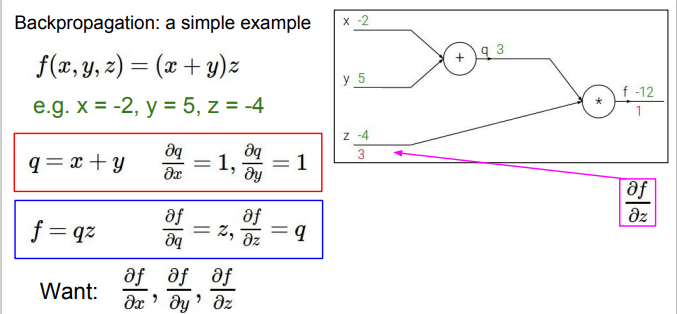
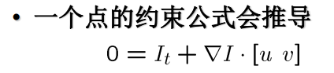
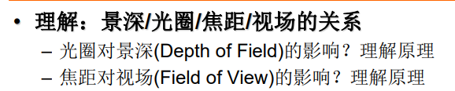
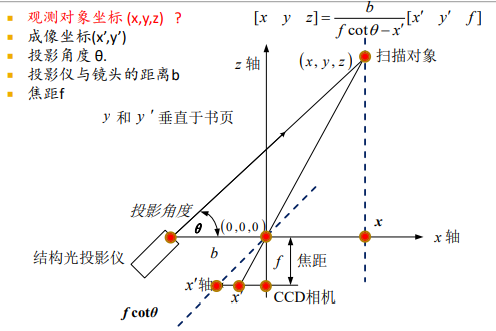

[TOC]

# 主元分析与人脸识别

## 主元分析(PCA)

PCA方法的基本思想是最小化什么？

什么样的数据用PCA会比较有效？

优化目标函数的推导

关于选取多少个特征向量构建子空间，常用什么方法？

## Eigenface

Eigenface人脸识别方法的基本步骤

会写基于Eigenface的人脸重构公式（线性加权和）

理解利用人脸重构进行人脸检测的原理

思考：Eigen-X应用过程重点需要注意什么？随机变量分布要基本符合高斯分布，不然方差越大越好的假设不成立

# 物体识别

## Visual Recognition

基本任务大概可以分为哪些？

都有哪些挑战因素？

种类多、角度、光照、比例、变形、遮挡occlusion、背景干扰background clutter、intra-class variation

 理解Generalization error中模型带来的Bias与variance，以及模型复 杂度跟overfit, underfit的关系。

欠拟合：bias

过拟合：variance

## 基于BoW的物体分类

图像的BoW(bag-of-words)是指什么意思

如何构建visual words?

基本步骤

## 基于卷积全局优化的物体分类

# 深度学习

## 深度学习

 怎么理解被称为end-to-end的学习？ End-to-end learning: raw inputs to predictions

神经网络的学习，数学本质上是求解神经网络的什么？权重 

会写出基于梯度下降法的学习框架。

## BP反向传播算法

BP算法作用是计算什么？计算偏导即梯度

理解“梯度下降法”与BP算法的关系？梯度下降法先要计算梯度

给一个具体公式例子，会画出计算图，并计算梯度反向传播的过程

计算方法：首先已知$x/y/z$，然后正向计算每个节点上的值$q/f$，然后对每个节点反向各个路径求偏导，例如求$f$对$z/q$的偏导、求$q$对$x/y$的偏导，之后开始传播，传播的时候要乘上前面已经计算出来的值就可以了。

## CNN

理解卷积层的作用？用于提取图像中的特征

 卷积层主要利用哪两个技巧降低模型参数？localfield和共享权重

会计算第一个卷积层的权重(weight)数量（注意: 权重数与连接数的差别）

# 光流

光流解决的是什么问题？

运动跟踪

 光流三个基本假设是什么？

一个点的约束公式会推导

哪些位置光流比较可靠？为什么？

# 相机模型

##  理解：景深/光圈/焦距/视场的关系（都相反）

## 理想的针孔相机（pinhole camera）模型

总结：相机坐标映射到成像面

成像面坐标到图像坐标

两个变换矩阵乘起来

以上称为相机内参

世界坐标到相机坐标

以上是相机外参

## 齐次坐标系

齐次坐标好处？

刚体变换的齐次坐标

## 畸变

5个畸变参数

# 相机定标 Camera Calibration

相机定标 Camera Calibration的基本思路或思想 ？

有哪些优点？ 

基本过程（4个步骤）？ 

Homography矩阵有几个自由度？

求解需要至少几 个特征点？

6K+4是Ex个数*K+In个数

# 立体视觉

## 立体视觉的三角测量基本原理

## 如何做立体视觉

# 结构光三维成像原理

## 结构光成像系统的构成

结构光投影仪（一台或多台）、CCD相机（一台 或多台）以及深度信息重建系统。

## 利用结构光获取三维数据的基本原理

## ICP算法

