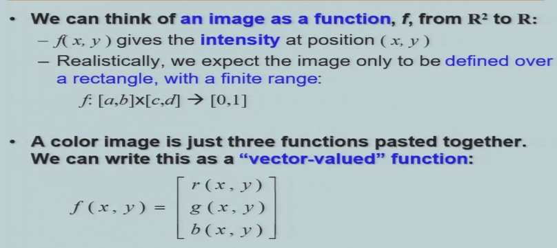
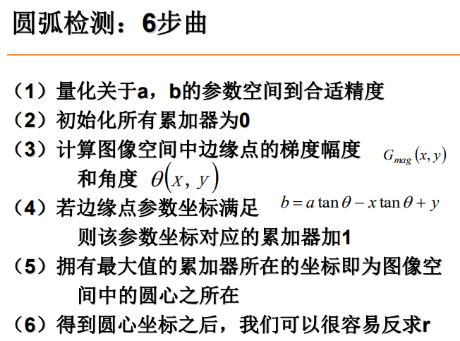
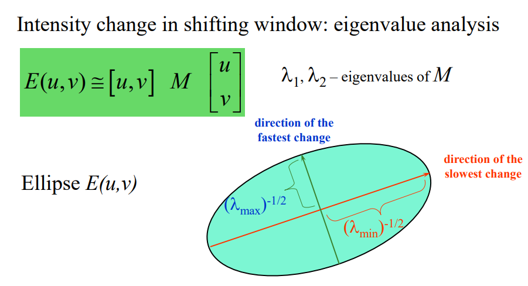
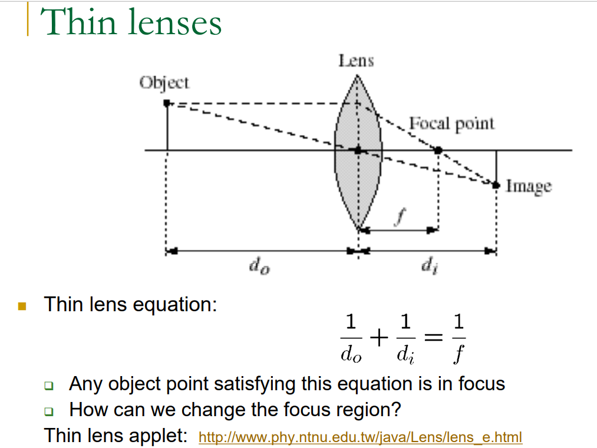
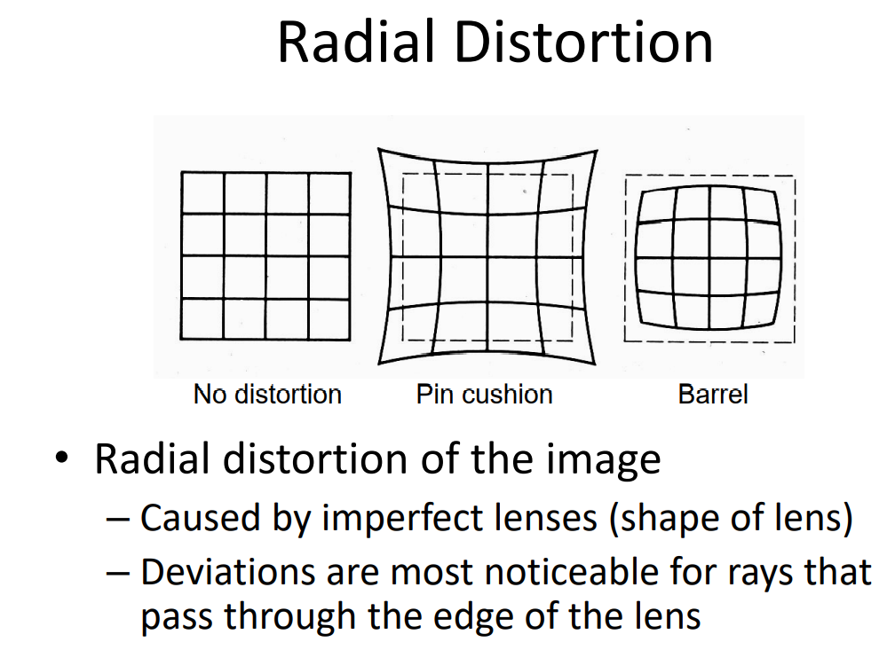

# 计算机视觉

[TOC]

## 课程内容

- 教材：《Computer Vision: Algorithms and Applications》
  - http://szeliski.org/Book
- 《Computer Vision: A Modern Approach》
- 《Computer Vision: Models, Learning, and Inference》
- 《Learning OpenCV》

### 考核与成绩

### 编程作业的提交

### 考试

全是大题12题到13题，分成以下种类：

- 描述算法，需要背
- 推导公式
- 计算题

## OpenCV Tutorial

### 图像

类型：

- 二值
- 灰度gray scale，用一个byte来表示，256
- 彩色

## Edge Detection 边缘检测

### 边缘及边缘检测概念

目标：identify sudden changes (discontinuities) in an image

边缘的原因：

- surface normal discontinuity
- depth discontinuity
- surface color discontinuity
- illumination discontinuity

边缘的特点：

- intensity灰度变化很大。求导计算极值，或者求二阶导得零点

  

### 用模板实现卷积

### 基于一阶导数的边缘检测

上面最下面两种方式是近似幅值的公式

2*2算子不对称

### 基于二阶导数的边缘检测

#### Laplacian算子

#### LoG算子（Marr&Hildreth算子）

优化：$g$是高斯函数，可以先做$\nabla^2g$，然后就可以对任意一张图片$f$来处理了。

### Canny边缘检测

思想：

- 如果有不太显著的边缘，就看周围有没有强的边缘（双阈值）
- 一阶导数会让线比较粗，于是就找边缘的”山脊“，看某个像素的梯度在自己方向上是否是最大的（非极大值抑制NMS）

高斯函数的$\sigma$表示周围像素对当前像素的影响，$\sigma$越大就越模糊，边缘就越来越小

## Curves 曲线

### 曲线表示

### 曲线拟合

#### 直线

#### 分线段/多边形

#### 椭圆

### Hough变换

#### 直线检测

对于经过某个坐标$(x,y)$的直线可以在cm坐标系中也找到一根直线，直线上的某一点$(c,m)$可以确定一根直线，所以在cm坐标系中各条直线的交点$(c,m)$就得到一条共同直线

[【图像处理算法】Hough变换](https://blog.csdn.net/qq_15971883/article/details/80583364)

经过一个点的直线在极坐标系下是一根正弦函数，因此多条正弦函数的交点就是共同的直线

#### 圆形检测

## Image Local Features

### Feature Detection

- Harris corner detector

  

  思想：用一个小窗口圈住一个部分，然后移动，如果变化大就说明是特征点。所以就让两个矩阵相减即可。

- 

  相减的时候还要用一个窗口函数$w$

  此处$(u,v)$表示的是窗口移动的方向

  

  

  可视化之后$E(u,v)$相当于一个三维曲面

  

  让$E(u,v)$等于一个固定常数，然后可以得到圆或者椭圆。这个椭圆上面的点表示：移动到两个不同的位置$E(u,v)$相同，那么在这两个位置越近说明变化越快，越远表示变化越慢

  

  椭圆的长短轴是看特征值的，长度表示$E(u,v)$变化的快慢

  

  定义Corner，$\lambda$都要大，且近似相等

  

  人为规定下面的公式来判别Corner：

  

  

  

### Feature Descriptions

Harris Corner对旋转、反射亮度影响很小，但是缩放影响很大

思路是：对某个点周围的窗口size建立函数，当图片放大的时候这个函数也会相应变化，目标是找到最适合观测的一个窗口（极值）

我们要在xy空间之外增加一个scale的空间

## Image Stitching

SIFT找一个16\*16的窗口，先要在一个优化的scale空间里找，然后再求128位向量

三个点对可以计算出六个参数

### Image Blending

在拼接的区域可以按权重过渡

## 图像空间变换

特征脸：

协方差描述两个随机变量之间的关系。如果协方差大于0，一个增大另一个也偏向于增大；如果小于0，一个增大另一个会减小；如果是0就表示不相关

独立肯定不相关，不相关不一定独立

主元分析PCA：

找个一个方向投影之后分散，方差很大

我们要求的是$a_1$，这是投影的方向，最后我们发现就是协方差矩阵的特征向量，算出来之后可以带进去求$var(z_1)$，我们最后发现要找特征值最大对应的特征向量

我们目前找到了一个方向，对于高维向量我们还想找到其他方向：方法就是和已经得到的方向正交，同时也能让在它的方向上投影方差最大

最后我们得到多个方向拼在一起，然后做投影

某个随机向量接近于高斯分布就比较适合PCA

## Visual Recognition

- K-nearest neighbor alogrithm

  

  

  当维度增大，会出现维度灾难，某个点和其他点的距离比值趋近于1（欧式距离），即分辨率降低。所以在高维上使用欧氏距离有问题，而是cos距离（理解为夹角）

## Object Categorization

- Bag-of-words model

  

  重点在如何将图片切分成多个code word

  这些code word和线性空间的基的区别在于这些word是可以冗余的

  

  可以用regular grid去切分，也可以用特征点切出一部分

  具体是先计算SIFT特征点，然后聚类，然后切出对应部分图片

  

  

  

## Convolution

欠拟合：bias

过拟合：variance

## BP

计算方法：首先已知$x/y/z$，然后正向计算每个节点上的值$q/f$，然后对每个节点反向各个路径求偏导，例如求$f$对$z/q$的偏导、求$q$对$x/y$的偏导，之后开始传播，传播的时候要乘上前面已经计算出来的值就可以了。

## Motion Estimation

Optical Flow：光流，找两幅图片亮度有明显变化

使用三个假设

最后只能得到一条等式，但其中有两个变量，实际上人也经常会有视觉illusion，原因也是在于一条等式不能比较好地确定运动方向。

因此我们这里假设两个点距离足够近，使得$u=v$

## Camera

投影之后长度丢失，共线保持

加透镜之后光更强

大光圈，小景深；小光圈，大景深

焦距越大，field of view就越小，看的更加远

投影：

四种坐标：

- 相机坐标
- 世界坐标
- 成像面坐标
- 图像坐标

前三种都是厘米为单位，最后一个是像素为单位

引入齐次坐标

投影矩阵

总结：相机坐标映射到成像面

成像面坐标到图像坐标

两个变换矩阵乘起来

以上称为相机内参

世界坐标到相机坐标

以上是相机外参

## Camera Calibration

失真类型：

- Radial distortion

  原因：透镜的物理性质不均匀、光圈的位置

  

  

- Tangential distortion

  原因：光轴没有完全垂直

  

定标的方法：

用一个calibration object，拍照之后，得到多对对应点，以此可以求出参数

## Stereo Vision

