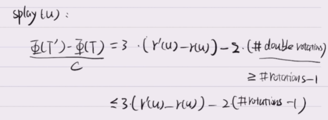
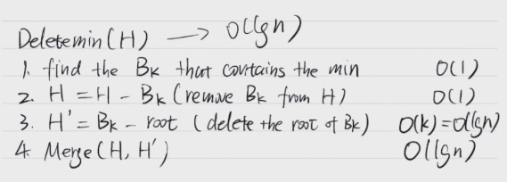
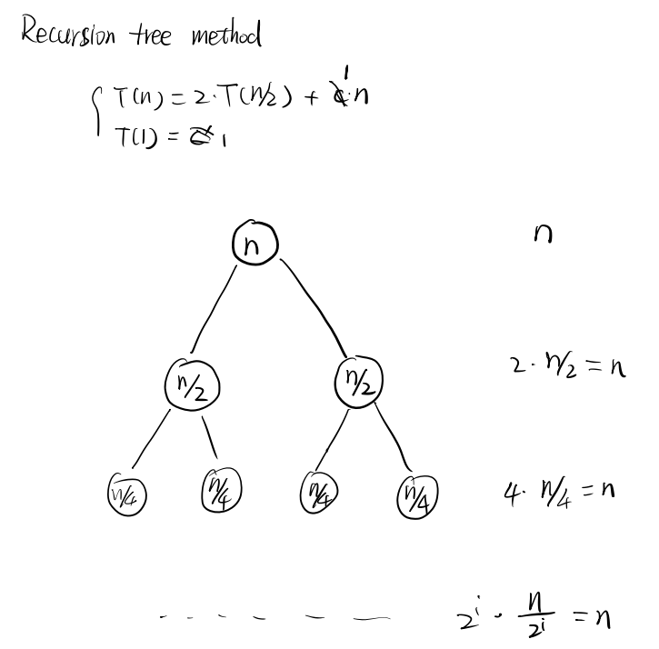
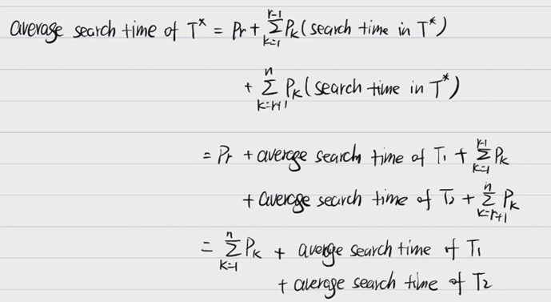
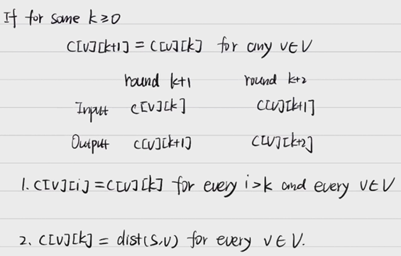
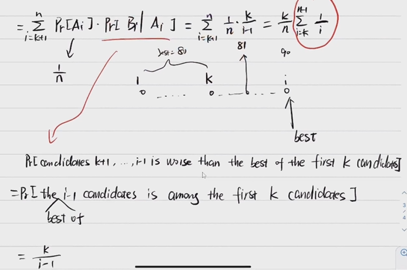

# ADS-Review

- MYC老师
  
  
  
  
  
  
  
  
  
- 个人认为计院大二下考试难度最高的一门课，从这两年看来一年比一年难，需要用心准备，不然考试成绩会非常难看
  - 但是相对的，平时分是比较容易拿高分的，所以平时分一定要往高去刷
  - 历年卷可以去**PTA教育超市购买**，虽然有点贵，但我感觉还是值得的
  
- 这门课的内容还是很不错的，学完之后对算法和数据结构会有一个新的认识
  - 要特别当心后半部分的NP问题，随机算法，近似算法，局部搜索等内容，考试最难的就是这一块

[TOC]

## 1. Advanced Data Structure

### 1.1 Tree

#### 1.1.1 Binary Search Tree

- 特点
  - 左节点 < 父节点 < 右节点
- 树的高度：从根到叶子节点的最大路径长，所有**叶子**高度为0。
- 树的深度：从根到叶子节点的最大路径长，**根**的深度为0。
- 删除（递归，非懒惰）
  - 找到要删除的节点
  - 使用它左子树最大的节点 / 右子树最小的节点的值替换
  - 进入删除用于替换的节点的流程继续上一步操作

#### 1.1.2 AVL Tree

- 平衡二叉树的一种

> Lemma: A balanced binary tree with $n$ nodes must have height $O(\log n)$
>
> Proof: 
> We will show any balanced binary tree of height $h$ has at least $c^h$(constant) nodes. ($n\ge c^h,\log n\ge h\log c,h\le \log_c^n$)
> $n(h)$: the smallest # nodes to make a balanced binary tree of height $h$.
> $n(0)=0,n(1)=1,n(2)=2,n(3)=4,n(4)=n(3)+n(2)$
> $n(h)=n(h-1)+n(h-2)+1$
> $n(h)\ge (\frac{1+\sqrt5}{2})^n$
> Pay attention: When $n=h$, the height of the left subtree should at least be $h-1$, and to keep the tree balanced, the right subtree should at least be $h-2$. 

- 根本目标：用二叉搜索树来**提高搜索的速度**

- 使用场景：频繁使用删除、插入，动态的改变数据的情况

- AVL树的定义（height balanced的定义）

  - 空树是**height balanced**的
  - 对于任何一个节点，左右子树的高度差的绝对值不超过1（把高度控制在$O(logn)$）
    - 高度的定义：**空节点的高是$0$，没有儿子的节点(学名是叶节点)高为1**，看**点**的数量

- balance factor的定义：
  $$
  The\quad balance\quad factor\quad BF( node ) \quad= \quad h_L - h_R .  In \quad an\quad AVL\quad tree, BF( node ) = -1, 0, or\quad1.
  $$

- 平衡情况

  假设u节点在插入节点之后开始不平衡，其中左子树高度为$h+2$，右子树为$h$，则v节点的左子树和右子树分别为$h+1$和$h$

  - L case

    

    - LL case

      注意B子树高度必须为$h$，当$h_B<h$或$h_B>h+1$显然不成立。而如果$h_A=h_B=h+1$，那么回退一步，A和B子树只有一个高度会减少为$h$，则v节点的树高度还是$h+2$，所以此时就已经不平衡了！

    - LR case

      

      

  - R-case

- **树的旋转rotation**

  - 只有插入点的Ancestor平衡会受影响
  - 当**高度差的约束被打破**的时候（插入、删除操作的时候）就需要进行旋转，有LL,RR,LR,RL四种旋转方式
  - 代价：交换指向的指针
  - 基本操作
    - 单旋（外部）：LL、RR（基本就是LL型旋转的镜像对称）
    - 双旋（内部）：LR = RR + LL（先R再L）、RL = LL + RR
      - $k_1 < k_2 < k_3 $
      - $k_1或k_3是第一个违反的点$
      - 判断插入的点是不是在$k_1和k_3$之间，是的话就是双旋，不是就是单旋
    - 每次复杂度：$O(log {n})$
    - 一次插入/删除后只需操作一次即可
  - 插入（一般采用递归写）
    - 找到合适位置
    - 如果子树高度不变，则插入完成，如果高度不平衡则
      - 插入后，上溯到左右节点高度差为2的位置P（第一个违反的点）
      - 如果子节点的高度差同号，则执行单旋；反之执行双旋。并更新子节点高度为其**左右子树高度较大者 + 1**，单旋更新2次，双旋更新4次
      - 更新节点P高度为**左右子树高度较大者 + 1**
  - 删除
    - YDS：删除比插入复杂，如果删除操作相对较少，懒惰删除恐怕是最好的策略
    - 删除也只有Ancestor会受影响（**注意可能会有多个节点受影响**），然后去和Insertion一样做修复，可以一边修复一遍更新左右子树高度，即如果不平衡就修复然后更新高度然后再往上传。
    - Every BST deletion in an AVL tree is essentially removing a **leaf**. If delete($u$):
      - $u$ is a leaf
      - $u$ has only a child $v$. $v$ must be a leaf.
      - $u$ has two children. Delete the smallest element in the right subtree which has 0 or 1 child.  
    - $O(\log n)+O(\log n)\cdot O(1)=O(\log n)$
  - 给定树高h，最小节点数计算，见上方Lemma
    - 画图分析可知：n~h~ = n~h-1~ + n~h-2~ + 1，即左子树节点数 + 右子树节点数 + 根
    - 又：n~0~ = 1
    - 通过斐波那契数列的通项公式得：$n_{h} = Fib(h + 2) - 1 \approx \frac{1}{\sqrt{5}}(\frac{1 + \sqrt{5}}{2})^{h+2} - 1$
    - 由此可知$h = O(log {n})$

#### 1.1.3 Splay Tree

- 问题：我们无法保证每一次的操作不是最坏情况，但是我们可以做到摊还下来时间复杂度仍是$O(logN)$，让最坏的情况不常发生

- ​    特点：
  - 不一定平衡的二叉树
  - 每访问一次某节点就会将该节点移动到根部
  - M次连续操作的总复杂度为：$O(Mlog{N})$
  - Splaying not only moves the accessed node to the root, but also roughly halves the depth of most nodes on the path

- 目标：从**空树开始**，任何M次连续的操作一共最多消耗$O(M\log N)$的时间

  - 必须要从一棵空树开始
  - 具体做法：在树中，每次有节点被访问到，就将其**旋转到根节点**
  
- 旋转的方法

  - 如果父节点是根节点，直接把父子旋转即可
  
    
  
- 如果父节点不是根节点
  
  - zig-zag：即LR或RL双旋
  
    
  
  - zig-zig：即两次LL或RR单旋（注意是**先v再u**！！！）
  
    
  
- 每次要将被访问的节点按照上述规则**旋转到根节点**上为止

- 查找
  - 找到节点 $O(L)$
  - 找到后通过基本操作调整至根部 $C\cdot N_{rotation}$
  - $N_{rotation}\ge \frac{L}{2},O(L)=C'\cdot N_{rotation}$
  - 单次复杂度：$C\cdot N_{rotation}$
  
- 插入
  - 找到合适位置
  - 插入后通过基本操作调整至根部
  - 单次复杂度：$C\cdot N_{rotation}$
  
- 删除的操作步骤
  - 找到要删除的节点X，将其旋转到根节点(这也是access)
  - 如果根节点只有一个儿子，就直接删掉
  - 如果根节点有两个儿子，就删掉产生左右两棵子树，在左子树上找到最大的节点旋转到根节点，并且把右子树接到左子树的右边
  - 单次复杂度：$C\cdot N_{rotation}$

#### 1.1.4 摊还分析 Amortized Analysis

- 分析一系列的操作的代价 

  T(k)/k, T(k): worst case for sequences of k operations

- Any M consecutive operations take at most O(M log N) time

- 最坏情形复杂度 $\leq$ 摊还复杂度 $\leq$ 平均情形复杂度

- **聚合分析 Aggregate analysis**：确定n个操作的总代价**上界**为T(n)，单次平均代价为T(n)/n。

- **核算法 Accounting method**：将操作序列中较早操作的余额作为“信用credit”存储，与数据结构的特定对象关联，随后用于支付摊还代价与实际代价的差额。

  - 保证银行中存款一直 > 0
  - 
  - 

- **势能法 Potential method（重）**：与核算法类似，分析每个操作的代价，但是将势能作为一个整体函数，与某个对象无关。操作的摊还代价的计算为操作实际代价加上操作引起的**势能变化**。

  - $\Phi(i)$ = # credit left after the $i$th operation 第i步之后的红绿之差
  - $\Phi(0)$ = # credits at the beginning
  - 定义势函数$\Phi(n)$，每次操作的摊还代价$\hat{c_i} = c_i(真实代价) + \Phi(i)- \Phi(i-1)$
  - $\Phi(n)\ge\Phi(0)\rightarrow \sum_{i}\hat{c_i}\ge\sum_{i}c_i$ 
    - 定义中对任意$n\ge0$成立左式
    - 但是实际上$\Phi(n)-\Phi(0)=-O(k)$也可以
  - 总操作的摊还代价为 $\sum \hat{c_i} = \sum c_i + \Phi(n)- \Phi(0)$

- 实例：

  - 栈操作（有pop、push以及multipop）

    - 聚合分析

      - 栈大小为n，最坏情况下multipop为$O(n)$，故n次操作最坏代价O（$n^2$），平均每次O（n），但这不是紧确界；

      - 在一个空栈执行n个push、pop和multipop操作，代价最多为O（n），因为当一个对象压入栈后至多弹出一次。故任意一个n次操作序列代价O（n），单次操作代价为O（1）。

    - 核算法

      - 设push代价为2，pop代价为0，multipop代价为0，而其实际代价为$（1，1，min（k，size））$；
      - push操作时支付2单位代价，其中1单位支付实际代价，1单位作为信用。这样，**每一个插入的元素**都具有1美元的信用；在pop和multipop中弹出该元素时，不缴纳额外的费用，而是使用信用支付代价，故总摊还代价为O（n），平均操作代价为O（1）。
    
    - 势能法

      - 对一个初始数据结构进行n次操作。ci表示第i个操作的实际代价，di表示执行第i次操作后得到的数据结构，势函数定义为$f（d_i）= sizeof（d_i）$；
      - push代价为1 + 1 = 2，pop代价为1 - 1 = 0，multipop代价和pop一样为0.
      - 故每个操作的摊还代价为O（1），n个操作的摊还代价为O（n）。
    
  - 二进制计数器递增（真实代价与进位翻转的位数程线性关系）

    - 聚合分析
      - 最坏情况下一次+1的cost为O（k），n次为O（nk），但这不是紧确界。
      - 每两次才会反转所有的位；最后一位每次操作都会反转1次，倒数第二位为两次操作反转一次，故第i位的反转次数为n/2^i，n个操作总次数为$\sum_{i=0} ^{k-1}{\frac{n}{2 ^i}}<\sum_{i=0} ^{\infin}{\frac{1}{2 ^i}} = 2n.$
      - 所以总摊还代价为O（n），单次代价为O（1）。
    - 核算法
      - 每次操作置0 -> 1，缴费2单位，1单位用于支付实际代价，另一单位存在该位作为信用来支付未来的复位操作。
      - 因为每个操作最多置位一次，因此摊还代价为2单位。所以n次操作总代价为O（n）。
    - 势能法
      - 定义势函数为每次操作后计数器中1的个数bi。
      - 假设第i个操作将ti个位复位，则实际代价为ti + 1。
      - 若bi = 0，则bi-1 = ti = k；若bi > 0，则bi-1 - ti + 1。
      - 综上，bi < bi-1 - ti + 1，故势能差为f（di）- f（di-1）<= bi-1 - ti + 1 - bi-1 = 1 - ti。
      - 所以摊还代价为ci‘ = ci + 1 - ti = ti + 1 - 1 - ti = 2，故n次操作摊还代价为O（n）。
  
  - 伸展树操作

    - 我需要找到一个$\Phi(n)$使得

      - $\Phi(n)\ge\Phi(0)$
      - $\Phi(i)-\Phi(i-1)=C\cdot \log n-C\cdot N_{rotation}$
  
      这样$\hat{c_i}=c_i+\Phi(i)-\Phi(i-1)=C\log n$

    - 定义T的节点总数$size(u)$，rank为$r(u)=\log(size(u))$，定义$\Phi(T)=C\cdot \sum_{u\in T}r(u)$

    - 上述定义中存在问题，因为$size(u)$随着Insert在变化

    - 给出广义定义

      - Given $m$ types of operations $t_1,\dots,t_m$ with acutal cost $T_{t_1}(D),\dots,T_{t_m}(D)$, we say that they have amortized cost $A_{t_1}(D),\dots,A_{t_m}(D)$, if for any sequence of $k$ operations $O_1,\dots,O_k$, $\sum amortized~cost\ge \sum actual~cost$ $\sum_{i=1}^{k}A_{type(O_i)}(D_{i-1})\ge \sum_{i=1}^{k}T_{type(O_i)}(D_{i-1})$
  
      - $\Phi(D)$: Potential of D
  
        $A_{t_i}(D)=T_{t_i}(D)+\Phi(D')-\Phi(D)$
  
        下略见下图
  
      - 
  
      - 
  
    - Claim：$T'$为$T$splay(u)之后的树
  
      $\Delta=\Phi(T')-\Phi(T)\le3C(r'(u)-r(u))-2C(N_{rotation}-1)$
  
    - 若上述Claim成立则：
  
      
  
      
  
      
  
      对于Insert，节点的ancestor的$\Delta_1$都可能改变，每个节点最多加1，所以最多加$h$；
  
      
  
      
  
      
  
      对于Delete，v的size显然比u的size少一，所以$r(v)\le r(u)$
  
    - 下面开始证明Claim
  
      - Case 1: Single Rotation
  
        
  
      - Case 2: Zig-Zag
  
        
  
        此处需要引理Technical Lemma: For positive $a$, $b$, $c$, if $a + b\le c$, then $\log a + \log b \le 2\log c-2$
  
        
  
      - Case 3: Zig-Zig
  
        
  
        
  
      - 注：上面三个case没有取C，应该等式左边都除以C
  
      - 整个Splay(u)的potential change都加起来
  
        
  
        注意$N_{rotation}$中Single Rotation最多就是1，因为Single Rotation结束之后就完成了，所以double rotations数量就大于等于$N_{rotation}-1$
  
  - 斜堆（详见***斜堆部分***）

#### 1.1.5 Red-Black Tree

- Extended Binary Tree
  - 将所有节点补全看起来像满二叉树，有值的点为internal node，NULL为external node
- 红黑树的定义
  - 红黑树是一种二叉搜索树，并且节点的颜色为红色或者黑色
  - 红黑树的**根节点是黑色** 
  - 叶节点都是黑色的(叶节点是NULL的时候把NULL也视为黑色的节点)
  - 红色节点的两个儿子一定都是黑色节点
  - 对于每一个节点，所有的从该节点出发到达后代的叶节点的简单路径包含相同数量的黑色节点
- 
- black height of node x: `bh(x)`
  - 节点的black height表示从x**到叶节点的路径中黑色节点**的个数 （excluding x **不包括本身**）
  - $bh(Tree)=bh(root)$
  - 性质：
    - 有N个节点的红黑树的高度最多为$2\log (N+1)$ 
    - $bh(Tree)>=\frac{h(Tree)}{2}$ （因为红色节点的children都是黑色的，因此黑色节点至少有一半）

> Lemma: A red black tree $T$ (extended version) with $n$ internal nodes has height at most $2\log (n+1)$
>
> Proof: 
> for any $u\in T$, $T_u$: the subtree rooted at $u$, size($T_u$)=# internal nodes of $T_u$
> Will show: $size(T_u)\ge 2^{bh(T)}-1$ for any $u$
> Then: let $u$ = root of $T$
> $size(T)\ge 2^{bh(T)}-1\ge 2^{\frac{h(T)}{2}}-1,h(T)\le 2\log(n+1)$
> Now start proof by **induction** on height of $T_u$
> Base case: $h(T_u)=0,size(T_u)=0,bh(u)=0$
> Inductive hypothesis: Assume that all $T_u$ with height $\le k$，$size(T_u)\ge 2^{bh(u)}-1$
> Inductive step: When height of $T_u=k+1$, 
> $$
> size(T_u)=1+size(T_{v_1})+size(T_{v_2})\\
> \ge 1+2^{bh(v_1)}-1+2^{bh(v_1)}-1\\
> =2^{bh(v_1)}+2^{bh(v_1)}-1\\
> \ge 2^{bh(u)-1}+2^{bh(u)-1}-1\\
> =2^{bh(u)}-1
> $$
> Corollary: findkey $O(\log n)$

- 红黑树的操作

  - 插入insert

    - **先当作普通的BST插入**并且将该**节点作为红色节点**，但是这么做会破坏红黑树的性质4，需要进行旋转

    - 分情况判断怎么旋转

      - case1：插入的节点在父节点的左侧且叔叔节点是红色的：父节点和叔节点变成黑色

        

        - 如果P的父节点是黑色的，完成
        - 如果P是根节点，就染黑，完成
        - 如果P的父节点是红色的，向上递推

      - case2：叔节点是黑色的，不论左右儿子都要进行**旋转成如下图所示之后换成一黑带两红**

        - case2.1：v是u的左儿子

          

        - case2.2：v是u的右儿子

          

      - 

    - 插入的时间复杂度是$O(\log N)$ 插入之后需要从底下不断向上调整多次，直到满足红黑树的所有性质

    - Rotation最多两次

  - 删除 delete

    - Deleted node has at most one child (excluding NULL) 不会有左儿子

    - 删除的节点是**叶节点**：让其父节点指向NULL，保持不变

    - 删除的节点度数为1：用孩子代替原本的节点

    - 删除的节点度数为2：用最大的左儿子或者**最小的右儿子**代替节点

    - 删除的节点是红色节点时性质不会被破坏

    - 删除的节点是黑色的时候

      - 该节点有一个红色的儿子，放上去然后染黑

        

        （上图红色节点的儿子都是NULL，因为被删掉的黑色节点到叶节点的路径上的黑色节点数要一样）

      - 该节点的儿子都是黑色的（都是NULL）

        

        将NULL设置为Double Black

        - case 1: the sibling of double black is black

          - case 1.1: the children of the sibling is black

            

            +号表示黑buff，蓝色表示颜色不确定。

            - 如果P本来是红色，就变黑
            - 如果P是根，就保持黑
            - 如果P本来是黑色并且不是根，P就是双黑，继续向上推

          - case 1.2: the right child of u is red（远侄子是红色）

            

            v是u的黑得到，p的黑是A的双黑得到的

          - case 1.3: the right child of u is black and the left child of u is red（近侄子是红的）

            

        - case 2: the sibling of double black is red

          

          变成case 1了，注意P是红色的，所以只要再一次就结束了

        - 

    - 删除时间为$O(\log n)$

    - 最多做三次旋转，case2一次，case1.3两次

  - Number of rotations

    - 红黑树在Insert中旋转次数不超过2，删除的过程中旋转次数不超过3

- 

#### 1.1.6 B+ Tree

- M阶的B+树的定义
  - fanout of a node $u$ = # children of $u$
  - 根节点是叶节点或者根节点有`2~M`个儿子 
  - 根以外的**非叶节点**有`[M/2]~M`（上取整）个儿子，每个**叶节点**内含`[M/2]~M`（上取整）个元素
    - B+树的儿子指的不是节点里的几个数据，而是节点向下指出来的新节点
    - 每个节点的key数是子节点数-1，画图的时候key分布在两个指向儿子的箭头之间
    - key值的确定方法：等于key右边第一个指针对应的子节点的最左边的值
    - keys are in sorted order
  - 所有的叶节点的深度相同
  - B+ tree of order 4 也被称为2-3-4树， order3的被称为2-3 tree
  - $num(leaves)\ge \frac{n}{[\frac{M}{2}]}$
  - 
  
- Find Key

  - $O(\log_2^M)\cdot O(\log_M^N)=O(\log N)$
  - 上式前面是用二分查找Key，然后第二个是深度

- B+树的插入算法

  - 对于order M， 有N个元素的B+树而言 $T=O(M)\cdot O(\log_M^N)=O(\frac{M}{\log M}\log N)$ （$O(\log_M^N)$是层数）

  - B+树的深度 $Depth(M,N)=O([\log_{[M/2]}N])$ , 找到插入位置的事件复杂度是log N

  - 对于order3的B+树而言，非叶节点的索引个数在有三个儿子时需要两个，否则只需要一个索引

  - Split Leaves

    

  - Split internal nodes

    

    将中间的值推到上一级去

```c
Btree  Insert ( ElementType X,  Btree T ) 
{ 
	Search from root to leaf for X and find the proper leaf node;
	Insert X;
	while ( this node has M+1 keys ) {
    		split it into 2 nodes with [(M+1)/2] and [(M+1)/2] keys, respectively;
    		if (this node is the root)
        		create a new root with two children;
    		check its parent;
	}
} 
//算法的描述：找到合适的位置先插入，如果叶节点的keys数量超过了M，则分裂成两个，然后向上继续合并和拆分
```

- **Deletion** **is similar to insertion except that the root is removed when it loses two children** 删除和插入的做法相似，不过当一个根节点失去两个儿子时就要删除

  - Merge Leaves

    - If siblings next to it has more than  $\lceil\frac M2\rceil$ keys, take one from the sibling （兄弟间有双向指针）, update the keys in its ancestors

    - If siblings next to it each has only $\lceil\frac M2\rceil$ keys, merge. 

      $\lceil\frac M2\rceil-1+\lceil\frac M2\rceil\le M$

      

  - Merge Non-Leaves

    - 类似上面，先借后合

  - 时间：$O(M)\cdot O(\log_M^N)=O(\frac{M}{\log M}\log N)$

- 

### 1.2 Invert File Index

- Term-Document Incidence Matrix 文档关联矩阵

  - a matrix of the appearance of each word in each doc
  - 如果单词在某篇文章中出现，则对应的矩阵上位置的值为1，否则为0，若干篇文章的出现情况可以得到若干个二进制字符串
    - 只关注一个单词**出现与否**，并不关注出现的**频率**
  - 用**逻辑运算**可以考察单词在doc中的出现情况

- Inverted File Index 倒排文件索引

  - Index is a mechanism for locating a given  term in a text 一种在文章中定位给定单词的方法
  - Inverted File contains a list of pointers to all occurrences of that term in the text
    - 索引的方式  单词---\<次数；依次列出每一篇出现的doc的编号>
    - 更nb的索引方式  单词----\<次数；(出现的doc的编号；该doc中每一个出现的位置)>

  - 索引方式一：用链表来存word出现的文章的序号，找到两个链表之后求交集（如下图）。最后query time：$O(f(Q))+O(\abs{Q}\log \abs{Q})$（Q是query word个数，f是频率，第二项是根据频率来排序）

    

    

  - 索引方式二：能够查词组（要求word的连续且有顺序）

- Index generator 索引生成器

```c
while(read a document D){
	while(read a term T in D){
		if(Find(Dictionary,T)==false)
			Insert(T);
		Get T's position list;
		Insert a node to T's posting list
	}
}
write the inverted index to disk
```

- While accessing a term by hashing in an inverted file index, range searches are expensive.
- 读取时的简单处理 
  - word stemming 碰到一个单词的多种形式和时态的时候只保留一种root形式
  - stop words 面对一些出现频率高但是useless的单词时不统计，比如a，the等
- 当存储空间不足时
  - using the memory block and merge them in the end 采用多块内存存储
  - distributed indexing 分布式索引
    - **term-partitioned** index 按词语来划分 （查询方便）
    - **document-partitioned** index 按照文档的编号来划分 （可扩展性scalable和鲁棒性robust）
    - 实际上是两种方式混用，先按文档编号来划分，在内部使用词语来划分
  - dynamic index 动态索引
    - insert新内容就更新一个auxiliary index
    - 不常索引的doc将会被删除，可以加一个flag，隔一段时间删除
    - 索引由main index+auxiliary index构成
  - Compression 压缩
    - B+树的node只能用数组（链表不支持二分查找），压缩可能让多个string合成一个长string，数组存长string的开头下表
    - 另外inverted file index中word对应文件的序号可以存**差值**
- Thresholding 阈值
  - **document：只检索前面x个按权重排序的文档**
    - 对于布尔查询无效
    - 会遗漏一些重要的文档，因为有截断
    - 权重根据公司
  - **query：把带查询的terms按照出现的频率升序排序**
    - 当query terms非常多的时候，根据排序来找
    - 先搜前20%，再搜20%看是否稳定（差不多），如果不稳定就继续搜
    - 实际上更自然的是，求交集之后如果差不多就稳定
  - 要区分两种不同的阈值各自的作用
- 搜索引擎的评价标准
  - 
  - how fast does it index 索引有多快
  - how fast does it search 搜索有多快
  - Expressiveness of query language 查询语言的表现
- Relevance measurement
  - 准确率precision $P_R=R_R/(R_R+I_R)$
  - 召回率 recall $R_R=R_R/(R_R+R_N)$
  - 


### 1.3 Heap


#### 1.3.1 Leftist Heap 左倾堆

- NPL(x) -- Null path length

  - 对于任意一个节点x，通往**一个没有两个子节点（至多一个节点）的节点的最短路径长**称为NPL(x)，**空节点的NPL值为-1**
  - 计算方法：NPL(x) = min { NPL(c)  c is a child of X} +1

- 左倾堆的性质

  - 对于每个节点，**左儿子的NPL值不小于右儿子的NPL值**，所以整体看起来向左倾斜
    - $npl(u.left)\ge npl(u.right)$
    - npl值看的是从自己出发的，但是左倾堆的性质是儿子的npl值满足条件
  - 左倾堆实际上是一种不平衡的二叉树，它的数据结构定义如下

  ```c
  struct TreeNode{
      ElementType Element;
  	PriorityQueue Left;
  	PriorityQueue Right;
  	int	Npl;
  };
  ```

- Lemma: there are at most $\log_2(n+1)$ nodes on the right path of a leftist tree with $n$ nodes

  Proof: if there are $r$ nodes on the right path, there are at least $2^r-1$ nodes in the leftist tree

  数学归纳法：

  base: $r=1$, $n\ge 1$

  inductive hypothesis: $r=k,n\ge 2^k-1$

  So, when $r=k+1,n\ge2^{k+1}-1$

  

  上图中左边的路径一定会大于$k$

- 对于一个右路径有r个节点的左倾堆，至少一共有$2^r-1$个节点

- 左倾堆的合并

  - 

    

    加上update npl($u_1$)
    
    
    
    加上update npl($u_2$)
    
    递归次数$\le r_1+r_2$
    
    递归的时间 $O(1)$
    
    合并时间 $O(r_1+r_2)=O(\log n_1+\log n_2)=O(\log n)$
    
  - 递归方法：

    - 每次合并需要比较两个左倾堆的根节点的大小，将大的合并在小的上面

    ```c
    PriorityQueue Merge(PriorityQueue H1,PriorityQueue H2)
    {
        if(H1==NULL) return H2;
        if(H2==NULL) return H1;
        if(H1->Element<H2->Element)
            return Merge1(H1,H2);
        else
            return Merge1(H2,H1);
    } 
    
    PriorityQueue Merge1( PriorityQueue H1, PriorityQueue H2 )
    { 
    	if ( H1->Left == NULL ) 	/* single node */
    		H1->Left = H2;	/* H1->Right is already NULL 
    				    and H1->Npl is already 0 */
    	else {
    		H1->Right = Merge( H1->Right, H2 );     /* Step 1 & 2 */
    		if ( H1->Left->Npl < H1->Right->Npl )
    			SwapChildren( H1 );	/* Step 3 */
    		H1->Npl = H1->Right->Npl + 1;
    	} /* end else */
    	return H1;
    }
    
    //The time complexity is O(log N)
    ```

  - 迭代方法（上面是尾递归可以迭代）

    - 将两个堆拆分成若干条right paths，将它们从上到下合并成一个
    - 然后自下而上互换左右子节点，当子树不满足左倾堆性质的时候

  - **Insertion is merely a special case of merging.**

    - 插入当作特殊的merge进行处理即可
    - 一个堆和一个大小为1的堆Merge

- 左倾堆的Delete Min

  - 删除根节点
  - 将左右子树作为两个左倾堆进行合并

- 左倾堆的Delete

  

  其中Fix the leftist property $O(\log)$如下：

  删除$u$节点的时候只要考虑$u$的ancestor，假设有k个ancestor，分成3种情况。

  

  在case1和case3不断重复，直到出现case2，并且case1和case3都会使得$u_i$变成$u_{i+1}$的右儿子，最后就会如下

  

- DecreaseKey

  

#### 1.3.2 Skew Heap 斜堆

- 斜堆是左倾堆的一种简单形式，它使得对于斜堆的连续M次操作最多消耗$O(M\log N)$的时间

- 相比左倾堆的特点
  - **Skew heaps have the advantage that** **no extra space** **is required to maintain path lengths and** **no tests** **are required to determine when to swap children.** 不需要额外存储NPL值，交换左右子节点的时候不需要test
  - It is an open problem to determine precisely the expected right path length of both leftist and skew heaps.
  
- 相比于普通的二项堆，Skew heaps are advantageous because of their ability to merge more quickly than balanced binary heaps. The worst case time complexities for Merge, Insert, and DeleteMin are all *O*(*N*), while the amorited complexities for Merge, Insert, and DeleteMin are all *O*(*logN*).

- 斜堆的Merge
  - **Always swap** the left and right children except that the largest of all the nodes on the right paths does not have its children swapped. 
  - 人类语言描述merge的过程
    - NULL和NULL合并无事发生
    - NULL和非空斜堆合并的结果是非空斜堆
    - 如果两个非空的斜堆合并，取**根节点值比较小**的作为新的根节点，让另一个堆和其右儿子进行合并后作为新的右儿子，合并完成之后交换左右子节点(**不是镜像对称**，只要交换左右儿子)
  - **把insert当成是一个点和一个斜堆的merge** 
  
- 在skewed heap的base case中，right path的最下面的node不需要交换左右儿子。

- Delete&DeleteKey not support

- 斜堆的摊还分析
  
  - 将操作后的根节点作为$D_i$
  
  - 势能函数的选取：number of heavy nodes
    - heavy nodes：if the number of descendants of p's right subtree is at least half of the number of descendants of p, and light otherwise.
  
      size($T_{u.right}$) $\ge$ size($T_{u.left}$)
  
    - The only nodes whose heavy/light status can change are nodes that are initially on the right path
  
  - Merge
  
    
  
    只有在right path上的点才会在merge的时候发生变化
  
    
  
    heavy的点都变成了light，而light的点可能会变
  
    
  
    上面$l_1$，$h_1$表示$r_1$上的light nodes和heavy nodes
  
    
  
    最后需要证明$l_1\le \log n_1,l_2\le \log n_2$
  
    
  
    证明：从right path往下走的时候，light node的右子树至多是n/2，所以light node的个数是$O(\log n)$
  
  - Insert同上
  
  - Deletemin
  
    
  
  - 对于斜堆而言，插入，合并，删除的**最坏情况的复杂度**都是$O(N)$, 三种操作的**摊还代价**都是$O(\log N)$ 

#### 1.3.3 Binomial Queue 二项队列

- 定义：二项队列是**一系列**heap-order的tree，每一棵树是一个binomial tree

- binomial tree 二项树

  - 高度为0的二项树是一个单节点的树

  - 高度为k的二项树是由两个高度为k-1的二项树拼接而成的，formed by attaching a binomial tree to the root of another binomial tree of height k-1; 第二棵挂在第一棵的根节点上

  - $B_k$ has k children($B_1,B_2,\dots,B_{k-1}$) and have $2^k$ nodes

  - the number of nodes in depth $d$ is $C(k,d)$

    > Proof(Induction)
    > base case: $k$ = 0 true
    > inductive hypothesis: $B_{k-1}$ true
    > inductive step: $B_k$ depth d,  has two $B_{k-1}$ tree:
    > $C(k-1,d)+C(k-1,d-1)=C(k,d)$

- 二项队列

  - 二项堆是一个森林

    - 不同高度的二项树
  
    - 堆的顺序
  
    - 例子：有6个节点的二项堆可以分成$B_1$和$B_2$
  
      实际上6可以化成2进制数110，即$B_2+B_1$
  
    - \# trees in a binomial heap with $n$ nodes $\le$ $\log n$  
  
  - 不同高度的二项树只能存在一个，如果存在两个相同的就要进行合并,数据结构的表示如下
  
  ```c
  typedef struct BinNode *Position;
  typedef struct Collection *BinQueue;
  typedef struct BinNode *BinTree;  
  
  struct BinNode
  {
      int Element;
      Postion LeftChild;
      Postion NextSibling;
  }
  
  struct Collection 
  { 
  	int CurrentSize;  /* total number of nodes */
  	BinTree	TheTrees[ MaxTrees ];
  } ;
  // leftchild中存的是最大的树
  ```
  
  - 支持的operation
  
    - FindMin
  
      - 找到每棵树的根节点中的最小值即可
      - 时间复杂度最多为$O(\log N)$ 
      - 可以用维护一个变量来存储一个二项堆列中的最小值，每次更新的时候检查该值是否改变，这样一来FindMin消耗**常数时间** 
  
    - Combine/Merge
  
      - 将两个高度相同的二项队列进行合并Combine
      - 将两棵高度相同的二项树合并成新的二项树，取小的作为根节点，如果有三棵树(进位产生了一棵)则随机选两棵树合并
        - 两个二项树合并的算法
  
      ```c
      BinTree CombineTrees( BinTree T1, BinTree T2 )
      {  /* merge equal-sized T1 and T2 */
      	if ( T1->Element > T2->Element )
      		/* attach the larger one to the smaller one */
      		return CombineTrees( T2, T1 );
      	/* insert T2 to the front of the children list of T1 */
      	T2->NextSibling = T1->LeftChild;
      	T1->LeftChild = T2;
      	return T1;
      }
      ```
  
      - Merge时间复杂度为$O(\log N)$ 
  
      ```c
      BinQueue  Merge( BinQueue H1, BinQueue H2 )
      {	BinTree T1, T2, Carry = NULL; 	
      	int i, j;
      	if ( H1->CurrentSize + H2-> CurrentSize > Capacity )  ErrorMessage();
      	H1->CurrentSize += H2-> CurrentSize;
      	for ( i=0, j=1; j<= H1->CurrentSize; i++, j*=2 ) {
      	    T1 = H1->TheTrees[i]; 
              T2 = H2->TheTrees[i]; /*current trees */
      	    switch( 4*!!Carry + 2*!!T2 + !!T1 ) { 
      		case 0: /* 000 */
      	 	case 1: /* 001 */  break;	
      		case 2: /* 010 */  H1->TheTrees[i] = T2; H2->TheTrees[i] = NULL; break;
      		case 4: /* 100 */  H1->TheTrees[i] = Carry; Carry = NULL; break;
      		case 3: /* 011 */  Carry = CombineTrees( T1, T2 );
      			            H1->TheTrees[i] = H2->TheTrees[i] = NULL; break;
      		case 5: /* 101 */  Carry = CombineTrees( T1, Carry );
      			            H1->TheTrees[i] = NULL; break;
      		case 6: /* 110 */  Carry = CombineTrees( T2, Carry );
      			            H2->TheTrees[i] = NULL; break;
      		case 7: /* 111 */  H1->TheTrees[i] = Carry; 
      			            Carry = CombineTrees( T1, T2 ); 
      			            H2->TheTrees[i] = NULL; break;
      	    } /* end switch */
      	} /* end for-loop */
      	return H1;
      }
      ```
  
      - 
  
    - Insert
  
      - 是一种特殊的Merge，时间复杂度为$O(\log n)$
  
      - 
  
      - 从一个空的二项队列开始插入N个元素最多消耗$O(N)$的时间，因此**均摊到每一个操作上**的时间复杂度是**常数时间**
  
        > Proof1:
        > O(n) + # total combines ($B_0$和$B_0$的combine两次发生一次，$B_1$和$B_1$的combine四次发生一次)
        > =O(n)+n/2+n/4+...+n/$2^{\log n}$
        > =O(n)
        >
        > Proof2:
        > $\Phi(D)$ =\# trees in D
        > actual cost = O(1) + # combines
        > Insert的时候先加一棵树，然后combine一次减一棵
        > 所以树的变化为 1 - # combines
        > actual cost = O(1) + 1 - $\Delta$#trees
        > amortized cost = O(1) + 1 - $\Delta$#trees + $\Delta\Phi(D)$=O(1)
  
    - Delete Min操作
  
      - 找到最小的根节点将其删除，将这颗二项树剩余的节点移除作为一个新的二项队列(find min)，将剩下的若干二项树作为一个新的二项队列，一共得到两个二项队列
      - 将两个二项队列合并
      - 时间复杂度为$O(\log N)$ 
  
      ```c
      ElementType  DeleteMin( BinQueue H )
      {	BinQueue DeletedQueue; 
      	Position DeletedTree, OldRoot;
      	ElementType MinItem = Infinity;  /* the minimum item to be returned */	
      	int i, j, MinTree; /* MinTree is the index of the tree with the minimum item */
      
      	if ( IsEmpty( H ) )  {  PrintErrorMessage();  return –Infinity; }
      
      	for ( i = 0; i < MaxTrees; i++) {  /* Step 1: find the minimum item */
      	    if( H->TheTrees[i] && H->TheTrees[i]->Element < MinItem ) { 
      		MinItem = H->TheTrees[i]->Element;  MinTree = i;    } /* end if */
      	} /* end for-i-loop */
      	DeletedTree = H->TheTrees[ MinTree ];  
      	H->TheTrees[ MinTree ] = NULL;   /* Step 2: remove the MinTree from H => H’ */ 
      	OldRoot = DeletedTree;   /* Step 3.1: remove the root */ 
      	DeletedTree = DeletedTree->LeftChild;   free(OldRoot);
      	DeletedQueue = Initialize();   /* Step 3.2: create H” */ 
      	DeletedQueue->CurrentSize = ( 1<<MinTree ) – 1;  /* 2MinTree – 1 */
      	for ( j = MinTree – 1; j >= 0; j – – ) {  
      	    DeletedQueue->TheTrees[j] = DeletedTree;
      	    DeletedTree = DeletedTree->NextSibling;
      	    DeletedQueue->TheTrees[j]->NextSibling = NULL;
      	} /* end for-j-loop */
      	H->CurrentSize  – = DeletedQueue->CurrentSize + 1;
      	H = Merge( H, DeletedQueue ); /* Step 4: merge H’ and H” */ 
      	return MinItem;
      }
      ```
  
      - 
  
    - Decrease Key：将decrease key的点往上换，换到根节点最多也就k次
  
      
  
    - Delete
  
      

## 2. Algorithms

### 2.1 Backtracking

- 回溯法的基本思路：考虑所有可能的情况进行注意验证，在验证的过程中进行合理的剪枝(pruning)
- 本质：DFS+pruning

#### 案例1：八皇后问题

- 目标:在棋盘中找到八个位置放置皇后，使得它们都不同行且不同列，也不能同时位于对角线上

- 使用game tree的方式来表示回溯的过程：对于n个皇后的问题有n！种不同的情况需要验证

- 结论

  - 对于大于3的n都存在可行的放置方法
  
  - 对于特殊的n（质数，6k+1，6k+5，...）可以很快找到可行的放置方法（如下n=7的时候）
  
    
  
  - 对于一般的n，这是一个NP hard问题
  
  - 暴力：$O(n!\cdot n^2)$
  
  - 回溯 不考虑剪枝$O(n!\cdot n)$
  
    ```c++
    for (i = 0; i < n; i++)
    	P[i] = -1;
    i = 0;
    while (i >= 0 && i < n){
        next_choice = -1;
        for (j = P[i] + 1; j < n; j++) {
            if (j cannot attack P[0],...,P[i-1]) {
                next_choice = j;
                break;
            }
        }
        if (next_choice == -1) {
            P[i] = -1;
            i = i - 1;
        } 
        else {
            P[i] = next_choice;
            i = i + 1;
        }
    }
    if (i == -1)
        no feasible placement;
    else
        P is a feasible placement;
    ```
  
    
  
  

#### 案例2：加油站问题 Tumpike Problem

- 目标：在一条直线上找到n个地方建立加油站，已知它们两两之间的距离，求出所有加油站的位置，假定第一个加油站的坐标是0

  

- 解决方式

  - 有$\frac{n(n-1)}{2}$个距离和n个加油站

  - 首先需要根据加油站的数量计算出n的大小

  - 先将第一个加油站和最后一个加油站的位置确定，并将已经可以计算出的距离从路径中删除

  - 找到剩下的距离中最大的距离并检验，不断重复上述过程，如果检验失败则回到上一种情况，恢复原本被删除的距离再往下回溯
    - 每次检验分成靠近左边和靠近右边两种情况

  - 主要依据：D中最大距离是来自$a_{n-1}-a_i$或者$a_i-a_0$

  - 伪代码

    ```c++
    Input: a multiset D;
    Output: a multiset A;
    // main
    A = {0, max(D)};
    remove max(D) from D;
    TP(D, A);
    // TP
    bool TP(D, A) {
        if (D.empty())
            return true;
        a1 = max(D);
        a2 = max(A) - a;
        for (x = a1 or x = a2) {
            Delta = dist(x,A); // compute distance between x and every point in A
            if (Delta is in D) {
                remove Delta from D;
                add x to A;
                if (TP(D, A))
                    return true;
                else {
                 	add Delta to D;
                    remove x from A;
                }
            }
        }
        return false;
    }
    ```

  - 时间

    - 对于极其稀少情况$\Theta(2^n\cdot n\log n)$
    - 对于大多数情况$O(n^2\log n)$

  - 代码实现

  ```c
  bool Reconstruct ( DistType X[ ], DistSet D, int N, int left, int right )
  { /* X[1]...X[left-1] and X[right+1]...X[N] are solved */
      bool Found = false;
      if ( Is_Empty( D ) )
          return true; /* solved */
      D_max = Find_Max( D );
      /* option 1：X[right] = D_max */
      /* check if |D_max-X[i]| in D is true for all X[i]’s that have been solved */
      OK = Check( D_max, N, left, right ); /* pruning */
      if ( OK ) { /* add X[right] and update D */
          X[right] = D_max;
          for ( i=1; i<left; i++ )  Delete( |X[right]-X[i]|, D);
          for ( i=right+1; i<=N; i++ )  Delete( |X[right]-X[i]|, D);
          Found = Reconstruct ( X, D, N, left, right-1 );
          if ( !Found ) { /* if does not work, undo */
              for ( i=1; i<left; i++ )  Insert( |X[right]-X[i]|, D);
              for ( i=right+1; i<=N; i++ )  Insert( |X[right]-X[i]|, D);
          }
      }
      /* finish checking option 1 */
  	if ( !Found ) { /* if option 1 does not work */
          /* option 2: X[left] = X[N]-D_max */
          OK = Check( X[N]-D_max, N, left, right );
      if ( OK ) {
              X[left] = X[N] – D_max;
              for ( i=1; i<left; i++ )  Delete( |X[left]-X[i]|, D);
              for ( i=right+1; i<=N; i++ )  Delete( |X[left]-X[i]|, D);
              Found = Reconstruct (X, D, N, left+1, right );
              if ( !Found ) {
                  for ( i=1; i<left; i++ ) Insert( |X[left]-X[i]|, D);
                  for ( i=right+1; i<=N; i++ ) Insert( |X[left]-X[i]|, D);
              }
          }
          /* finish checking option 2 */
      } /* finish checking all the options */
      
      return Found;
  }
  ```

- 回溯算法的一种模板

```c
{   
    bool Found = false;
    if ( i > N )
        return true; /* solved with (x1, …, xN) */
    for ( each xi in Si ) { 
        /* check if satisfies the restriction R */
        OK = Check((x1, …, xi) , R ); /* pruning */
        if ( OK ) {
            Count xi in;
            Found = Backtracking( i+1 );
            if ( !Found )
                Undo( i ); /* recover to (x1, …, xi-1) */
        }
        if ( Found ) break; 
    }
    return Found;
}
```

- 回溯方式的选择：应该选择**从少到多**的回溯方式，这样**在剪枝的情况下可以排除更多的情况** 


#### 案例3：AI下棋 Tic-tac-toe

- 需要推算出所有可能的情况并选择当前胜率最高的情况往下走
- Minimax Strategy 最大最小策略
  - 人需要最小化当前情况P的可能赢的情况，而AI要将它最大化
  - goodness函数 $f(P)=W_{AI}-W_{Human}$，**W是当前情况下某一方可能赢的所有结果**，不需要考虑另一方后面会怎么下，只要计算自己在当前局势下的任何可以赢的方法
    - 注意：如果估值函数相同可以多取一层，实际上取决于算力

#### 剪枝 Pruning

- 规则：每次在max里**向下取最大**的，在min里**向下取最小**的，并且上面的值是由下一层的取出来得到的，对于不会影响上一层取值的点就可以进行剪枝
  - $\alpha$ pruning-- max-min
  
    
  
  - $\beta$ pruning-- min-max
  
    
  
  - 搜索时间 $O(\sqrt{N})$
  
  - 

### 2.2 Divide & Conquer

- A method to solve problem recursively 递归地解决问题	
  - $T(N)=aT(N/b)+f(N)$
  - 一些基本的例子
    - 最大子列和问题 ---  $O(N\log N)$ 
    - 树的遍历---$O(N)$
    - 归并排序和快速排序$O(N\log N)$ 

#### 案例1：Closest Point Problem

- 对于N个点，最垃圾的方法就是搜索$\frac{N(N-1)}{2}$次求出最短距离
- 分治法的解决思路
  - 将问题分成三个子问题，对于每个点，分别从同侧的左右两边和异侧来找到距离他最近的点
    - 需要按照x或者y坐标进行排序之后在进行分治，否则达不到$O(N\log N)$的复杂度
  - $T(N)=3T(N/3)+f(N)$，因此总的时间复杂度是$O(N\log N)$ 

#### 求解分治法时间复杂度的方法

- Substitution Method

  - 总结了一下就是猜出答案

- Recursion-Tree Method

  - 画一棵很奇怪的树，我也不知道这玩意和直接进行数学上的推导有啥区别

- Master Method

  - 好！只要记住公式就行

  - 一些细节
    - N/b 是不是证书
    - T(N)=O(1)当N是比较小的数字的时候

  - 例子

    

    

    

  - 公式

    

    

    

    

  - 总结起来就是三种情况: 是$N^{\log_ba}$ 的渐进上界，渐进下界和等价，证明可以通过取$N=b^k$来完成

- 总结：分治法的时间复杂度可以通过下面的公式来总结

  

### 2.3 Dynamic Programing

- Process

  - define subproblems
  - find recurrence
  - compute the optimal values
  - reconstruct the optimal solution

- solve sub-problems **just once** and save the answer in a **table** 用存储空间记录子问题的结果，避免重复的运算

- Weighted Independent Set on Paths

  - 输入一堆点，每个都有自己的权重weight

  - 输出一个独立集S（没有两个点之间有一条边相连）有最大的权重

  - case 1: $v_n\notin S^*$. $S^*$ = opt for $G_{n-1}$

    case 2: $v_n\in S^*$. $S^*$ = $v_n$ + opt for $G_{n-2}$

    ```pseudocode
    for i = 0 to n:
    	define c[i] be the total weight of the optimal solution for G_i;
    	if i == 0:
    		c[i] = 0;
    	else if i == 1:
    		c[i] = W1;
    	else if i >= 2:
    		c[i]=max(c[i-1], c[i-2]+Wn);
    ```

  - Compute c[n]

    - 用递归会重复计算很多东西
    - Recursion with memorization
    - 迭代

  - 重构答案

    

    如果相等，说明包不包含都可以

- Weighted Interval Scheduling

  - 输入一系列的interval：$I_1(s_1,f_1),\dots,I_n(s_n,f_n)$，带有权重$w_1,\dots,w_n$

  - 假设$f_1\le f_2\le \dots\le f_n$

    case 1: $I_n\notin S^*$,  $S^*$ = opt for $\{I_1,I_2\dots I_n\}$

    case 2: $I_n\in S^*$, $S^*$ = $I_n$ + opt for $\{I_1,\dots,I_{g(n)}\}$, $g(n)=max\{j:f_j\le s_n\}$ 注意当右边为空$g(n)=0$

    ```pseudocode
    Recurrence:
    	c[0] = 0; 
    	c[i] = max{c[i-1], Wi+c[g(i)]};
    
    for i = 0 to n:
    	define c[i] to be the maximum total weight of compatible sets chosen from {I1, I2, ..., In};
    ```

    

- Ordering Matrix Multiplications

  - Let $bn$ = the number of different ways to compute $M_1-M_n,$ Then $M_{1n}=M_{1i}M
    _{i+1,n}$ so $b_n=\sum_{i=1}^{n-1}b_ib_{n-i}$   // Catalan number

  - $b_1=1,b_2=1,b_3=2,b_4=b_1b_3+b_2b_2+b_3b_1$

  - Let $M_{ij}$ be the cost of optional way to compute Mi-Mj, Then we have

  - ```pseudocode
    for 1 <= i <= j <= n:
    	let c[i][j] be the minimum time cost to compute Mi*...*Mj;
    ```

  - $c[1][n]=min_{1\le k<n}\{c[1][k]+c[k+1][n]+r_0r_kr_n\}$

    $c[i][j]=min_{i\le k<j}\{c[i][k]+c[k+1][j]+r_{i-1}r_kr_j\}$

    $c[i][i]=0$

    计算顺序是看表达式中哪个$c[i][j]$差值最小就先算

  - ```pseudocode
    Compute c[i][j]
    for i = 1 to n:
    	c[i][i] = 0;
    for t = 2 to n: // M_i, M_{i+1}, ..., M_{i+t-1}先计算差的少的
    	for i = 1 to n-t+1:
    		j = i+t-1;
    		c[i][j] = min_{i<=k<j}{c[i][k]+c[k+1][j]+r_{i-1}*r_k*r_j};
    		d[i][j] = argmin{...}; // 即上述k
    ```

  - Reconstruction

    ```pseudocode
    reconstruct(i, j) // assert i <= j
    if i <= j + 1:
    	return null;
    else
    	k = d[i][j];
    	T1 = reconstruct(i, k);
    	T2 = reconstruct(k+1, j);
    	return (T1, T2)
    ```

    

    重构时间复杂度可能是$O(n^2)$？

  - 这种算法的时间复杂度$T(N)=O(N^3)$, 而传统算法 $b_n=O(\frac{4^n}{n^{1.5}})$

- Optinmal BST

  - 输入n个keys，都有自己的频率$p_1,p_2,\dots,p_n$，找到一个BST使得平均搜索时间最小。其中平均搜索时间$\sum_{i=1}^np_i(1+d_i)$

  - using **greedy method** 每次选取可选范围内概率最高的作为根节点，递归建树，但不一定是最优

  - 

    

    

  - 定义子问题

    ```pseudocode
    for i, j in [1,n]
    	define c[i][j] be the average search time of the optimal BST for keys {i, i+1, ..., j} with freqency {p1, p2, ... pj};
    	// if i > j, c[i][j] = 0
    ```

  - Recurrence

    ```pseudocode
    c[1][n]=min_{1<=r<=n}{c[1][r-1]+c[r+1][n]+SUM(p1,p2,...,pn)}
    
    c[i][j]=min_{i<=r<=j}{c[i][r-1]+c[r+1][j]+SUM(pi,...,pj)}
    
    // base case
    c[i][i]=pi
    c[i][j]=0 if i > j
    ```

  - Cmputing `c[i][j]`

    ```pseudocode
    compute Pij for all 1<=i<=j<=n; // O(n^2)
    c[i][i] = pi for i to n;
    c[i][j] = 0 for i > j;
    for t = 2 to n:
    	for i = 1 to n-t+1:
    		j = i + t - 1;
    		c[i][j] = min{...};
    		root[i][j] = argmin{...};
    ```

  - 动态规划的解决办法 $T(N)=O(N^3)$，该算法可以继续优化成$O(N^2)$ 

    

    直观感受：左子树去掉一个$i$，树会往左转（理解为：本来树是加权平衡的，然后去掉左子树一个点之后左子树变轻）；去掉$j$会往右转

    见资料

- 最短路问题（带负边）

  - 本问题考虑存在负边的情况，但是如果有负圈就直接报错

  - Bellman-Ford Algorithm
  
    
  
  - 定义子问题
  
    
  
  - Recurrence：
  
    
  
    
  
    
  
  - 算法详情：注意最多算$n$轮，本算法6/7两步需要用到下面的Lemma
  
    
  
    最后的时间复杂度是$O(\abs{V}\abs{E})$，空间复杂度是$O(\abs{V}^2)$可以优化到$O(\abs{V})$
  
  - 下边会引入一个lemma，如果当某个$k$使得$c[v][k+1]=c[v][k]$，那么有如下三点，主要是第三点：
  
    
  
    如果$c[v][k+1]=c[v][k]$，那么$c[v][k]=dist(s,v)$，因为$k$增大只是路径长度增大，不会改变最短路，严格证明如下：
  
    
  
    
  
  - Lemma: G has no negative cycle if and only if $c[v][n-1]=c[v][n]$ for all $v\in V$ where $n=\abs{V}$.
  
    Proof: 右推左trivial，左推右
  
    
  
    如果G不存在负圈，假设有非负圈，那么删掉这个非负圈会使得路径长度不增，那么一定存在一条最短路没有圈（非负圈或者负圈都没有），而这种没有圈的路径最多$n-1$条边，则$c[v][n-1]$一定就是全局最短路，所以$c[v][n]=c[v][n-1]$（多加一条边没有影响）
  
- All-Pairs Shortest Path

  - 简单的想法：

    如果没有负边就跑Dijkstra：$O(\abs{V}^2\log\abs{V}+\abs{V}\abs{E})$

    如果有负边就跑Bellman-Ford：$O(\abs{E}\abs{V}^2)$

  - Floyd-Worshall $O(\abs{V}^3)$

  - 子问题：定义path rank为一条路径上**中间节点**index最大的点（如果两个点能直达就不用在意rank）

    

    

  - Recurrence

    

    注意case2中可能发生两条路径都经过同一个点，这样就会产生环

    

    

  - 算法实现

    

    


  ```c
  void AllPairs( TwoDimArray A, TwoDimArray D, int N ) 
  {   int  i, j, k; 
      for ( i = 0; i < N; i++ )  /* Initialize D */ 
           for( j = 0; j < N; j++ )
  	 D[ i ][ j ] = A[ i ][ j ]; 
      for( k = 0; k < N; k++ )  /* add one vertex k into the path */
           for( i = 0; i < N; i++ ) 
  	 for( j = 0; j < N; j++ ) 
  	    if( D[ i ][ k ] + D[ k ][ j ] < D[ i ][ j ] ) 
  		/* Update shortest path */ 
  		 D[ i ][ j ] = D[ i ][ k ] + D[ k ][ j ]; 
  }
  ```

  - $T(N)=O(N^3)$ but faster in a dense graph

- 生产线问题

  - 两条生产线，每一步同时受到两条生产线前面一个步骤的影响，要求计算最短的加工时间

  ```c
  f[0][0]=0; L[0][0]=0;
  f[1][0]=0; L[1][0]=0;
  for(stage=1; stage<=n; stage++){
    for(line=0; line<=1; line++){
      f_stay = f[  line][stage-1] + t_process[  line][stage-1];
      f_move = f[1-line][stage-1] + t_transit[1-line][stage-1];
      if (f_stay<f_move){
        f[line][stage] = f_stay;
        L[line][stage] = line;
      }
      else {
        f[line][stage] = f_move;
        L[line][stage] = 1-line;
      }
    }
  }
  
  ```

- 背包问题

  - 一个背包的最大存储空间为M，将已知大小的N个物品选择一些放入背包中，每种物品的大小是$w_i$, 每种物品产生的收益是$x_i$ 目标是求解收益的最大值

    - 0-1背包问题：背包问题的特殊情况，物品只能整个放入或者不放入

  - 求解0-1背包问题的动态规划法

    - 分析：状态转移方程为$F_j=max(F_j,x_i+F_{j-w_i})_{w_i\le j}$ 也就是对于第i个物品，可以选择装上去也可以选择不装上去

    ```c
    for(i=0;i<N;i++)
    {
        for(j=M;j>=w[i];j--)
        	f[j]=max(f[j],x[i]+f[j-x[i]]);
    }
    ```

    

### 2.4 Greedy

- 优化问题
  - **Given a set of** **constraints** **and an** **optimization function**. Solutions that satisfy the constrains are called **feasible solutions**. A feasible solution for which the optimization function has the best possible value is called an **optimal solution**. 
  
- 贪心算法
  - **Make the** **best** **decision at each stage, under some** **greedy criterion****. A decision made in one stage is **not changed** **in a later stage, so each decision should** **assure feasibility**
  - 坚持局部最优直到全局最优，但**不一定能达到全局最优**,贪心算法的结果不一定是真正的最优解
  - Greedy algorithm works **only if** the local optimum is equal to the global optimum只在局部最优和全局最优等价的时候可以使用 
  
- Activity Selection Problem 活动安排问题
  - 动态规划方法:n个事件a1-an, Cij 表示第i和第j个事件之间能安排的最多的事件数目$c_{ij}=max(c_{ik}+c_{kj})+1$，时间复杂度$T=O(N^2)$	
    - 另一种动态规划方法$c_{1j}=max(c_{1,j-1},c_{1,k(j)}+1)$, 这里k(j)是距离aj最近的不冲突活动，并且要在aj之前完成
    - 有权重的模式$c_{1j}=max(c_{1,j-1},c_{1,k(j)}+w_{ij})$
    
  - 贪心方法
    1. 总是选择开始最早的---错
    
    2. 选择持续时间最短的活动---错
    
    3. 跟别的活动冲突最少---错
    
    4. 选择尽早结束的活动--对
    
       ```c
       let R be the set of activities; // O(n)
       let A be empty; // O(1)
       sort R in inceasing order of finish time;// O(nlog n)
       for activity i in R: // n * O(1)只需要比较新的活动和前一个活动的结束时间比一下就可以
       	if i is compatible with activities in A:
       		add i to A;
       return A;
       ```
    
       **Proof 1**: Induction(showing the greedy solution "stay ahead" of the optimal solution in every step)
    
       Assume a optimal solution OPT rather than the algorithm solution A
    
       A: $i_1,i_2,\dots, i_k$
    
       OPT: $j_1,j_2,\dots,j_{k+1},\dots,j_m$
    
       claim: $f_{i_t}\le f_{j_t}$ for t=1 to k (By induction on t)
    
       So A = OPT
    
       **Proof 2**: Exchange argument(showing that any feasible solution, in particular the OPT, can be modified to look more like the greedy solution, while the solution quality does not get worse down)
    
       A: $i_1,i_2,\dots, i_k$
    
       OPT: $j_1,j_2,\dots,j_{k+1},\dots,j_m$
    
       从头开始对比A和OPT，如果是同一个活动就跳过，直到遇到一个不同的两个$i_t$和$j_t$，则$f_{i_t}\le f_{j_t}$，所以$i_t$不和$j_1,j_2,\dots,j_{t-1},j_{t+1},\dots,j_m$冲突，因此将$j_t$换成$i_t$，最后得到一个最优解OPT：$i_1,i_2,\dots,i_k,j_{k+1},\dots,j_m$产生矛盾，因为算法没有选$j_{k+1},\dots,j_m$。
    
    5. 选择最迟开始的活动--对
    
       
    
       
    
       - 规律：每个子问题中活动结束最早的一定会包含在最优解当中
    
  - Consider any nonempty subproblem Sk, and let am be an activity in Sk with the earliest finish time. Then am is included in **some maximum-size subset** of mutually compatible activities of Sk
  
  - corectness
    - algorithm gives non-overlapping intervals
    - the result is optimal
    - 需要证明按照这样的方法选取**不会使得结果变差** 
  
- 可以进行贪心的基本条件
  - **the local optimum is equal to the global optimum**
  - 可以在做出一次贪心选择之后转化成一个子问题
  - 证明用贪心的方法总能存在最优解
  - 存在**最优子结构**(optimal substructure)，在做了贪心选择之后还可以在子问题中找到最优解
  
- Huffman Code哈夫曼编码--用于文件路径压缩
  - 把出现频率高的用短的01串来编码，以达到压缩路径的目的
  - 需要保证没有一个字符是另一个字符的前缀，否则存在多种解码方式
  - 等长编码：N个字母需要$\log_2N$位的01字符串进行编码
  
  - 编码可以使用BST来表示，称其为$\Sigma-tree$
  
  - 问题输入：$\sum$  with $f_a$ for each $a\in\Sigma$, $\abs{\Sigma}\ge 2$
  
    输出：find a $\Sigma-tree$ that minimizes $\sum_{a\in\Sigma}f_a\cdot depth(a)$ 
  
  - Huffman's criterion: always merge the pair of trees that causes tht minimum increasement in the average leaf depth
  
    ```c
    // Huffman's algorithm
    // O(n)
    for each a in Sigma:
    	create a tree Ta of a single node labeled 'a';
    	f(Ta) = f(a);
    Let F be the set all trees;
    // (n-1)O(log n) use heap
    while there are more than one trees in F:
    	let T1 and T2 be the two tree with min freq;
    	remove T1 and T2 from F;
    	T3 = merge of T1 and T2;
    	f(T3) = f(T1) + f(T2);
    	add T3 to F;
    return the unique tree in F;
    ```
  
    **Lemma**: Let $a$, $b$ be two symbols with min freq. there is an optimal solution in which $a$ and $b$ are siblings.
  
    Proof: assume $f_a\le f_b$
  
    设OPT: $a$ 在最深的地方，假设$a$的父亲是$u$，且$u$必有两个children（如果只有一个$a$就可以删掉$a$并且将$u$设置为$a$），假设$u$的另一个child是$c$，设其深度为$d_1$，设$b$的深度为$d_2$，则$d_1\le d_2,f_b\le f_c$，则将$c$和$d$互换之后并不会比OPT更差，所以得证
  
    注意：如果我们找到最优的满足上述Lemma性质的树就是最优解
  
    **Theorem**: Huffman's algorithm returns an optimal $\Sigma-tree$
  
    Proof: By induction on size of $\Sigma$
  
    Base case: $\abs{\Sigma}=2$ optimal
  
    Inductive Hypothesis: $\abs{\Sigma}=k$, optimal
  
    Inductive Step: $\abs{\Sigma}=k+1$, optimal 
  
    
  
    
  
  - 思考题：If all the symbols are stored in increasing order of their frequencies, then we need O(n) time to find the optimal tree
  
    提示：用两个queue

## 3. CS Theory

### 3.0 Amortized Analysis 摊还分析

- ##### 最坏bound>=摊还bound>=平均bound(不是cost，而是bound)

  - ”摊还cost一定小于平均cost“这样的表述是**错**的

- 摊还分析**不涉及概率**上的分析，而可以保证**最坏情况下每个操作的平均性能** 

#### 案例：栈的multipop

```c
while(!isEmpty(s)&&k>0){
    pop(s);
    k--;
}
//The time cost T=min(sizeof(s),k)
```

- 方法一：Aggregate analysis **聚合分析** 

  - 基本思路：n个连续的操作最差情况下需要消耗的时间为T(n)，则每个操作的摊还代价为 T(n)/n
  - 对于此题，一次multipop最差的时间复杂度为O(n)，但是pop的次数不能超过push的次数，而push最多有n次，因此n次的push，pop和multipop最多消耗O(n)的时间，摊还之后的时间复杂度就是常数时间

- 方法二：Accounting method **核算法** 

  - 基本思路：对不同的操作赋予不同的费用，可能会多于实际的代价，当一个操作的摊还代价超出实际的代价时就可以将多出来的存储邮与支付后续代价不够时的情况，称为**信用**credit，但是我们要**始终保证信用不能是负数**，也就是信用可以累计，但不能透支

    | 操作     | 实际代价 | 摊还代价 |
    | -------- | -------- | -------- |
    | push     | 1        | 2        |
    | pop      | 1        | 0        |
    | multipop | min(k,s) | 0        |

  - 我们可以把摊还代价设置成这样是因为pop次数之和肯定不会超过push的次数，因此可以保证任何情况下信用值不是负数，而此时摊还代价总和的上界为2n所以平均的摊还代价是O(1)

- 方法三：Potential method 势能法

  - 基本思路：对信用进行更加定量的分析，定义势能函数使得 $c'_{i}=c_{i}+\Theta(D_{i})-\Theta(D_{i-1})$,计算得到，$\sum_{i=1}^{n}c'_{i}-\sum_{i=1}^{n}c_{i}=\Theta(D_{n})-\Theta(D_{0})$,因此需要保证势能函数最终值大于初始值
  - 本题中，定义$\Theta(D_{n})$表示stack中的元素的个数，对于push，实际代价为1，引起的势能变化也是1，因此代价为2，而对于pop类型的操作，pop了K次的实际代价为K，引起势能的变化为-K，因此代价都是0，求和可得摊还代价为O(1)
    - 这类方法需要保证势能函数的初始值不能大于最终值
    - **In general, a good potential function should always assume its minimum at the start of the sequence.** 一个好的势能函数需要让势能函数的初始值是最小值

### 3.1 P and NP

- Recall

  - Euler circuit problem 欧拉回路问题: find a path that touches **every edge exactly once** 找到一条路径经过每条边恰好一次，一笔画问题

  - Hamilton cycle problem: find a single cycle that contains every vertex 找到一个回路经过每个点一次

  - Halting problem 停机问题: Is it possible to have your C compliler detect all infinite loops?---No 编译器不能发现所有的无限循环

    > Given a program P and an input x, does P halt on x?
    >
    > Proof:
    >
    > Assume there exist program Halt
    > $$
    > Halt(P,x)=
    > \left\{
    > \begin{array}{rlc}
    > \rm{yes,~if~P~halts~on~x}\\
    > \rm{no,~if~P~loops~on~x}
    > \end{array}
    > \right.
    > $$
    > Consider a program $Diagonal(P)$.
    >
    > 1. If $Halt(P,P)$ = yes
    > 2. go to 1
    >
    > $$
    > Diagonal(P)=
    > \left\{
    > \begin{array}{rlc}
    > \rm{loop,~if~P~halts~on~P}\\
    > \rm{halt,~if~P~loops~on~P}
    > \end{array}
    > \right.
    > $$
    >
    > $Diagnonal$ hals on P if and only if $P$ loops on $P$
    >
    > Let $P=Diagnonal$, it causes contradiction.

- 判定问题

  - 引入如下三个关于图中最短路的问题

    > 1. 找最短路
    > 2. 找最短长度
    > 3. 判定是否有一条路的长度最多是$k$
    >
    > 显然，如果有算法能解决1就能解决2和3
    >
    > 如果有算法能够在多项式时间内解决3就能在多项式时间内解决2（用二分查找去判定，需要$\log (\sum_eW_e)$次）；问题1的解决方法可以每次删边然后看是否会影响最优解，需要$O(e)$
    >
    > 因此判定问题和其他问题的难度是一样的

  - An algorithm $A$ receives, return "yes" or "no", that is  $A(s)$. If $A$ return "yes", we say $A$ accepts $s$ and if $A$ returns "no", we say $A$ rejects $s$.

    For computer, the input is string $s$, and **language** is set $X$ of strings on which the answer is yes.

    An algorithm $A$ solves a problem $X$ (or A decides a language $X$) if for all strings $s$, $A(s)=yes$ if and only if $s\in x$ 

  - An algorithm $A$ has a polynomial running time if there is a polynomial function $p(\cdot)$ so that for every input string $s$, $A$ terminates on $s$ in at most $O(p(|s|))$ steps 

    - 判断一个数$i$是否是素数不是多项式算法，因为输入编码（二进制串string——input size）是$\log i$

      [(25条消息) 什么是伪多项式时间算法_zhang35的博客-CSDN博客_伪多项式时间算法](https://blog.csdn.net/zhang35/article/details/105262033?ops_request_misc=%7B%22request%5Fid%22%3A%22165278059316782388094082%22%2C%22scm%22%3A%2220140713.130102334..%22%7D&request_id=165278059316782388094082&biz_id=0&utm_medium=distribute.pc_search_result.none-task-blog-2~all~sobaiduend~default-1-105262033-null-null.142^v10^control,157^v4^new_style&utm_term=伪多项式时间&spm=1018.2226.3001.4187)

  - $P$ is the set of all problem $X$ for which there exists a polynominal

  - We say $B$ is a efficient verifier for a problem $X$ ($B$ verifies $X$ in polynominal time) if  

    - $B$ is a polynomial-time algorithm that takes two arguments $s$ and $t$

    - there exists a polynomial function $p(\cdot)$ for every string $s$, $s \in X$ **if and only if** there exists a string $t$ (certificate) such that $\abs{t}\le p(\abs{s})$ and $B(s,t)=yes$. 

      例子：张三得了100分，你想去verify，$s$表示这件事，$t$表示PTA成绩，$B$表示去PTA上读这个成绩

  - $NP$ is the set of all problems $X$ for which there exists an efficient verifier

    > Lemma: $P\subseteq NP$

  - 如何比较两个问题的难度 reduction

    - 如果有两个问题$X$和$Y$，两者的instance的分别是$I_X$和$I_Y$，且有一个映射函数$f$使得$f(I_X)=I_Y$，且两者的答案都相同

      那么如果存在$B$能够解决$Y$，那么就能有方法解决$X$，首先对$I_X$取$f$得到$f(I_X)=I_Y$，之后对$f(I_X)$取$B$

    - 如果$B$和$f$都是多项式时间的，那么时间分别是$\abs{f(I_X)}=poly(\abs{I_X})$，第二步的时间$poly(\abs{f(I_X)})=poly(poly(\abs{I_X}))=poly(\abs{I_X})$，那么$A$也是多项式时间

    - $Y$的难度更高，即$X\le_{P}Y$

    - 例子

      - 哈密尔顿圈问题HCP，给定一个图是否存在一个简单环经过所有点刚好一次

        旅行商问题TSP，给定一个加权的完全图，对于一个整数$k$，是否存在一个简单环访问所有点一次并且开销至多为$k$

        证明$HCP\le_PTSP$

        

      - Clique Problem 给定一个无向图和一个整数$k$，问$G$是否存在一个完全子图（clique团）**至少**包含$k$的节点

        Vertex Cover Problem 顶点覆盖问题，给定一个无向图$G=(V,E)$和一个整数$k$，问$G$是否存在**至多**包含$k$的节点的vertex cover ($V'\subseteq V$ s.t. every edge in $E$ is incident to at least one vertex in $V'$) 对任意一条边都至少有一个顶点被选中

        证明：clique problem $\le_p$ vertex cover problem

        

        vertex cover problem中边取反，且$k'$取$\abs{V}-k$

        

        

        上图是左推右：用反证法，矛盾的原因是$(u,v)$不可能既在$G$又在$G'$中

        

    - 定义：A language (Problem) $X$ is polynomial-time reduible to a language (Problem) $Y$ if there exists polynomial time computable $f: \{0,1\}^*\rightarrow \{0,1\}^*$ such that for all $x\in \{0,1\}^*$, $x\in X$ if and only if $f(x)\in Y$

    - If $X\le_pY$ and $Y$ is in $P$, $x\in P$

      If $X\le_p Y$ and $Y\le_p Z$, then $X\le_PZ$

  - NP-Complete

    - we say a problem $X$ is NP-Complete if
      - $X\in NP$
      - any problem in $NP$ is polynomial-time reducible to $X$
    - Lemma: If a NP-Complete problem in $P$, then $P=NP$
    - If a problem $X$ is $NPC$, $X\le_pY$, and $Y\in NP$, $Y$ is $NPC$ (can be used to prove NPC)

- SAT problem

  - 给定一个逻辑表达式，看是否有01赋值使其为true

  - 提供的证据certicifate为an assignment that satisfies the formulate

    $B$: evaluate the formula using  the certificate return yes if it is satisfied, and no otherwise.

- 图灵机 Turing Machine

  - 组成：Infinite Memory && Scanner 无限的内存和扫描头
    - scanner 上有若干head，每一个扫描头一次只能指向一个state，并且一次只能左右移动一格

  - 可以执行的操作：
    - change the finite control state 改变
    - erase the symbol in the unit currently pointed by head and write a new symbol in 清除并写入
    - Head moves on unit to left or right or stays at its current position 左右移动或保持不动

  - A **deterministic turing machine** executes one instruction at each point in time. Then depending on the instruction and it goes to the next unique instruction **确定性**图灵机
    - 对于给定的输入**每一步的执行都是唯一的**图灵机 

  - A nondeterministic turing machine is free to choose its nect step from a finite set and is one of the steps leads to a solution, it will always choose the correct one不确定性图灵机
    - 对于给定的输入可以自由选择执行的下一步，并且会选择正确的solution

  - 

    上面是DTM

    

- NP problem

  - A problem is NP if we can prove any solution is true in polynomial time可以在**多项式的时间内验证**问题的**任意解**是对的
  - Not all the decidable problems are in NP. 可描述的问题不全是NP问题

- NP-Complete Problems -- the hardest    NP完全问题

  - 性质：any problem in NP can be polynomially reduced to it 一个NPC问题可以从任何NP问题通过多项式规约得到
  - NP-hard + NP 可以推出是NPC
  - 如果我们可以在多项式时间内解决**任何一个NPC问题**，那么我们就可以在**多项式时间内解决所有NP问题**
  - 例如，如果哈密顿回路问题是NPC问题，我们可以推断出旅行商人问题**(简称TSP问题)**也是NPC问题
    - 一个问题可以被归约成HCP问题，然后被归约成TSP问题，也就是说归约具有传递性
  - 第一个被证明为是NPC问题的是**Circuit Satisfiability问题**(Circuit SAT)
  - SAT问题，顶点覆盖问题，哈密顿回路问题都是NPC问题，**停机问题不是NPC问题**


- #### P，NP，NPH，NPC的关系总结

  - P是可以在多项式时间内解决的问题，NP是可以在多项式时间内验证一组特定的解是否正确的问题，NP-hard问题是NP问题可以通过多项式归约得到的一个较为复杂的问题，NPC问题就是NP问题归约之后得到的，NPC问题既是NP又是NP-hard
  - 几个问题的**包含关系**是，$P\subset NP,NP\cap NP-hard=NPC$ 

- 形式化的语言描述

  - Abstract Problem：a binary relation on a set I of problem instances and a set S of problem solutions.
  - 形式化语言的描述

  

  - A verification algorithm is a two-argument algorithm A, where one argument is an ordinary input string x and the other is a binary string  y called a certificate. 
  - SAT问题就是给定n个布尔变量$x_i$，从他们本身和他们的否中选出K组，每组m个变量，小组取并集，大组取交集，要求让最后的结果是1，这样的叫做`m-SAT`问题
  - 如果最大团问题是NPC问题，则顶点覆盖问题也是NPC问题
    - 转化方式是一个图G如果有大小为K的最大团当且仅当G的补图有一个大小为`|V|-K`的顶点覆盖
  - `co-NP`是所有满足L的补和L本身都是NP问题的形式化语言L所构成的集合
    - 这些概念最有可能的关系是，NP和co-NP有交集，P包含在这个交集当中
    - $L\in NP\and co-NP$ 如果L是一个P问题 
  - 
  - 希望能优化指数到 $n^{poly(\log n)}$: quosi-polynomial 
  - 

### 3.2 Approximation algorithm

- Approximation Ratio近似率
  - 对于任何规模为n的输入，$C$为算法的cost，$C'$为优化后的算法的cost，则$max(\frac{C}{C'},\frac{C'}{C})\leq\rho(n)$ , 如果一个算法的近似率达到了$\rho(n)$则该算法可以被称为一个$\rho(n)$-近似算法
  - **approximation scheme**：除了n以外还收一个参数$\epsilon$影响
  - PTAS： polynomial-time approximation scheme 关于n成多项式复杂度的算法(对于特定的$\epsilon$)
  - FPTAS：fully polynomial-time approximation scheme 关于n和$\epsilon$都成多项式复杂度的算法
  - 

#### 案例1：Bin Packing

- Next Fit方法：策略是**尽可能先把箱子填满**
  - 性质：如果最优的方法需要M个箱子，那么next fit方法使用的箱子不会超过`2M-1`，可以用反证法证明该结论，最重要的条件是**相邻的两个箱子内的和肯定大于1**，否则就会放到一个箱子里
    - 策略是当前箱子放不下直接到下一个去
    
    - theorem: For any instance $I$ of binpacking problem, $NF(I)\le 2OPT(I)$
    
      Proof: Assume that $NF(I)=2k$ or $2k+1$
    
      $s(B_1)+s(B_2)>1, S(B_{2k-1})+S(B_{2k})>1$
    
      $\sum_{j=1}^{2k}s(B_j)>k$, $\sum_{i=1}^ns_i>k$
    
      $OPT\ge \lceil\sum_is_i\rceil\ge k+1$
    
      So $\frac{NF(I)}{OPT(I)}\le\frac{2k+1}{k+1}\le 2$
    
      所以近似比最多是2（但是我们找到一个例子趋近于2，最后2这个近似比tight）

```pseudocode
void NextFit ( )
{   read item1;
    while ( read item2 ) {
        if ( item2 can be packed in the same bin as item1 )
	place item2 in the bin;
        else
	create a new bin for item2;
        item1 = item2;
    } /* end-while */
}
```

- First Fit方法：策略是**找到第一个能放下的箱子** 
  - 可以用$O(N^2)$的时间复杂度来实现这个算法
  - 如果最优的情况需要M个箱子，那么这个算法所需要的箱子不会多余1.7M

```pseudocode
void FirstFit ( )
{   while ( read item ) {
        scan for the first bin that is large enough for item;
        if ( found )
	place item in that bin;
        else
	create a new bin for item;
    } /* end-while */
}
```

- Best Fit方法：策略是找到**能放下这个当前物品并且剩余空间最小的箱子**
  - 时间复杂度也是$O(N \log N)$ ，可以用平衡树来实现，所需要的箱子个数不会超过最优解的1.7倍

  - 

    构造如下例子：

    

    OPT=11，BF (FF) = 18

  - 以上三种实际上都是**Online Algorithm**，可以证明只要是Online的算法所需要的箱子的个数不会少于最优解的5/3倍

  - 其他的情况有worst fit和second fit

- OffLine Algorithm (First Fit Decreasing: Sort + first)
  - 在开始装箱之前先检查一次所有的箱子并按照非递增的顺序排序，然后使用First Fit或者Best Fit算法，这种情况下需要的箱子的个数不会超过(11M+6)/9

  - 其中11/9是asympototic approximation ratio渐进近似比，前面的是绝对近似比

    

    取$OPT(I)$为2，可得绝对近似比

  - 简单的贪心方法会给出一些比较好的结果

- Theorem: For binpacking problem, no polynomial time algorithm can achieve an approximation ratio better than $3/2$ , unless $P=NP$
  No online algorithm is better than $5/3$ .

#### 案例2：Knapsack Problem 0-1背包问题

- 目标：将N个物品装入容量为M的背包里，每个物品有自己的重量Wi和收益Pi，最终目标是要让收益最大化

- 使用贪心算法的近似率是2，证明如下
  - 

    

    上面一个算法比较坏的情况是价值最高的性价比不是最高但不错，下面一个算法比较坏的情况是价值最高的性价比很低，但两个算法不会同时很坏，所以可以都跑一遍，然后选择好的解

  - ```pseudocode
    A*(I):
    1. run A1 and A2 on I
    2. return the better of A1(I) and A2(I)
    ```

  - Theorem: A* has an approximation ratio of 2

    Proof: fix $I$ to be an arbitrary instance

    其中$OPT_{FRAC}$表示binpacking问题的分数解，也就是说物体装得了分数个，即永远选性价比最高的物体装

    $OPT_{FRAC}(I)\ge OPT_{INT}(I)$

    $A_1(I)\ge OPT_{FRAC}(I)-v_{max}$其中$v_{max}$是分数解中放得下但是$A_1$放不下的部分，而这一部分又小于$v_{max}$，所以这里直接写$v_{max}$

    $A_2(I)\ge v_{max}$，因为$A_2(I)$永远会先选$v_{max}$。

    

  - 注意到这些关系: $p_{max}\le P_{opt}\le P_{frac}$, $p_{max}\le P_{greedy}$ , $P_{opt}\le P_{greedy}+p_{max}$ 因此可以得到$\frac{P_{opt}}{P_{greedy}} \le1+\frac{p_{max}}{P_{greedy}}\le 2$ 

- 使用动态规划的方法求解
  - $W_{i,p}$ 代表仅考虑前i个物品利益最大化的最小的重量，则状态转移方程为$W_{i,p}=W_{i-1,p}$(如果pi>p) $W_{i,p}=min(W_{i-1,p},W_{i-1,p-p_i}+w_i)$ 
  - 这种动态规划算法的事件复杂度是$O(n^2v_{max})$ ，伪多项式时间算法，input size是$\log v_{max}$

- 背包问题是`NP-hard`问题，但是如果对于规模为n的背包问题，没有一个物品的大小超过多项式复杂度则不是NP-hard问题

  - $\theta=\frac{\delta v_{max}}{n}$

    $\hat{v_i}=\lceil\frac{v_i}{\theta}\rceil$, $\hat{v_{max}}=\lceil\frac{v_{max}}{\theta}\rceil=\lceil\frac{n}{\delta}\rceil$

    等比例减少然后scaling取上整，得到时间复杂度是$O(\frac{n^3}\theta)$，但是存在偏差

    

    

- [近似算法：背包问题 - 三乐先生的博客 | Charles's Blog (drwxyh.github.io)](https://drwxyh.github.io/2018/08/11/Approximation-Algorithm-of-Knapsack-Problem/#:~:text=PTAS（Polynomial time approximation scheme） 定义：若对于每一个固定的 ϵ > 0,A A 是一个多项时间近似方案。 FPTAS（Fully polynomial time approximation scheme）)

#### 案例3：K-center problem

- 问题描述: 在给定的N个点的平面中选择K个点(不一定是已有的点)作为中心作圆覆盖所有的点，要求使得这些圆中的最大半径(distance)取得最小值

  - 关于距离的定义：需要运算函数满足同一性，对成性和三角不等式
  
  - 一种贪心的思路: 将第一个中心放在尽可能好的地方，然后不断加入点使得覆盖半径减小

  - 首先将问题简化成选择的点都在已有的点上
  
  - 如果知道最优的解为C\*，而r(C\*)为最优解的半径，r为挪到已存在一点的半径，那么$r(C^*)\le r\le 2r(C^*)$，所以扩大两倍就得到可行解
  
    
  
  - 假设我们知道最优解：注意两点，其一是假设已知最优解r，其二select是随机选
  
  ```pseudocode
  Centers  Greedy-2r ( Sites S[ ], int n, int K, double r )
  {   Sites  S’[ ] = S[ ]; /* S’ is the set of the remaining sites */
      Centers  C[ ] = empty;
      while ( S’[ ] != empty ) {
          Select any s from S’ and add it to C;
          Delete all s’ from S’ that are at dist(s’, s) <= 2r;
      } /* end-while */
      if ( |C| <= K ) return C;
      else ERROR(No set of K centers with covering radius at most r);
  }
  ```
  
  - Theorem: Suppose the algorithm selects more than $K$ centers. Then for any set $C^*$ of size at most $K$, the covering radius is $r(C^*)>r$.
  
    Proof: 反证法，假设选择了多余$K$个点且能找到一组解使得$r(C^*)\le r$，设算法找了$K+1$个点，而最优算法是$K$个点且半径为$r(C^*)\le r$，对于这$K+1$点中的两个它们之间距离一定$>2r$（因为算法delete掉了$<2r$的情况），而在$C^*$中一定有一点覆盖了两个算法找到的点（抽屉原理），此时这个三角形不满足条件。
  
    

  - 如果不知道最优解r(C*): 采用**二分法**，将已知的最大半径和0作为起点进行二分
  
  - 下面是另一个贪心的方法，就是先一点加入C，然后一直选当前的最远点加入C
  
    ```cpp
    Centers  Greedy-Kcenter ( Sites S[ ], int n, int K )
    {   Centers  C[ ] = empty;
        Select any s from S and add it to C;
        while ( |C| < K ) {
            Select s from S with maximum dist(s, C);
            Add s it to C;
        } /* end-while */
        return C;
    }
    ```
  
    这种算法的**近似率是2**，因此是个2-approximation 
  
    Theorem: The algorithm returns a set $C$ of $K$ centers such that $r(C)\le 2r(C^*)$ where $C^*$ is an optimal set of $K$ centers.
  
    Proof:
  
    反证法，假设存在一个点离所有center的距离大于$2r(C^*)$。算法在构建$C$的过程中选择的点和centers的距离都是大于$2r(C^*)$（否则说明离某center最远的点也在$2r(C^*)$以内，一开始假设存在某点离center距离大于$2r(C^*)$是不可能的），因此其实本算法和刚刚上面那个算法就**一模一样**，因为每次都是将大于$2r$的加入$C$然后delete掉小于等于$2r$。那么我将$r(C^*)$代入上面那个算法的话，就会获得$K+1$个点产生error（最后那个点是一开始反证法假设的点）
  
  - **除非P=NP，否则K-center问题不存在近似率小于2的逼近算法** 
  

#### 补充


其中线性时间求生成树的二近似：先求$S_G$，然后将边和顶点看做是一个大顶点，然后再求最大生成树

### 3.3 Local Search局部搜索

- 和贪心算法是有区别的，贪心算法不是局部搜索的特例

- 局部搜索的框架Local Search Framework

  - Local：a local optimum is a best solution in a neighborhood
    - 定义邻居关系：S ~ S’: S‘ is a neighboring solution of S – S' can be obtained by a **small modification** of S.
    - N(S): neighborhood of S
  - Search：在neighborhood中从一个点出发，找到局部最优的解
    - **gradient descent** —— 梯度下降法，找梯度下降最快的方向来优化
- 局部搜索算法的框架
  
  ```c
  SolutionType Gradient_descent()
  {   
      Start from a feasible solution S in FS ;
      MinCost = cost(S);
      while (1) {
          S’ = Search( N(S) ); /* find the best S’ in N(S) */
          CurrentCost = cost(S’);
          if ( CurrentCost < MinCost ) {
              MinCost = CurrentCost;    
              S = S’;
          }
          else  break;
      }
      return S;
  }
  ```

#### 案例1：顶点覆盖问题

- 问题描述：在无向图G中找出最小的点集S，对于G的每一条边，至少有一个顶点在S中

  - 快速得到可行解：直接取所有的顶点，此时的`cost(S)=|S|`

  - S'是S的邻居，如果S'可以从S中去掉一个点得到

  - 搜索方法：从S=V开始，每次删除一个点并且检查是否为最小覆盖

    - 梯度下降法不一定work，改进后的算法：Metropolis Algorithm
    - 梯度下降法是定向选择邻居，而metropolis是**随机选择邻居**的算法
    - 参数
      - $\Delta C=C(S')-C(S)$：当找到的两个cost相差越大就不容易爬升
      - $T$：当温度很高的时候系统就更活跃，更容易往上走
      - 模拟退火：逐渐降低$T$
    - 
    
    
    ```c
    SolutionType Metropolis()
    {   
        Define constants k and T;
        Start from a feasible solution S in FS ;
        MinCost = cost(S);
        while (1) {
            S’ = Randomly chosen from N(S); 
            CurrentCost = cost(S’);
            if ( CurrentCost < MinCost ) {
                MinCost = CurrentCost;    S = S’;
            }
            else {
                With a probability e^{-dcost/KT}  , let S = S’;
                else  break;
            }
        }
        return S;
    }
    ```

#### 案例2：Hopfield Neural Network

- 无向图G中的边带有权重wi, wi是正数时两个节点状态不同，是负数时节点状态相同。**There may be** **no** **configuration that respects the requirements imposed by** **all** **the edges.**

  - 点有两种state分别是-1和1
  
  - 定义好边和坏边(好边就是满足条件的边) $w_es_us_v<0$ 

  - 目标
  
    - maximize $\sum_{e:good}\abs{w_e}$
  
    - 对于一个顶点，如果其好边权重和大于等于坏边权重和则称之为满足的，如果所有点都是满足的，那么这个图就是稳定的
  
      $\sum_{e=(u,v)\in E\&e:good}\abs{w_e}\ge \sum_{e=(u,v)\in E\&e:bad}\abs{w_e}$
  
      即$\sum_{e=(u,v)\in E}w_es_us_v\le 0$
  
  - **state-flipping**算法（属于是local search）

    - 可以写成local search形式
    - 每一个local maximum都是稳定状态
  
  
  ```c
  ConfigType State_flipping()
  {
      Start from an arbitrary configuration S;
      while ( ! IsStable(S) ) {
          u = GetUnsatisfied(S);
          su = - su;
      }
      return S;
  }
  ```
  
  - State-flipping算法最多在$W=\sum|w_e|$次循环后达到稳定情况，所以一定会停止
    $$
    \Phi(S)=\sum_{e:good}\abs{w_e} \\
    \Phi(S')=\Phi(S)-\sum_{e=(u,v)\in E\&e:good}\abs{w_e}+\sum_{e=(u,v)\in E\&e:bad}\abs{w_e}\\>\Phi(S)\\
    \Phi(S')\ge \Phi(S)+1\\
    0\le \Phi(S)\le \sum_{e\in E}\abs{w_e}=W
    $$
    伪多项式时间 $O(W)$但input size是$\log W$

#### 案例3：Max Cut Problem

- 在无向图G中找到一个分割(A,B),使得$w(A,B)=\sum_{u\in A, v\in b}w_{uv}$最大
  - 可行解：任何一种分割方案
  
  - 邻居的定义：S'可以由S在两个分割AB之间移动一个点得到，**实际上是Hopfield Neural Network的一种特殊情况** 
  
    a special case of Hopfied Neutral Network where all $w_e>0$ for all $e$ ($e$ cross the cut iff $e$ is good)
  
  - 使用上述State-Flip算法
  
    ```pseudocode
    State-flip-Max-Cut
    pick an arbitrary cut (A, B);
    while some node u is unsatisfied:
    	flip the membership of u;
    ```
  
    unsatisfied: $\sum_{e~cross~the~cut}w_e< \sum_{e~not~cross~the~cut}w_e$
  
    in $O(W)$ iterations, reach local maximum
  
  - 定理：局部最优解的权重和不会低于全局最优解的一半 $w(A,B)\ge \frac{1}{2}w(A*,B*)$  
  
    Proof: eventually, $(A,B)$ is stable. 
  
    For any $u\in A$, $\sum_{e~not~cross~the~cut}w_e\le\sum_{e~cross~the~cut}w_e$
  
    即$\sum_{e=(u,v)\in E,v\in A}w_e\le \sum_{e=(u,v)\in E,v\in B}w_e$
  
    即
    $$
    2\sum_{e=(u,v)\in E,u\in A, v\in A}w_e=\sum_{u\in A}\sum_{e=(u,v)\in E,v\in A}w_e\le \sum_{u\in A}\sum_{e=(u,v)\in E,v\in B}w_e=W(A,B)\\
    2\sum_{e=(u,v)\in E,u\in A, v\in A}w_e\le W(A,B)\\
    w(A^*,B^*)\le \sum_{e\in E}w_e=\sum_{e=(u,v)\in E,u,v\in A}w_e+\sum_{e=(u,v)\in E,u,v\in B}w_e+\sum_{e=(u,v)\in E,u\in A,v\in B}w_e\\
    \le \frac{w(A,B)}2+\frac{w(A,B)}2+w(A,B)\\
    =2w(A,B)
    $$
  
  - **big-improvement-flip**算法：当新的局部最优解的增长的幅度小于$\frac{2\epsilon}{|v|}w(A,B)$的时候就停止，为了让算法可以在多项式时间内结束
    
    - 这样以来就有 $(2+\epsilon)w(A,B)\ge w(A*,B*)$   
    - 最多$O(\frac{n}{\epsilon}\log W)$ 次flips之后就可以停下来
    - 
    
  - 最大分割问题存在近似于为1.1382的逼近算法，但是没有近似率低于$\frac{17}{16}$的
  
    
  
    构建$(A,B)$的邻域，时间复杂度是$O(n^2)$

#### Summary

- 大邻域——避免local optimum
- 小邻域——更快的搜索时间

#### 附录

- 优化理论

  - 局部最优
  - 全局最优

- 博弈论

  - dominate strategy 不管对手选什么策略，自己的dominate都是最好的，此时得到均衡解 Equilibrium

  - Pareto Optim 帕列托最优，不存在其他的解让某一个player受益增加且不损害其他player

  - Price of Anarchy (PoA)

    $PoA=\frac{equilibrium}{optimum}$

### 3.4 Random Algorithm 随机算法

- 用随机的决策来处理最坏的情况

- 基本的性质

  - **efficient randomized algorithms that only need to yield the correct answer with** **high probability** 用非常高的概率给出正确的答案
  - **randomized algorithms that are always correct, and run efficiently** **in expectation** 总是正确的，并且在期望中运行的很有效率

#### 案例1：雇佣问题

  - 总的cost=天数N \* 每天面试的花费 + 雇佣的人数M*雇佣费用
  - 想招到最好的candidat，一种简单的算法
      - 每次hire当前最优的candidate
      - 但这种算法在参加者的质量递增的时候会不work

  ```c
  int Hiring ( EventType C[ ], int N )
  {   /* candidate 0 is a least-qualified dummy candidate */
      int Best = 0;
      int BestQ = the quality of candidate 0;
      for ( i=1; i<=N; i++ ) {
          Qi = interview( i ); /* Ci */
          if ( Qi > BestQ ) {
              BestQ = Qi;
              Best = i;
              hire( i );  /* Ch */
          }
      }
      return Best;
  }
  ```

  - 可以证明：任何确定算法，最坏情况下雇所有人

  - 如果参加面试者的顺序是随机的，那么最后的总cost是$O(C_h\ln N+NC_i)$ ，但是需要进行随机的排列，将上述算法中的数组C进行随机的排列之后在进行就可以达到这种效果

    > $A_i$ = candidate $i$ is the best among the first $i$ candidate
    >
    > Probability($A_i$) = $\frac1i$ 因为$i$个人是best的概率相同
    >
    > If candidate $i$ is hired, $X_i$ = 1, otherwise $X_i$ = 0
    >
    > $E(\sum_{i=1}^nX_i)=\sum_{i=1}^nE(X_i)=\sum_{i=1}^nPr(A_i)=\sum_{i=1}^n\frac1i\le \ln n$

- Randomized Permutation 随机排序算法

  - 一种比较简单的实现方式：生成**随机数来代表元素的优先级** 

  ```c
  void PermuteBySorting ( ElemType A[ ], int N )
  {
      for ( i=1; i<=N; i++ )
          A[i].P = 1 + rand()%(N3); 
          /* makes it more likely that all priorities are unique */
      Sort A, using P as the sort keys;
  }
  ```

#### 案例2：雇佣问题(online)

- 新的解决思路：随机排序，先面试前k个不录取，在后面的N-K个人中选出第一个比前K个最高分要高的

```c
int OnlineHiring ( EventType C[ ], int N, int k )
{
    int Best = N;
    int BestQ = - INF ;
    for ( i=1; i<=k; i++ ) {
        Qi = interview( i );
        if ( Qi > BestQ )   BestQ = Qi;
    }
    for ( i=k+1; i<=N; i++ ) {
        Qi = interview( i );
        if ( Qi > BestQ ) {
            Best = i;
            break;
        }
    }
    return Best;
}
```

- 记Si为第i个人被录取的概率，则需要满足第i个人是得分最高的并且第k+1到i-1个人都没有被录取

$$
P(S_i)=\frac{k}{N(i-1)}\\
P(S)=\sum\limits_{i=k+1}\limits^{N}\frac{k}{N(i-1)}=\frac{k}{N}\sum\limits_{i=k}\limits^{N-1}\frac{1}i\\
\frac{k}{N}\ln \frac{N}{k}\le P(S)\le \frac{k}{N}\ln \frac{N-1}{k-1}
$$





- 用求导的方法可以得到最合适的k值，应该是N/e(e是自然对数的底数)


#### 案例3：快速排序

- 确定性的算法中，快排**最差的时间复杂度**是$O(N^2)$，

- 平均的时间复杂度是$O(N\log N)$ 要求是   **every input permutation is equally likely** 

- 随机选择一个位置作为pivot
  - 方案一：选central splitter——将数组分成两段的pivot并且每段至少是总长度的1/4
  
    - 一直选直到选到central splitter，概率是1/2
  
    - 
  
      上图表示对数组进行两段划分，最长的一段不会超过$(\frac34)^i\cdot n$，而一旦长度小于3就会停止，所以层数最多是$O(\log_{\frac43}n)$。而每一层的长度的期望是$\Theta(n)$
  
    - 但是这种方法是在划分完之后才能知道轴好不好，这样就比较浪费
  
  - 方案二：随机选pivot
  
    - 
  
    - 注意：每两个元素之间只会比较一次
  
    - 
  
    - 
  
      上面的概率是$\frac2{j-i+1}$即$E(X_{ij})$
  
    - 
  
  - Modified Quicksort：在开始递归之前选择出一个中心分割点
  
- **The expected number of iterations needed until we find a central splitter is at most 2.**

- 最终随机选择pivot的快速排序的复杂度是$O(N\log N)$ 


### 3.5 Parallel Algorithm 并行算法

- 两种并行算法的模型

  - Parallel Random Access Memory (PRAM)

    - 使用**共享的内存**，每个进程消耗unit time access
    - 解决访问冲突的办法
      - EREW：不能同时读写一个位置
      - CREW：可以同时读不能同时写
      - CRCW：可以同时读写
    - 计算n个数的和

    - 缺点
      - 不能知道当处理器个数发生变化的时候会如何影响我们的算法
      - **Fully specifying the allocation of instructions to processors requires a level of detail which might be unnecessary**
    
  - Work-Depth(WD)算法

    - In Work-Depth presentation, each time unit consists of a sequence of instructions to be performed concurrently; the sequence of instructions may include **any number** 
    - 
  - 计算n个数的和，操作总数变少了
    
  
- 评定平行算法优劣的规则

  - Work Load 工作总量 $W=\Theta(n)$
  
  - Depth: maximum amount work of any chain of depenencies $D=\Theta(\log n)$
  
  - $p$ processors: running time = $O(\frac{W}{p}+D)$
  
    证明：
  
    
  
    将每个任务根据时间画成直方图，其中最高的时间就是$D$，总面积就是$W$。对于$p$个处理器，将并行任务分成$p$组
  
    $T=t_1+t_{p+1}+t_{2p+1}+\dots+t_{(g-1)p+1}$
    $$
    pT=pt_1+pt_{p+1}+pt_{2p+1}+\dots+pt_{(g-1)p+1}\\
    \le \sum\limits_{i=1}\limits^g(t_{ip}+t_{(i-1)p+1}-t_{ip+1})p\\
    \le \sum\limits_{i=1}\limits^gt_{ip}p+\sum\limits_{i=1}\limits^g(t_{(i-1)p+1}-t_{ip+1})p\\
    \le W+p(t_1-t_{gp+1})\\
    \le W+pD
    $$
  
  - 最坏的运行时间 T(N)即上面的$D$
    - P(N)=W(N)/T(N) processors and T(N) time(on a PRAM)
    - W(N)/p time using any number of p(less than W(N)/T(N)) processors(on a PRAM)
    - W(N)/P+T(N) time using any number of p processors(on a PRAM)
  
- **WD-presentation Sufficiency** **Theorem**

  - **An algorithm in the WD mode can be implemented by any P(n) processors within**

    **O(W(n)/P(n) + T(n)) time, using the same concurrent-write convention as in the WD presentation.**

#### 案例1：Prefix Sum

- 求前$i$个数的和（$i=1\dots n$）

- 定义$c(h,i)$定义为点$(h,i)$最右边的孩子+所有左边的叶节点

  

  

- 伪代码如下所示

 

- T(N)=O(log N) W(N)=O(N)

#### 案例2：数组归并

- 将两个单调不减的数组A,B合并成两个

  - 简化一下问题，m=n，并且A,B中的元素各不相同，log n是整数

  - 分割法 Partitioning Paradigm

    - 分割成若干个小问题，并行执行

    - 引入RANK(i,B)表示A[i]元素位于B的哪两个元素之间 Rank(i, B) = (rank of A[i] in B) - 1

      

      

    - 计算RANK使用二分查找，可以使时间复杂度变成log n级别

      

      本算法的时间复杂度为`log n`，work load的大小是`n log n`

  - 传统的串行算法：时间复杂度和work load都是`O(n+m)`级别 

- 新算法：parallel ranking

  - 假设n=m并且数组严格递增
  
    
  
    在上图这种情况下，B这一小段元素在C中的rank只需要计算这些元素在A的一小段中的rank加上A的最小元素在C中的rank
  
  - 步骤一：令$k=\frac{n}{\log n}$ ，把两个数组分别等分成$k$组，**间隔为log n**，并计算每个小组中的RANK 
  
    
  
    W=组数*B中BinarySearch时间
  
    对B也切成$k$组
  
  - 步骤二：Actual Ranking 有2p个规模为O(log n)的子问题，所以总的时间复杂度还是log n，但是work load变成了O(n)级别

#### 案例3：找最大值

- 第0种算法：串行 $W=O(n),D=O(n)$

- 第1种算法：把求和算法中的+改成max即可使用 $W=\Theta(n),W=O(\log n)$

- 第2种算法：任意两个之间比较，小的那个标记为1，最后输出标记为0。$W=\Theta(n^2),D=O(1)$

  

- 第3种算法：双对数算法（Divide and Conquer）
  - $h=\log \log n$ ，将问题按照$\sqrt{n}$ 的规模划分成$\sqrt{n}$个子问题，对每个子问题都用本算法解决，最后用第2种算法求出$\sqrt{n}$个结果中的最大值（这个最后一步$W=O((\sqrt{n})^2)=O(n),D=O(1)$）
    - $W(n)=O(n)+\sqrt{n}\cdot W(\sqrt{n})$
    
      $D(n)=O(1)+D(\sqrt{n})$
    
    - 最后的结果是$D=O(\log \log n)$，$W=O(n\log \log n)$ 

- 第4种算法：两次划分，第一划分之后用串行；第二次划分之后用算法3

  

  

- 第5种：随机并行算法，高概率使得$D=O(1)$ 并且$W(n)=O(n)$ 
  - 【Theorem】The algorithm finds the maximum among n elements. With very high probability it runs in O(1) time and O(n) work. The probability of not finishing within this time and work complexity is $O(1/n^c)$ for some positive constant c.

  - Step1：A中随机取$n^{7/8}$个数形成B，B分成$n^{3/4}$组，每组$n^{1/8}$个元素，然后用算法2跑求每组中最大的值，得到C（C的元素个数为$n^{3/4}$）

    

    C再分成$n^{1/2}$组，每组$n^{1/4}$个元素，求每组最大形成D（D元素个数为$n^{1/2}$），最后用算法2求D中最大数即可。

    

  - Step 2：重新生成一个长度为$n^{7/8}$的数组B，然后找A中比刚刚找到的M大的数覆盖掉B中的某个数。

    

```c
while (there is an element larger than M) {
     for (each element larger than M)
         Throw it into a random place in a new B(n7/8);
     Compute a new M;
}
```


### 3.6 External Sorting 外部排序

- 为什么不直接在磁盘上进行快排？
  - 磁盘I/O的效率太低了，需要找到磁道和扇区
  - 解决方法：使用tapes进行排序
    - tape的特点：只能顺序地访问，不能像内存中的数组一样直接寻址
    - **至少需要3条tapes** 

- 假如内存里最多可以保持M条记录，对N个元素进行排序
  - 每次读出M个数据放进内存进行排序，然后放在tapes中
  - 一共需要进行的循环的次数(passes)  $1+\lceil\log_{2}(N/M)\rceil$ 向上取整(2路归并) 
  - I/O Cost: $\frac{N}{B}\cdot (1+\lceil\log_{2}(N/M)\rceil)$
  
- 优化的目标
  - 减少循环的次数
  - run merging
  - 并行操作的缓冲处理
  - run generation 生成更好的run

- **减少循环的次数**的方法 

  - 使用K路归并排序，需要的pass数变成了$1+\lceil\log_k(N/M)\rceil$ 
  - 缺点是**需要2k个磁带**，比较消耗磁带
  - I/O Cost: $\frac{N}{B}\cdot (1+\lceil\log_{k}(N/M)\rceil)$

- 用更少的磁带来进行排序

  - 用3个tape来进行二路归并排序
    - 不要进行对半拆分，采用不对等的拆分来做
    - **合并的次数相比于对半分变多了，但是不需要进行磁带的复制，会更加节约时间**, 不对称分割效率反而高的原因是减少了磁带复制的时间消耗
  - 当run的次数是斐波那契数Fn的时候最好的拆分的办法是把它拆成Fn-1和Fn-2
  - 对于K路merge

  - 如果不是斐波那契数，可以**增加一些空的runs**来凑到斐波那契数
  
- K路的merge最少需要k+1个tapes (Polyphase)
  
  - 定义Fabonacci of order k
  
    $F_i=0$ for $i =0,...,k-2$
  
    $F_{k-1}=1$
  
    $F_i=F_{i-1}+F_{i-2}+\dots+F_{i-k}$ for $i\ge k$
  
    
  
- ### 缓冲区的优化

  - 并行的实际上是对buffer的读和写
  - 对于一个K路归并，需要2k个输入buffer和2个输出buffer来进行并行操作
  - 此时$M=(2k+2)\cdot B$
  - 事实上K不是越大越好，因为如果K增大，就会导致input buffer的数量需求增加，导致buffer size减少，导致磁盘中一个block的size减少，导致访问磁盘的seek time增加，因此最优的K值取决于磁盘的参数和外部memory的规模

- 如何获取更加长的run

  - 使用堆的结构来进行排序操作，规则是一直取出堆中现存的可以放在现在所在的run后面的最小的数，直到堆中的数据都放不进当前run了再更换一个run
  - 如果内存可以容纳M个元素，则这种方法生成的run的平均长度为2M
  - 再输入的元素接近已经排好序的状态时非常work

- 最小化merge的时间(这个比较简单)
  - 使用哈夫曼树，每次把最短的两个run进行合并
  - T=O(the weighted external path length)


## 4. 新增内容：Project知识点的考察

- 突然说道考试要考project中出现过的内容，心血来潮整理一下这学期七个project中的相关内容

### 4.1 Project 1：Shortest path with heaps

- 这个project是唯一一个我们小组没有做过的project
- 斐波那契堆：本题中引入的一种新的堆数据结构，具体的性质如下
  - 斐波那契堆和二项队列类似，是一组最小堆有序树构成的，相比于二项队列有更好的摊还性能
  - 堆中的每一棵树都有根但是无序，每个节点x包含指向父节点的指针和指向任意一个子节点的指针，x的所有子节点都用双向的循环链表链接，称为x的子链表中的节点都有指向左右兄弟，所有的根节点之间也用一个双向的循环链表连接起来
  - 需要维护一个**指向斐波那契堆最小元素的指针** 
  - 各种操作的时间复杂度的分析
    - FindMin：因为维护了一个指向最小元素的指针，所以时间复杂度是$O(1)$ 
    - DeleteMin: 需要先FindMin之后在进行合并，总的时间复杂度是$O(\log N)$
    - Decrease Key: 可能需要进行位置的调整，时间复杂度是$O(\log N)$
    - Insert：时间复杂度是$O(\log N)$，但是摊还代价是$O(1)$ 
  - 总的空间复杂度是线性的

### 4.2 Project 2：Safe fruit

- 这个感觉也没什么好讲的，是一个非常具体的算法题，用回溯法实现，感觉直接拿来考没有什么必要

### 4.3 Project 3：Beautiful Sequence

- 这个题也是一个非常具体的算法题，主要就是定义了一种Beautiful Sequence的结构
  - 一个序列被称为是漂亮的，如果它包含两个相邻的元素，并且两个元素的差的绝对值小于一个给定的数字m
  - 这个project就是需要计算所有可能的**漂亮子序列**的个数
- 如果采用传统的方法逐一验证，那么对于长为n的序列，其子序列个数为$2^n$，则验证所需要的时间复杂度是$O(2^NN)$，是非常离谱的，但是我们这里可以使用动态规划解决
  - 建立一个数组`dp[ ]`，`dp[k]`表示由子序列中的前K个数中的漂亮子序列个数，我们考虑从k到k+1时候的变化，对于前K个中的所有漂亮子序列，新加入的第K+1个数可有可无，因为不管怎么样都是漂亮的子序列，因此这一部分产生的漂亮子序列个数为`2dp[k]` ，另一部分漂亮子序列则是由于第K+1个数的加入而产生的，这就需要前K个数中存在一个数i，这个数和第K+1个数的差的绝对值不超过m，此时产生的新的漂亮子序列的个数等于前i个数产生的不漂亮子序列的个数
  - 所以这个题目的状态转移方程为$dp[k+1]=dp[k]+\sum\limits_{j<=k,|a[j]-a[k]|\le m} (2^{j-1}+dp[j-1]-dp[j])$ 此时的时间复杂度是$O(N^2)$

### 4.4 Project 4：Huffman Code

- 主要是模拟哈夫曼树来进行哈夫曼编码的正确性校验，好像也没什么东西，因为哈夫曼编码是PPT上的内容，主要要记住一点就是哈夫曼编码的各个编码之间**不能存在两个有前缀关系** 

### 4.5 Project 5：Bin Pack

- 二维装箱问题，是一维的装箱问题的二位拓展，需要考虑箱子的长宽和物品的长宽
- First-Fit 算法
  - 先将物体按照高度排序，然后从底部开始，按照高度从大到小遍历所有物体，找到第一个可以放得下的位置把物体放进去
  - 排序消耗的时间复杂度是$O(N\log N)$ 装箱的时间复杂度是$O(N^2)$ 
  - 逼近率约为2.7，是一个不太好的数字

### 4.6 Project6：Skip List

- 主要是引入了一种叫做跳表的数据结构，采用随机算法来降低时间复杂度，本质上是用时间来换空间

- 跳表的性质如下

  - 一个跳表有多个层级(level)，每一层都是一个普通的链表，第一层包含全部节点
  - 每上一层会有**一定概率保留上一层的部分节点**，直到最高的一层只剩下一个
  - 每一层中的节点按照递增顺序排序
  - 在代码实现中就会给每个节点有多个next指针(按照层数构成一个数组)，代码实现应该如下

  ```c
  struct SNode
  {
  	int key;
  	SNode *forword[MAXN_LEVEL];
  };
  
  struct SkipList
  {
  	int nowLevel;
  	SNode *head;
  };
  ```

- level的期望值是$O(\log N)$级别的，空间复杂度依然是$O(N)$级别

- 由于随机算法的加持，跳表的查询，插入，删除的平均时间复杂度都是$O(\log N)$ 但是最坏的时间复杂度依然是线性级别的

### 4.7 Project 7：MapReduce

- 主要介绍了一种并行算法的框架也就是MapReduce，核心步骤分为map和reduce两个部分，其中map是并行地对大规模的数据进行处理，reduce是将处理的结果进行合并
